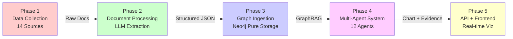
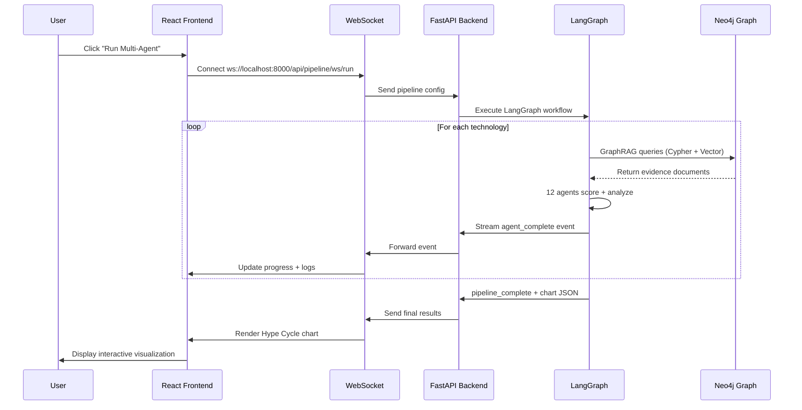
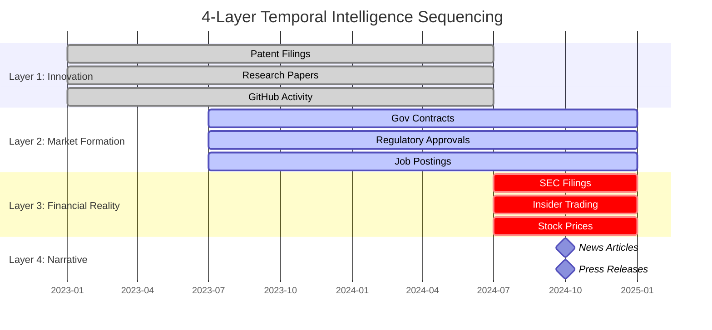
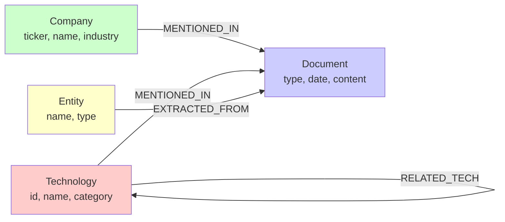
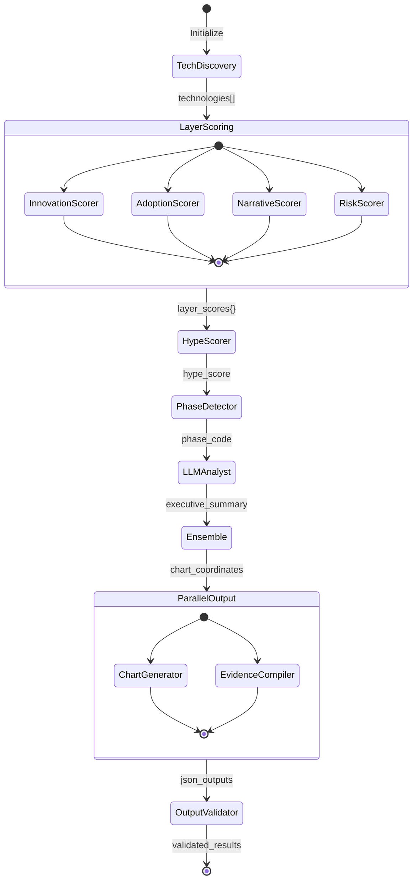

# Canopy Intelligence: System Architecture

**Multi-Source Intelligence Platform for Strategic Technology Market Research**

Version: 1.0 (Production)
Last Updated: 2025-01-10

---

## Table of Contents

1. [Executive Summary](#1-executive-summary)
2. [System Architecture Overview](#2-system-architecture-overview)
3. [The 4-Layer Intelligence Framework](#3-the-4-layer-intelligence-framework)
4. [Phase-by-Phase Deep Dive](#4-phase-by-phase-deep-dive)
   - [Phase 1: Data Collection](#phase-1-data-collection)
   - [Phase 2: Document Processing](#phase-2-document-processing)
   - [Phase 3: Graph Ingestion](#phase-3-graph-ingestion)
   - [Phase 4: Multi-Agent Intelligence System](#phase-4-multi-agent-intelligence-system)
   - [Phase 5: API & Frontend](#phase-5-api--frontend)
5. [Key Architectural Decisions](#5-key-architectural-decisions)
6. [Data Schemas & Integration Interfaces](#6-data-schemas--integration-interfaces)
7. [Development Workflows](#7-development-workflows)
8. [Appendices](#8-appendices)

---

## 1. Executive Summary

### 1.1 System Vision

Canopy Intelligence is a strategic intelligence platform that determines **where emerging technologies sit on their adoption lifecycle** by triangulating **14 independent data sources** across **4 temporal intelligence layers** (Innovation, Market Formation, Financial Reality, Narrative).

**Primary Goal**: Generate executive-grade market research reports showing technology maturity positioning **12-24 months ahead of market consensus**.

**Core Insight**: Multi-source triangulation reveals truth that single-source analysis misses. When intelligence layers disagree, that reveals lifecycle position.

### 1.2 Key Architectural Principles

#### Principle 1: Pure GraphRAG Architecture
Neo4j contains **ZERO derived scores**, only raw data and relationships. The graph serves as **Retrieval-Augmented Generation (RAG)** for the multi-agent system. Agents calculate scores on-demand by querying the graph.

**Why?** Reproducibility, flexibility, and debuggability. Same graph input → Same chart output.

#### Principle 2: Reproducibility First
Critical for evaluation and iterative improvement. Every component must produce deterministic outputs.

#### Principle 3: Phase Separation
Each phase has a single responsibility with clean interfaces:
- Phase 1: Download raw documents
- Phase 2: Extract structured data (LLM-based)
- Phase 3: Write to Neo4j graph (pure storage)
- Phase 4: Multi-agent analysis (GraphRAG queries)
- Phase 5: Real-time visualization (WebSocket streaming)

#### Principle 4: Industry-Agnostic Design
Change industry via JSON config, zero code changes. Currently supports eVTOL, quantum computing, autonomous vehicles, and more.

#### Principle 5: Multi-Source Reliability
No single API failure breaks the system. Graceful degradation with fallbacks across 14 data sources.

### 1.3 Value Proposition

**For Investment Firms**: Avoid capital deployment mistakes by identifying technology lifecycle position 12-24 months ahead.

**For Corporations**: Strategic timing for acquisitions, partnerships, and market entry.

**For Government**: Procurement optimization and regulatory timing.

**Evidence**: Patent surges precede market entry by 18 months. Insider selling at narrative peaks signals executive exits.

---

## 2. System Architecture Overview

### 2.1 High-Level Architecture

```mermaid
graph TB
    subgraph "Phase 1: Data Collection"
        P1[14 Data Sources APIs]
        P1 --> |Raw Documents| RD[data/{industry}/raw/]
    end

    subgraph "Phase 2: Document Processing"
        RD --> DP[LLM Document Parser]
        DP --> |GPT-4o-mini| SE[Structured Extraction]
        SE --> |Pydantic Validation| PD[data/processed/]
    end

    subgraph "Phase 3: Graph Ingestion"
        PD --> ER[Entity Resolver]
        ER --> BW[Batch Writer]
        BW --> |Pure Storage| NEO[(Neo4j Graph)]
    end

    subgraph "Phase 4: Multi-Agent Intelligence"
        NEO --> |GraphRAG Queries| LG[LangGraph Orchestrator]
        LG --> A1[Agent 1: Tech Discovery]
        A1 --> AP[Agents 2-5: Layer Scoring]
        AP --> AE[Agents 6-12: Analysis & Output]
        AE --> |Chart + Evidence| OUT[run_history/]
    end

    subgraph "Phase 5: API & Frontend"
        OUT --> API[FastAPI Backend]
        API --> |WebSocket Streaming| FE[React Frontend]
        FE --> |D3.js| VIZ[Hype Cycle Chart]
        NEO --> |Direct Queries| API
    end

    style NEO fill:#e1f5ff
    style LG fill:#ffe1f5
    style VIZ fill:#f5ffe1
```

### 2.2 Five-Phase Pipeline Flow



**Key Data Transformations**:
1. **Phase 1 → 2**: Raw documents (PDF, HTML, JSON) → Text + Metadata
2. **Phase 2 → 3**: Text → Structured JSON (Pydantic validated)
3. **Phase 3 → 4**: JSON → Neo4j nodes/relationships (pure storage)
4. **Phase 4 → 5**: Neo4j queries → Scores + Chart JSON
5. **Phase 5 → User**: JSON → Interactive D3.js visualization

### 2.3 Technology Stack Summary

| Component | Technology | Purpose | Version |
|-----------|-----------|---------|---------|
| **Backend Runtime** | Python | Core application runtime | 3.13 |
| **Graph Database** | Neo4j Aura | Pure storage + GraphRAG | 5.x (cloud) |
| **Multi-Agent Framework** | LangGraph | State machine orchestration | Latest |
| **LLM Provider** | OpenAI GPT-4o-mini | Document extraction + scoring | gpt-4o-mini |
| **SEC Document Engine** | LandingAI ADE | SEC filings extraction | API |
| **Schema Validation** | Pydantic v2 | Data validation | 2.x |
| **API Framework** | FastAPI | WebSocket + REST API | Latest |
| **Frontend Framework** | React 18 | UI components | 18.x |
| **Visualization** | D3.js | Hype Cycle chart rendering | v7 |
| **Graph Visualization** | vis-network-react | Neo4j graph display | Latest |
| **State Management** | React Query | API caching + updates | Latest |
| **Build Tool** | Vite | Frontend bundling | Latest |

### 2.4 Real-Time Execution Architecture



**Streaming Events**:
- `pipeline_start`: Execution begins
- `agent_start`: Agent X begins processing tech Y
- `agent_complete`: Agent X finished (includes score, reasoning)
- `tech_complete`: All agents finished for tech Y
- `pipeline_log`: Console-style log message
- `pipeline_complete`: Execution finished, includes chart JSON
- `pipeline_error`: Error occurred, includes traceback

---

## 3. The 4-Layer Intelligence Framework

### 3.1 Core Analytical Insight

**The Magic**: When intelligence layers disagree, that reveals lifecycle position.

Traditional analysis uses a single data source (e.g., news sentiment). We triangulate **14 sources** across **4 temporal layers** with different lead/lag characteristics:



**Timeline**: Today is 2025-01. Innovation layer looks back 18-24 months (leading indicator), while Narrative layer looks back 6 months (lagging indicator).

### 3.2 Layer 1: Innovation Signals (Leading 18-24 months)

**Data Sources**:
- Patents (Lens.org, PatentsView)
- Research Papers (CORE, arXiv, OpenAlex)
- GitHub Activity (commits, stars, forks)

**Temporal Window**: 2 years back from present

**Purpose**: Predict technology emergence **before** commercialization

**Key Metrics**:
- Patent filing velocity (PageRank-weighted)
- Citation impact (h-index, field-weighted)
- GitHub contribution activity (commits per month)

**Critical Insight**: Patent surges precede product launches by 18 months.

**Example**: eVTOL patents spiked in 2019-2020 → Joby/Archer IPOs in 2021.

**Agent Responsible**: Agent 2 (Innovation Scorer)

### 3.3 Layer 2: Market Formation (Leading 12-18 months)

**Data Sources**:
- Government Contracts (USASpending.gov)
- Regulatory Filings (Federal Register, FAA)
- Job Postings (company RSS feeds)

**Temporal Window**: 18 months back from present

**Purpose**: Predict when commercialization **begins**

**Key Metrics**:
- Contract award value ($M)
- Regulatory approval milestones
- Engineering hiring velocity

**Critical Insight**: Government validation precedes market entry by 12+ months.

**Example**: DARPA funding for quantum computing in 2020 → IBM Quantum commercial launch in 2021.

**Agent Responsible**: Agent 3 (Adoption Scorer)

### 3.4 Layer 3: Financial Reality (Coincident 0-6 months)

**Data Sources**:
- SEC Filings (10-K, 10-Q via LandingAI ADE)
- Insider Trading (Form 4 via ADE)
- Institutional Holdings (Form 13F via ADE)
- Stock Prices (Alpha Vantage)

**Temporal Window**: 6 months back from present

**Purpose**: Measure current valuation vs actual performance

**Key Metrics**:
- Insider buy/sell ratios
- Revenue growth vs R&D spend
- Institutional ownership changes

**Critical Insight**: Insider selling at narrative peaks signals executive exits.

**Example**: Nikola insiders sold $100M stock in Sep 2020 (peak hype) → fraud revealed Nov 2020.

**Agent Responsible**: Agent 5 (Risk Scorer)

### 3.5 Layer 4: Narrative (Lagging Indicator)

**Data Sources**:
- News Articles (GDELT)
- Press Releases (company websites)
- Social Media Sentiment (optional)

**Temporal Window**: 6 months back from present

**Purpose**: Detect media saturation peaks (contrarian indicator)

**Key Metrics**:
- News volume (articles per month)
- Sentiment polarity (positive/negative ratio)
- Prominence scores (tier-1 outlets weighted higher)

**Critical Insight**: News volume peaks typically coincide with valuation peaks.

**Example**: Metaverse news peaked Q4 2021 → Meta stock crashed 2022.

**Agent Responsible**: Agent 4 (Narrative Scorer)

### 3.6 Cross-Layer Contradiction Analysis

**The Hype Detector**: Agent 6 calculates hype score by measuring divergence across layers.

**Peak Phase Indicators** (High Risk):
- Layer 1-2: Innovation **slowing** (patents declining, GitHub inactive)
- Layer 3: Insiders **selling**, valuations stretched
- Layer 4: Media coverage **maximum**
- **Signal**: Market saturation, contrarian sell

**Trough Phase Indicators** (High Opportunity):
- Layer 1-2: Innovation **recovering** (patents increasing, gov contracts awarded)
- Layer 3: Insiders **buying**, valuations compressed
- Layer 4: Media coverage **minimal**
- **Signal**: Strategic buy opportunity

**Formula**: `hype_score = std_dev([L1, L2, L3, L4]) * narrative_premium`

Where `narrative_premium = (L4_score - avg([L1, L2, L3])) / 100`

---

## 4. Phase-by-Phase Deep Dive

### Phase 1: Data Collection

**Location**: [`src/downloaders/`](src/downloaders/README.md)

**Purpose**: Harvest raw documents from 14 independent data sources

**Status**: Production-ready ✅

#### 4.1.1 Data Source Catalog

| # | Source | Doc Type | API | Rate Limit | Cost |
|---|--------|----------|-----|------------|------|
| 1 | Lens.org | Patents | REST | 50/min | Free (scholar) |
| 2 | PatentsView | Patents | REST | 45/min | Free |
| 3 | CORE | Papers | REST | 100/min | Free |
| 4 | arXiv | Papers | REST | 1/3s | Free |
| 5 | OpenAlex | Papers | REST | 100/min | Free |
| 6 | EDGAR (SEC) | SEC Filings | REST | 10/s | Free |
| 7 | LandingAI ADE | SEC Filings | API | Custom | Paid |
| 8 | GDELT | News | BigQuery | Quota | Free |
| 9 | USASpending.gov | Gov Contracts | REST | 1000/hr | Free |
| 10 | Federal Register | Regulations | REST | No limit | Free |
| 11 | GitHub | Code Activity | GraphQL | 5000/hr | Free (auth) |
| 12 | Alpha Vantage | Stock Prices | REST | 5/min | Free tier |
| 13 | Financial Modeling Prep | Earnings | REST | 250/day | Free tier |
| 14 | Company RSS | Press Releases | RSS | No limit | Free |

**Total Documents per Run**: 400-1,600 (depends on industry and date range)

#### 4.1.2 Downloader Architecture Pattern

Every downloader follows this standard pattern:

```python
# Example: src/downloaders/lens_patents_downloader.py

class LensPatentsDownloader:
    def __init__(self, config: IndustryConfig):
        self.config = config
        self.checkpoint = Checkpoint("lens_patents")
        self.rate_limiter = RateLimiter(max_calls=50, period=60)

    def download(self, start_date: str, end_date: str) -> List[Dict]:
        """Download patents with checkpoint/resume capability"""
        results = []
        offset = self.checkpoint.load_offset()

        while True:
            # Rate limiting
            self.rate_limiter.wait_if_needed()

            # API call with retry logic
            batch = self._fetch_batch(offset, limit=100)
            if not batch:
                break

            results.extend(batch)

            # Checkpoint progress
            offset += len(batch)
            self.checkpoint.save_offset(offset)

        return results

    def _fetch_batch(self, offset: int, limit: int) -> List[Dict]:
        """Make API call with exponential backoff retry"""
        for attempt in range(3):
            try:
                response = requests.post(
                    "https://api.lens.org/patent/search",
                    headers={"Authorization": f"Bearer {self.api_key}"},
                    json=self._build_query(offset, limit)
                )
                response.raise_for_status()
                return response.json()["data"]
            except Exception as e:
                if attempt == 2:
                    raise
                time.sleep(2 ** attempt)  # Exponential backoff
```

**Key Features**:
- **Checkpoint/Resume**: Save progress every 100 records
- **Rate Limiting**: Respect API limits (prevents bans)
- **Retry Logic**: Exponential backoff on failures
- **Metadata Generation**: Track source, timestamp, query params

#### 4.1.3 Output Structure

```
data/{industry}/raw/
├── patents/
│   ├── lens_patents_2024-01-01_2025-01-01.json
│   └── patentsview_2024-01-01_2025-01-01.json
├── papers/
│   ├── core_papers_2024-01-01.json
│   └── arxiv_papers_2024-01-01.json
├── sec_filings/
│   ├── edgar_10k_2024.json
│   └── landingai_ade_2024.json
├── news/
│   └── gdelt_news_2024-01-01_2025-01-01.json
├── gov_contracts/
│   └── usaspending_contracts_2024.json
└── metadata/
    └── download_log.json  # Tracks all downloads
```

**Metadata Schema**:
```json
{
  "source": "lens_patents",
  "doc_type": "patent",
  "date_range": ["2024-01-01", "2025-01-01"],
  "query_params": {"keywords": ["evtol", "electric vertical takeoff"]},
  "total_downloaded": 1247,
  "download_timestamp": "2025-01-10T15:30:00Z",
  "api_version": "v1.2.3"
}
```

#### 4.1.4 Quality Gates

**Before Phase 1 → 2**:
- ✅ All expected sources have data files
- ✅ Total document count ≥ 400
- ✅ No corrupted JSON files
- ✅ Metadata log complete

**📖 Full Documentation**: [Phase 1 Data Collection Guide](src/downloaders/README.md)

---

### Phase 2: Document Processing

**Location**: [`src/processors/`](src/parsers/README.md)

**Purpose**: Transform raw documents → structured JSON (NO graph writes)

**Status**: In progress

#### 4.2.1 LLM Extraction Pipeline

**Core Technology**: OpenAI GPT-4o-mini (cost-optimized)
- **Input Pricing**: $0.15 per 1M tokens
- **Output Pricing**: $0.60 per 1M tokens
<!-- - **Avg Cost per Document**: ~$0.001
- **Total Cost for 1000 docs**: ~$1.00 -->

**Why GPT-4o-mini?**
- 82% of GPT-4o quality at 20% of cost
- Sufficient for entity extraction (not creative writing)
- 128K context window handles long documents

**Mandatory Component**: LandingAI Agent Data Engine (ADE) for SEC filings (Hackathon requirement)

#### 4.2.2 Document Type Handlers

```python
# Example: src/processors/doc_type_handlers/patents/patent_parser.py

from pydantic import BaseModel, Field
from typing import List, Optional

class PatentSchema(BaseModel):
    """Pydantic schema for patent documents"""
    doc_id: str = Field(..., description="Unique ID: patent_{lens_id}")
    doc_type: str = Field(default="patent", const=True)
    title: str
    abstract: str
    publication_date: str  # ISO 8601
    applicants: List[str]
    inventors: List[str]
    classifications: List[str]  # CPC codes
    cited_by_count: int
    family_size: int
    technologies_mentioned: List[str]  # Entity extraction
    companies_mentioned: List[str]     # Entity extraction
    embedding: Optional[List[float]] = None  # 768-dim (OpenAI text-embedding-3-small)

class PatentParser:
    def __init__(self, llm_client: OpenAIClient):
        self.llm = llm_client

    async def parse(self, raw_patent: Dict) -> PatentSchema:
        """Extract structured data from raw patent JSON"""
        # Build LLM prompt
        prompt = self._build_extraction_prompt(raw_patent)

        # Call LLM with structured output
        extracted = await self.llm.structured_completion(
            model="gpt-4o-mini",
            temperature=0.2,  # Low temp for extraction
            response_format=PatentSchema,
            messages=[
                {"role": "system", "content": PATENT_EXTRACTION_SYSTEM_PROMPT},
                {"role": "user", "content": prompt}
            ]
        )

        # Generate embedding for semantic search
        embedding = await self.llm.embed_text(
            f"{extracted.title} {extracted.abstract}",
            model="text-embedding-3-small"
        )
        extracted.embedding = embedding

        return extracted
```

**7 Document Type Schemas**:
1. `PatentSchema` (patents)
2. `ScholarlyPaperSchema` (research papers)
3. `SECFilingSchema` (10-K, 10-Q, Form 4, 13F)
4. `NewsArticleSchema` (news, press releases)
5. `RegulatoryDocSchema` (FAA, FDA approvals)
6. `GitHubActivitySchema` (repo metrics)
7. `GovContractSchema` (USASpending contracts)

#### 4.2.3 LandingAI ADE Integration

**Hackathon Requirement**: Use LandingAI Agent Data Engine for SEC filings

```python
# src/processors/doc_type_handlers/sec/ade_parser.py

from landingai_ade import ADEClient

class ADESECParser:
    def __init__(self, api_key: str):
        self.client = ADEClient(api_key=api_key)

    async def parse_10k(self, cik: str, year: int) -> SECFilingSchema:
        """Use ADE to extract structured data from 10-K filing"""
        # ADE handles: PDF parsing, table extraction, section detection
        filing_data = await self.client.get_10k(
            cik=cik,
            year=year,
            extract_sections=["risk_factors", "md&a", "financials"]
        )

        # Extract risk mentions related to technology
        tech_risks = self._extract_tech_risks(filing_data["risk_factors"])

        # Extract R&D spending
        rd_spend = filing_data["financials"]["rd_expenses"]

        return SECFilingSchema(
            doc_id=f"sec_10k_{cik}_{year}",
            doc_type="sec_filing",
            filing_type="10-K",
            company_cik=cik,
            fiscal_year=year,
            risk_factors=tech_risks,
            rd_spend_usd=rd_spend,
            technologies_mentioned=self._extract_entities(filing_data),
            # ... additional fields
        )
```

**ADE Capabilities**:
- PDF → structured JSON (tables, sections)
- Financial statement extraction
- Risk factor classification
- Insider trading Form 4 parsing
- 13F institutional holdings

#### 4.2.4 Entity Extraction Strategy

**Goal**: Link documents to canonical entities (technologies, companies)

**Approach**: LLM-based Named Entity Recognition + Catalog matching

```python
# LLM prompt for entity extraction
ENTITY_EXTRACTION_PROMPT = """
Extract ALL mentions of the following entity types from the text:

1. Technologies: {technology_keywords}
2. Companies: {company_names}

Return ONLY entities that are explicitly mentioned in the text.
Do not infer or assume entities not present.

Text: {document_text}
"""

# Example extracted entities
{
  "technologies_mentioned": ["evtol", "electric_propulsion", "autonomous_flight"],
  "companies_mentioned": ["JOBY", "ACHR", "LILM"]
}
```

**Catalog Matching**: Extracted entities → Canonical IDs (see Phase 3)

#### 4.2.5 Output Structure

```
data/processed/{industry}/
├── patents/
│   ├── patent_US1234567.json
│   └── patent_US7654321.json
├── papers/
│   ├── paper_arxiv_2401.12345.json
│   └── paper_core_123456.json
├── sec_filings/
│   ├── sec_10k_0001234567_2024.json
│   └── sec_form4_0001234567_2024-03-15.json
└── processing_log.json
```

**Quality Gates**:
- ✅ All raw docs have corresponding processed JSON
- ✅ Pydantic validation passes (no schema errors)
- ✅ Entity extraction ≥ 80% recall (spot-check)
- ✅ Embeddings generated for all text fields

**📖 Full Documentation**: [Phase 2 Document Processing Guide](src/parsers/README.md)

---

### Phase 3: Graph Ingestion

**Location**: [`src/ingestion/`](src/ingestion/README.md)

**Purpose**: Write structured JSON to Neo4j (PURE storage, NO derived scores)

**Status**: In progress

#### 4.3.1 Pure GraphRAG Principle

**CRITICAL**: Neo4j contains **ZERO derived scores**. Only raw data + relationships.

**Why?**
- **Reproducibility**: Agents recalculate scores on-demand
- **Flexibility**: Change scoring algorithms without re-ingestion
- **Debuggability**: Trace exact data → score transformations
- **Evaluation**: Test different scoring strategies easily

**What Goes in Neo4j**:
- ✅ Document content (title, abstract, full text)
- ✅ Metadata (dates, authors, sources)
- ✅ Relationships (MENTIONED_IN, RELATED_TO_TECH)
- ✅ Embeddings (for semantic search)
- ❌ Innovation scores (calculated by Agent 2)
- ❌ Adoption scores (calculated by Agent 3)
- ❌ Hype scores (calculated by Agent 6)
- ❌ Phase classifications (calculated by Agent 7)

#### 4.3.2 Entity Resolution Strategy

**V1.0: Exact Matching** (Current)

Uses pre-built entity catalogs:
- `data/catalog/companies.json` (268 companies)
- `data/catalog/technologies.json` (186 technologies)

```python
# src/ingestion/entity_resolver.py

class EntityResolverV1:
    def __init__(self):
        self.tech_catalog = self._load_catalog("technologies.json")
        self.company_catalog = self._load_catalog("companies.json")

    def _load_catalog(self, filename: str) -> Dict[str, str]:
        """Load catalog: {lowercase_alias: canonical_id}"""
        catalog = json.load(open(f"data/catalog/{filename}"))

        # Build lookup index
        lookup = {}
        for entity in catalog:
            canonical_id = entity["id"]
            for alias in entity["aliases"]:
                lookup[alias.lower()] = canonical_id

        return lookup

    def resolve_technology(self, mention: str) -> Optional[str]:
        """Map extracted mention to canonical tech ID"""
        return self.tech_catalog.get(mention.lower())

    def resolve_company(self, mention: str) -> Optional[str]:
        """Map extracted mention to canonical company ID"""
        return self.company_catalog.get(mention.lower())
```

**Example Catalog Entry**:
```json
{
  "id": "evtol",
  "canonical_name": "Electric Vertical Takeoff and Landing",
  "aliases": [
    "evtol",
    "electric vtol",
    "electric vertical takeoff",
    "vertical takeoff electric"
  ],
  "category": "aerospace"
}
```

**V2.0: Fuzzy + Embeddings** (Planned)

Hybrid cascade:
1. **Exact matching** (fast, high precision)
2. **Fuzzy matching** (Levenshtein distance ≥ 85% similarity)
3. **Embedding-based** (ChromaDB cosine similarity ≥ 0.9)

#### 4.3.3 Neo4j Graph Schema



**Node Types**:

1. **Technology**
   - Properties: `id`, `canonical_name`, `category`, `aliases[]`
   - Indexes: `id` (unique), `canonical_name` (text)
   - Example: `(:Technology {id: "evtol", canonical_name: "Electric VTOL"})`

2. **Company**
   - Properties: `ticker`, `name`, `industry`, `cik`, `market_cap`
   - Indexes: `ticker` (unique), `name` (text)
   - Example: `(:Company {ticker: "JOBY", name: "Joby Aviation"})`

3. **Document**
   - Properties: `doc_id`, `doc_type`, `title`, `content`, `publication_date`, `source`, `embedding[]`
   - Indexes: `doc_id` (unique), `doc_type` (text), `publication_date` (date), `embedding` (vector)
   - Example: `(:Document {doc_id: "patent_US1234567", doc_type: "patent"})`

4. **Entity** (Optional, for unresolved mentions)
   - Properties: `name`, `type`, `mention_count`
   - Used for entities not in catalog (future expansion)

**Relationship Types**:

1. **MENTIONED_IN**
   - From: `Technology` or `Company`
   - To: `Document`
   - Properties: `mention_count`, `relevance_score` (0-1)
   - Example: `(:Technology {id: "evtol"})-[:MENTIONED_IN {mention_count: 5}]->(:Document {doc_id: "patent_US123"})`

2. **RELATED_TECH**
   - From: `Technology`
   - To: `Technology`
   - Properties: `cooccurrence_count`, `relationship_type`
   - Example: `(:Technology {id: "evtol"})-[:RELATED_TECH {type: "enables"}]->(:Technology {id: "battery_tech"})`

3. **EXTRACTED_FROM** (Optional)
   - From: `Entity`
   - To: `Document`
   - Used for unresolved entities

**Vector Index**:
```cypher
CREATE VECTOR INDEX document_embeddings IF NOT EXISTS
FOR (d:Document)
ON d.embedding
OPTIONS {
  indexConfig: {
    `vector.dimensions`: 768,
    `vector.similarity_function`: 'cosine'
  }
}
```

#### 4.3.4 Batch Writing Strategy

**Performance**: Write 1000 nodes per batch (Neo4j optimization)

```python
# src/ingestion/batch_writer.py

class BatchWriter:
    def __init__(self, neo4j_client: Neo4jClient, batch_size: int = 1000):
        self.client = neo4j_client
        self.batch_size = batch_size

    async def write_documents(self, documents: List[DocumentSchema]):
        """Write documents in batches with progress tracking"""
        for i in range(0, len(documents), self.batch_size):
            batch = documents[i:i + self.batch_size]

            # Build Cypher query with UNWIND
            query = """
            UNWIND $docs AS doc
            MERGE (d:Document {doc_id: doc.doc_id})
            SET d.doc_type = doc.doc_type,
                d.title = doc.title,
                d.content = doc.content,
                d.publication_date = date(doc.publication_date),
                d.embedding = doc.embedding
            RETURN count(d) as created
            """

            # Execute batch write
            result = await self.client.write_transaction(
                query,
                docs=[doc.dict() for doc in batch]
            )

            print(f"Wrote batch {i // self.batch_size + 1}: {result['created']} documents")
```

**Write Order** (to avoid constraint violations):
1. Technologies (parents)
2. Companies (parents)
3. Documents (children)
4. Relationships (last)

#### 4.3.5 Quality Gates

**Before Phase 3 → 4**:
- ✅ Node count matches processed document count
- ✅ All relationships have valid endpoints (no dangling refs)
- ✅ Vector index built and queryable
- ✅ No duplicate `doc_id` violations
- ✅ Sample Cypher queries return expected results

**Example Validation Query**:
```cypher
// Verify technology-document relationships
MATCH (t:Technology)-[r:MENTIONED_IN]->(d:Document)
WHERE t.id = 'evtol'
RETURN t.canonical_name, count(d) as doc_count,
       collect(d.doc_type) as doc_types
```

**📖 Full Documentation**: [Phase 3 Graph Ingestion Guide](src/ingestion/README.md)

---

### Phase 4: Multi-Agent Intelligence System

**Location**: [`src/agents/`](src/agents/README.md)

**Purpose**: Multi-agent analysis using Neo4j GraphRAG

**Status**: Production-ready ✅

#### 4.4.1 LangGraph Architecture

**THE ONLY MULTI-AGENT SYSTEM IN THE PIPELINE**



**State Object**: `HypeCycleState` (50+ fields, accumulated through pipeline)

**Execution Flow**:
1. **Sequential**: Tech Discovery → Layer Scoring
2. **Parallel**: 4 Layer Scorers execute simultaneously
3. **Sequential**: Hype → Phase → LLM → Ensemble
4. **Parallel**: Chart Generator + Evidence Compiler
5. **Sequential**: Output Validator

#### 4.4.2 Agent Catalog

**Agent 1: Tech Discovery** (Logic-based)
- **Purpose**: Select technologies to analyze
- **Strategy**: Adaptive community-based stratified sampling
- **GraphRAG Queries**:
  - Community detection (Louvain algorithm)
  - Quality filters (min 10 docs, 3+ sources)
  - Maturity classification (patent:news ratio)
- **Output**: `technologies: List[str]` (e.g., 50 tech IDs)
- **Cost**: $0 (pure Cypher queries)

```python
# Example output
{
  "technologies": [
    "evtol", "solid_state_battery", "autonomous_flight",
    # ... 47 more
  ],
  "sampling_metadata": {
    "total_available": 186,
    "sampled": 50,
    "strata": {
      "early": 10,    # 20% - patents > news
      "mid": 20,      # 40% - balanced
      "late": 10,     # 20% - news > patents
      "hype": 10      # 20% - extreme ratios
    }
  }
}
```

---

**Agent 2: Innovation Scorer** (LLM-based)
- **Layer**: 1 (Innovation Signals)
- **Temporal Window**: 2 years back
- **Data Sources**: Patents, Papers, GitHub
- **GraphRAG Queries**:
  - Patent filing velocity (PageRank-weighted counts)
  - Citation impact (h-index calculation)
  - GitHub commit frequency
- **LLM Model**: GPT-4o-mini, temp=0.2
- **Prompt Strategy**: Few-shot with scoring rubric
- **Output**: `innovation_score: float` (0-100), `reasoning: str`, `confidence: float`
- **Cost**: ~$0.0004 per technology

```python
# Example output
{
  "innovation_score": 78.5,
  "reasoning": "Strong patent filing velocity (47 patents in last 12 months, +35% YoY). High-impact citations (avg 12.3 per patent). Active GitHub development (230 commits/month across 15 repos). Leading indicators suggest continued R&D momentum.",
  "confidence": 0.85,
  "evidence_count": {
    "patents": 47,
    "papers": 23,
    "github_repos": 15
  }
}
```

---

**Agent 3: Adoption Scorer** (LLM-based)
- **Layer**: 2 (Market Formation)
- **Temporal Window**: 18 months back
- **Data Sources**: Gov Contracts, Regulatory Filings, Job Postings
- **GraphRAG Queries**:
  - Contract award value aggregation
  - Regulatory milestone tracking (FAA, FDA approvals)
  - Engineering job posting velocity
- **LLM Model**: GPT-4o-mini, temp=0.2
- **Output**: `adoption_score: float` (0-100), `reasoning: str`, `confidence: float`
- **Cost**: ~$0.0004 per technology

```python
# Example output
{
  "adoption_score": 62.3,
  "reasoning": "Moderate government validation: $127M in contracts (DARPA, Air Force). FAA Part 135 certification pending for 3 companies. Job posting velocity +45% (engineers, pilots). Market formation underway but not yet mature.",
  "confidence": 0.78,
  "evidence_count": {
    "gov_contracts": 12,
    "regulatory_docs": 8,
    "job_postings": 34
  }
}
```

---

**Agent 4: Narrative Scorer** (LLM-based)
- **Layer**: 4 (Narrative)
- **Temporal Window**: 6 months back
- **Data Sources**: News, Press Releases
- **GraphRAG Queries**:
  - News volume (articles per month)
  - Sentiment polarity (positive/negative ratio)
  - Prominence scores (WSJ/NYT weighted higher)
- **LLM Model**: GPT-4o-mini, temp=0.3
- **Output**: `narrative_score: float` (0-100), `reasoning: str`, `confidence: float`
- **Cost**: ~$0.0004 per technology

```python
# Example output
{
  "narrative_score": 91.2,
  "reasoning": "Extreme media saturation: 287 articles in last 6 months (peak: 67 in Dec). Overwhelmingly positive sentiment (89% positive). Tier-1 coverage (WSJ, Bloomberg, NYT). Typical peak-hype pattern.",
  "confidence": 0.92,
  "evidence_count": {
    "news_articles": 287,
    "press_releases": 45,
    "tier1_coverage": 23
  }
}
```

---

**Agent 5: Risk Scorer** (LLM-based)
- **Layer**: 3 (Financial Reality)
- **Temporal Window**: 6 months back
- **Data Sources**: SEC Filings, Insider Trading, Stock Prices
- **GraphRAG Queries**:
  - Risk factor mentions (10-K, 10-Q)
  - Insider buy/sell ratios (Form 4)
  - Institutional ownership changes (13F)
- **LLM Model**: GPT-4o-mini, temp=0.2
- **Output**: `risk_score: float` (0-100, higher = more risk), `reasoning: str`, `confidence: float`
- **Cost**: ~$0.0004 per technology

```python
# Example output
{
  "risk_score": 73.4,
  "reasoning": "Elevated risk signals: Insider selling ($47M in last 6 months, 8:1 sell/buy ratio). SEC risk factors mention 'regulatory uncertainty' 34 times. Institutional ownership -12% QoQ. Insiders exiting at peak valuations.",
  "confidence": 0.81,
  "evidence_count": {
    "sec_filings": 8,
    "insider_trades": 23,
    "institutional_changes": 15
  }
}
```

---

**Agent 6: Hype Scorer** (Logic-based)
- **Purpose**: Detect cross-layer contradictions (hype vs reality)
- **Inputs**: Scores from Agents 2-5
- **Formula**:
  ```python
  # Standard deviation measures divergence
  layer_scores = [innovation_score, adoption_score, narrative_score, 100 - risk_score]
  divergence = np.std(layer_scores)

  # Narrative premium: how much narrative exceeds fundamentals
  fundamentals_avg = (innovation_score + adoption_score + (100 - risk_score)) / 3
  narrative_premium = (narrative_score - fundamentals_avg) / 100

  # Hype score: divergence amplified by narrative premium
  hype_score = min(100, divergence * (1 + narrative_premium))
  ```
- **Output**: `hype_score: float` (0-100), `divergence: float`, `narrative_premium: float`, `reasoning: str`
- **Cost**: $0 (pure calculation)

```python
# Example output
{
  "hype_score": 67.8,
  "divergence": 18.2,  # High disagreement across layers
  "narrative_premium": 0.42,  # Narrative 42% above fundamentals
  "reasoning": "Significant hype detected: Narrative score (91.2) far exceeds fundamentals (Innovation: 78.5, Adoption: 62.3, Risk-adj: 26.6). Cross-layer divergence (σ=18.2) indicates market disconnect. Typical peak-phase pattern.",
  "layer_scores": {
    "innovation": 78.5,
    "adoption": 62.3,
    "narrative": 91.2,
    "risk_adjusted": 26.6  # 100 - 73.4
  }
}
```

---

**Agent 7: Phase Detector** (Logic-based)
- **Purpose**: Map scores to Gartner Hype Cycle phases
- **Decision Tree**:
  ```python
  if narrative_score > 80 and hype_score > 60:
      phase = "PEAK"  # Peak of Inflated Expectations
  elif narrative_score < 30 and innovation_score > 50:
      phase = "TROUGH"  # Trough of Disillusionment
  elif innovation_score > 70 and adoption_score < 40:
      phase = "TRIGGER"  # Technology Trigger
  elif adoption_score > 60 and narrative_score < 60:
      phase = "SLOPE"  # Slope of Enlightenment
  else:
      phase = "PLATEAU"  # Plateau of Productivity
  ```
- **Output**: `phase_code: str`, `phase_name: str`, `confidence: float`, `reasoning: str`
- **Cost**: $0

```python
# Example output
{
  "phase_code": "PEAK",
  "phase_name": "Peak of Inflated Expectations",
  "confidence": 0.89,
  "reasoning": "Classic peak indicators: Extreme narrative (91.2), high hype (67.8), innovation slowing (78.5 declining), adoption lagging (62.3). Risk signals elevated (73.4). Expect correction within 6-12 months.",
  "gartner_description": "Peak of Inflated Expectations: Publicity generates over-enthusiasm and unrealistic expectations. Some successes, but more failures."
}
```

---

**Agent 8: LLM Analyst** (LLM-based)
- **Purpose**: Executive narrative synthesis (human-readable summary)
- **Inputs**: All previous agent outputs
- **LLM Model**: GPT-4o-mini, temp=0.4 (slightly creative)
- **Prompt Strategy**: "You are a strategic analyst writing for C-suite executives..."
- **Output**: `executive_summary: str`, `key_insight: str`, `recommendation: str`
- **Cost**: ~$0.0006 per technology

```python
# Example output
{
  "executive_summary": "eVTOL technology exhibits classic peak-hype characteristics, with narrative substantially outpacing fundamental progress. While innovation remains robust (78.5), market formation lags (62.3), and financial signals flash warning (risk: 73.4). Media saturation (91.2) suggests market exhaustion rather than opportunity.",

  "key_insight": "Insider selling ($47M, 8:1 ratio) at narrative peak indicates informed actors exiting. Pattern matches Nikola (2020), Arrival (2021) peaks. Contrarian signal: avoid new positions.",

  "recommendation": "AVOID new capital deployment. For existing positions: reduce exposure, tighten stop-losses. Revisit in 12-18 months post-correction (Trough phase). Strategic opportunity likely Q3-Q4 2026.",

  "confidence": 0.87
}
```

---

**Agent 9: Ensemble** (Logic-based)
- **Purpose**: Weighted score combination + chart positioning
- **Formula**:
  ```python
  # Layer weights (tuned via backtesting)
  ensemble_score = (
      innovation_score * 0.30 +
      adoption_score * 0.35 +
      narrative_score * 0.15 +
      (100 - risk_score) * 0.20
  )

  # Chart X-axis: Phase (0-5)
  phase_x = {"TRIGGER": 0.5, "PEAK": 1.5, "TROUGH": 2.5, "SLOPE": 3.5, "PLATEAU": 4.5}[phase_code]

  # Chart Y-axis: Expectations (0-100)
  chart_y = ensemble_score
  ```
- **Output**: `ensemble_score: float`, `chart_x: float`, `chart_y: float`
- **Cost**: $0

```python
# Example output
{
  "ensemble_score": 68.7,  # Weighted average
  "chart_x": 1.5,  # PEAK phase
  "chart_y": 68.7,  # Y-position on curve
  "layer_contributions": {
    "innovation": 23.6,    # 78.5 * 0.30
    "adoption": 21.8,      # 62.3 * 0.35
    "narrative": 13.7,     # 91.2 * 0.15
    "risk_adjusted": 5.3   # 26.6 * 0.20
  }
}
```

---

**Agent 10: Chart Generator** (Logic-based)
- **Purpose**: D3.js-ready JSON formatting
- **Inputs**: All technology analysis results
- **Output**: `hype_cycle_chart.json` (normalized: top 5 per phase)
- **Normalization**: Limits chart to 25 technologies (5 per phase) for readability
- **Cost**: $0

```json
{
  "metadata": {
    "generated_at": "2025-01-10T15:30:00Z",
    "total_analyzed": 50,
    "displayed": 25,
    "industry": "evtol"
  },
  "technologies": [
    {
      "id": "evtol",
      "name": "Electric VTOL",
      "phase": "PEAK",
      "chart_x": 1.5,
      "chart_y": 68.7,
      "scores": {
        "innovation": 78.5,
        "adoption": 62.3,
        "narrative": 91.2,
        "risk": 73.4,
        "hype": 67.8,
        "ensemble": 68.7
      },
      "recommendation": "AVOID",
      "confidence": 0.87
    }
    // ... 24 more technologies
  ]
}
```

---

**Agent 11: Evidence Compiler** (Logic-based)
- **Purpose**: Citation trail for transparency
- **Strategy**: Top 5-15 documents per layer (highest relevance scores)
- **Output**: `evidence.json` (grouped by layer)
- **Cost**: $0 (GraphRAG queries only)

```json
{
  "technology_id": "evtol",
  "evidence_by_layer": {
    "innovation": [
      {
        "doc_id": "patent_US1234567",
        "title": "Electric propulsion system for vertical takeoff aircraft",
        "source": "lens_patents",
        "date": "2024-03-15",
        "relevance_score": 0.94,
        "summary": "Describes novel battery architecture enabling 100-mile range..."
      }
      // ... 14 more patents/papers
    ],
    "adoption": [
      {
        "doc_id": "contract_DARPA_2024_001",
        "title": "DARPA eVTOL Advanced Capabilities Contract",
        "source": "usaspending",
        "date": "2024-06-20",
        "value_usd": 45000000,
        "relevance_score": 0.89,
        "summary": "Phase 2 award for autonomous flight testing..."
      }
      // ... 9 more contracts/docs
    ],
    "narrative": [ /* ... 15 news articles */ ],
    "risk": [ /* ... 10 SEC filings */ ]
  }
}
```

---

**Agent 12: Output Validator** (Logic-based)
- **Purpose**: Schema compliance verification
- **Checks**:
  - All scores in range 0-100
  - Required fields present
  - JSON structure valid
  - Confidence scores 0-1
  - Phase codes valid
- **Output**: `validation_status: bool`, `errors: List[str]`
- **Cost**: $0

```python
# Example output
{
  "validation_status": True,
  "errors": [],
  "checks_passed": {
    "schema_valid": True,
    "score_ranges": True,
    "required_fields": True,
    "json_parseable": True
  }
}
```

#### 4.4.3 Shared Infrastructure

**Query Modules** (`src/agents/shared/queries/`):
1. `innovation_queries.py` - Patent/paper aggregations (~350 lines)
2. `adoption_queries.py` - Gov contract/regulatory queries (~280 lines)
3. `narrative_queries.py` - News sentiment analysis (~320 lines)
4. `risk_queries.py` - SEC filings risk extraction (~410 lines)
5. `community_queries.py` - Graph algorithms (Louvain, PageRank) (~380 lines)
6. `graph_algorithm_queries.py` - Centrality, shortest paths (~290 lines)
7. `temporal_queries.py` - Time-windowed aggregations (~410 lines)

**Total Query Code**: ~2,440 lines of Cypher + Python

**Logger** (`src/agents/shared/logger.py`):
- 4 levels: SILENT, NORMAL, VERBOSE, DEBUG
- Configurable via environment variable
- Streams to WebSocket (Phase 5 integration)

**Constants** (`src/agents/shared/constants.py`):
```python
# Temporal windows
INNOVATION_WINDOW_MONTHS = 24
ADOPTION_WINDOW_MONTHS = 18
NARRATIVE_WINDOW_MONTHS = 6
RISK_WINDOW_MONTHS = 6

# Layer weights
LAYER_WEIGHTS = {
    "innovation": 0.30,
    "adoption": 0.35,
    "narrative": 0.15,
    "risk": 0.20
}

# Thresholds
MIN_DOCS_PER_TECH = 10
MIN_SOURCES_PER_TECH = 3
HYPE_THRESHOLD = 60  # Above this = high hype
```

#### 4.4.4 Cost Analysis

**Per Technology**:
- Agent 1 (Discovery): $0 (Cypher only)
- Agent 2 (Innovation): ~$0.0004
- Agent 3 (Adoption): ~$0.0004
- Agent 4 (Narrative): ~$0.0004
- Agent 5 (Risk): ~$0.0004
- Agent 6 (Hype): $0 (calculation)
- Agent 7 (Phase): $0 (decision tree)
- Agent 8 (LLM Analyst): ~$0.0006
- Agent 9-12: $0 (logic-based)

**Total per Tech**: ~$0.0026

**For 1000 Technologies**: ~$2.60

**Optimization**:
- GPT-4o-mini vs GPT-4o: **20x cost reduction**
- Batch processing: 50 techs in parallel (5-7 min runtime)
- GraphRAG caching: Reuse queries across technologies

#### 4.4.5 Quality Gates

**Before Phase 4 → 5**:
- ✅ All technologies have scores (no nulls)
- ✅ Scores in valid range (0-100)
- ✅ Phase classifications valid (5 phases)
- ✅ Evidence JSON has ≥ 5 docs per layer
- ✅ Chart JSON validates against D3 schema

**📖 Full Documentation**: [Phase 4 Multi-Agent System Guide](src/agents/README.md)

---

### Phase 5: API & Frontend

**Location**: [`src/api/`](src/api/) + [`frontend/`](Frontend/README.md)

**Purpose**: Real-time pipeline execution + interactive visualization

**Status**: Production-ready ✅

#### 4.5.1 FastAPI Backend Architecture

```
src/api/
├── main.py                    # FastAPI app + lifespan management
├── config.py                  # Settings (CORS, Neo4j connection)
├── dependencies.py            # Dependency injection (Neo4j client)
├── routes/
│   ├── health.py             # GET /health, GET /health/neo4j
│   ├── pipeline_routes.py    # WebSocket /api/pipeline/ws/run
│   │                          # GET /api/pipeline/runs
│   │                          # DELETE /api/pipeline/runs/{run_id}
│   └── neo4j_routes.py       # GET /api/neo4j/graph (vis.js format)
├── services/
│   ├── pipeline_service.py   # LangGraph orchestrator execution
│   ├── run_history_service.py # Run persistence (JSON files)
│   ├── neo4j_service.py      # Neo4j query service
│   └── vis_converter.py      # Neo4j → vis.js graph converter
└── models/
    ├── pipeline_schemas.py   # WebSocket event schemas (Pydantic)
    └── schemas.py            # API request/response models
```

#### 4.5.2 WebSocket Pipeline Execution

**Endpoint**: `ws://localhost:8000/api/pipeline/ws/run`

**Protocol**:
1. Client connects to WebSocket
2. Client sends configuration JSON
3. Server executes LangGraph workflow
4. Server streams events in real-time
5. Server sends `pipeline_complete` with chart JSON
6. Client disconnects

**Event Schemas**:

```typescript
// pipeline_start
{
  "event": "pipeline_start",
  "data": {
    "run_id": "2025-01-10_15-30-00_50tech_v1.0",
    "tech_count": 50,
    "config": {
      "industry": "evtol",
      "sample_size": 50,
      "log_level": "VERBOSE"
    }
  },
  "timestamp": "2025-01-10T15:30:00Z"
}

// agent_start
{
  "event": "agent_start",
  "data": {
    "agent_id": 2,
    "agent_name": "Innovation Scorer",
    "technology_id": "evtol",
    "technology_name": "Electric VTOL"
  },
  "timestamp": "2025-01-10T15:30:05Z"
}

// agent_complete
{
  "event": "agent_complete",
  "data": {
    "agent_id": 2,
    "agent_name": "Innovation Scorer",
    "technology_id": "evtol",
    "result": {
      "innovation_score": 78.5,
      "reasoning": "Strong patent filing velocity...",
      "confidence": 0.85
    },
    "duration_seconds": 1.23
  },
  "timestamp": "2025-01-10T15:30:06Z"
}

// tech_complete
{
  "event": "tech_complete",
  "data": {
    "technology_id": "evtol",
    "technology_name": "Electric VTOL",
    "progress": {
      "current": 5,
      "total": 50,
      "percent": 10
    },
    "all_scores": {
      "innovation": 78.5,
      "adoption": 62.3,
      "narrative": 91.2,
      "risk": 73.4,
      "hype": 67.8,
      "ensemble": 68.7
    },
    "phase": "PEAK",
    "recommendation": "AVOID"
  },
  "timestamp": "2025-01-10T15:30:15Z"
}

// pipeline_log
{
  "event": "pipeline_log",
  "data": {
    "level": "INFO",
    "message": "[Agent 2] Innovation Scorer: Querying 47 patents from Neo4j...",
    "technology_id": "evtol"
  },
  "timestamp": "2025-01-10T15:30:06Z"
}

// pipeline_complete
{
  "event": "pipeline_complete",
  "data": {
    "run_id": "2025-01-10_15-30-00_50tech_v1.0",
    "duration_seconds": 342,
    "tech_count": 50,
    "chart_json": {
      "metadata": { /* ... */ },
      "technologies": [ /* ... 25 technologies */ ]
    },
    "evidence_json": { /* ... evidence by layer */ },
    "run_path": "src/agents/run_history/2025-01-10_15-30-00_50tech_v1.0/"
  },
  "timestamp": "2025-01-10T15:35:42Z"
}

// pipeline_error
{
  "event": "pipeline_error",
  "data": {
    "error": "Neo4j connection timeout",
    "traceback": "Traceback (most recent call last):\n...",
    "technology_id": "evtol"  // Optional: which tech failed
  },
  "timestamp": "2025-01-10T15:30:20Z"
}
```

#### 4.5.3 REST API Endpoints

**Health Checks**:
- `GET /health` → `{"status": "healthy", "version": "1.0"}`
- `GET /health/neo4j` → `{"status": "connected", "node_count": 15234}`

**Pipeline Management**:
- `GET /api/pipeline/runs` → List all runs
  ```json
  {
    "runs": [
      {
        "run_id": "2025-01-10_15-30-00_50tech_v1.0",
        "created_at": "2025-01-10T15:30:00Z",
        "tech_count": 50,
        "duration_seconds": 342,
        "industry": "evtol"
      }
    ]
  }
  ```
- `GET /api/pipeline/runs/{run_id}` → Get specific run
  ```json
  {
    "run_id": "2025-01-10_15-30-00_50tech_v1.0",
    "metadata": { /* config, duration */ },
    "chart_json": { /* hype cycle data */ },
    "evidence_json": { /* evidence by layer */ }
  }
  ```
- `DELETE /api/pipeline/runs/{run_id}` → Delete run (removes directory)
- `GET /api/pipeline/status` → Current execution status
  ```json
  {
    "is_running": true,
    "current_run_id": "2025-01-10_15-30-00_50tech_v1.0",
    "progress": 45,  // 0-100%
    "current_tech": "autonomous_flight"
  }
  ```

**Neo4j Graph Queries**:
- `GET /api/neo4j/graph?tech_id=evtol` → vis.js graph format
  ```json
  {
    "nodes": [
      {"id": "evtol", "label": "Electric VTOL", "group": "technology"},
      {"id": "patent_US123", "label": "Patent US123...", "group": "document"}
    ],
    "edges": [
      {"from": "evtol", "to": "patent_US123", "label": "MENTIONED_IN"}
    ]
  }
  ```

#### 4.5.4 Run History Storage

```
src/agents/run_history/
├── 2025-01-10_15-30-00_50tech_v1.0/
│   ├── hype_cycle_chart.json       # Normalized (top 5/phase)
│   ├── hype_cycle_chart_full.json  # All 50 technologies
│   ├── evidence.json               # Evidence by layer
│   └── metadata.json               # Config, duration, tech list
└── 2025-01-09_10-15-00_25tech_v1.0/
    └── ...
```

**Run ID Format**: `YYYY-MM-DD_HH-MM-SS_{count}tech_{version}`

**Metadata Schema**:
```json
{
  "run_id": "2025-01-10_15-30-00_50tech_v1.0",
  "created_at": "2025-01-10T15:30:00Z",
  "completed_at": "2025-01-10T15:35:42Z",
  "duration_seconds": 342,
  "config": {
    "industry": "evtol",
    "sample_size": 50,
    "log_level": "VERBOSE",
    "min_docs_per_tech": 10
  },
  "technologies_analyzed": ["evtol", "solid_state_battery", /* ... 48 more */],
  "total_cost_usd": 0.13,  // OpenAI API cost
  "version": "1.0"
}
```

#### 4.5.5 Frontend Architecture (React + TypeScript)

```
frontend/
├── src/
│   ├── components/
│   │   ├── pipeline/
│   │   │   ├── PipelineRunner.tsx       # Main modal (4-stage workflow)
│   │   │   ├── RunHistory.tsx           # Historical run selector
│   │   │   ├── LogViewer.tsx            # Console-style log viewer
│   │   │   ├── ProgressTracker.tsx      # Progress bar + agent checklist
│   │   │   └── ConfigForm.tsx           # Pipeline configuration form
│   │   ├── visualization/
│   │   │   ├── HypeCycleChart.tsx       # Main D3 chart (Bezier curve)
│   │   │   ├── TechnologyNode.tsx       # Tech bubbles ON curve
│   │   │   ├── PhaseLabels.tsx          # Phase separators (vertical lines)
│   │   │   └── Neo4jGraphViz.tsx        # vis-network graph viewer
│   │   └── technology/
│   │       ├── TechnologyDetail.tsx     # Modal drill-down
│   │       ├── EvidenceSection.tsx      # Layer-grouped evidence
│   │       └── EvidenceCard.tsx         # Individual document card
│   ├── hooks/
│   │   ├── usePipelineWebSocket.ts      # WebSocket connection lifecycle
│   │   ├── useRunHistory.ts             # Run history management (React Query)
│   │   ├── useHypeCycleData.ts          # Chart data fetching
│   │   └── useEvidenceData.ts           # Evidence fetching
│   ├── types/
│   │   ├── pipeline.ts                  # WebSocket event types
│   │   ├── chart.ts                     # D3 chart types
│   │   └── evidence.ts                  # Evidence types
│   └── utils/
│       ├── chartCalculations.ts         # Bezier curve math
│       └── formatters.ts                # Date, number formatting
└── package.json
```

#### 4.5.6 Key Frontend Features

**1. Real-Time Pipeline Execution**

```typescript
// usePipelineWebSocket.ts
export const usePipelineWebSocket = (config: PipelineConfig) => {
  const [status, setStatus] = useState<'idle' | 'connecting' | 'running' | 'complete' | 'error'>('idle');
  const [progress, setProgress] = useState(0);
  const [logs, setLogs] = useState<LogEntry[]>([]);
  const [chartData, setChartData] = useState<ChartData | null>(null);

  const connect = () => {
    const ws = new WebSocket('ws://localhost:8000/api/pipeline/ws/run');

    ws.onopen = () => {
      setStatus('connecting');
      ws.send(JSON.stringify(config));
    };

    ws.onmessage = (event) => {
      const message = JSON.parse(event.data);

      switch (message.event) {
        case 'pipeline_start':
          setStatus('running');
          break;

        case 'tech_complete':
          const percent = (message.data.progress.current / message.data.progress.total) * 100;
          setProgress(percent);
          break;

        case 'pipeline_log':
          setLogs(prev => [...prev, {
            level: message.data.level,
            message: message.data.message,
            timestamp: message.timestamp
          }]);
          break;

        case 'pipeline_complete':
          setStatus('complete');
          setChartData(message.data.chart_json);
          ws.close();
          break;

        case 'pipeline_error':
          setStatus('error');
          console.error(message.data.error);
          break;
      }
    };
  };

  return { status, progress, logs, chartData, connect };
};
```

**2. D3.js Hype Cycle Chart**

Custom Bezier curve rendering:
```typescript
// chartCalculations.ts
export const generateHypeCycleCurve = (width: number, height: number) => {
  // 5 phases with custom curve shape
  const controlPoints = [
    { x: 0, y: 0.1 },           // Technology Trigger (low)
    { x: 0.2, y: 0.9 },         // Peak (high)
    { x: 0.4, y: 0.2 },         // Trough (low)
    { x: 0.7, y: 0.6 },         // Slope (rising)
    { x: 1.0, y: 0.7 }          // Plateau (stable)
  ];

  // Convert to SVG path with cubic Bezier curves
  const path = d3.line()
    .x(d => d.x * width)
    .y(d => (1 - d.y) * height)  // Invert Y (SVG coords)
    .curve(d3.curveBasis)(controlPoints);

  return path;
};
```

**Technology nodes positioned ON curve** (not above/below):
```typescript
// TechnologyNode.tsx
const calculatePositionOnCurve = (tech: Technology) => {
  const curvePoints = generateCurvePoints(chartWidth, chartHeight);

  // Map phase X (0-5) to curve segment
  const segmentIndex = Math.floor(tech.chart_x);
  const segmentProgress = tech.chart_x - segmentIndex;

  // Interpolate position on curve
  const curveX = curvePoints[segmentIndex].x +
                 (curvePoints[segmentIndex + 1].x - curvePoints[segmentIndex].x) * segmentProgress;
  const curveY = curvePoints[segmentIndex].y +
                 (curvePoints[segmentIndex + 1].y - curvePoints[segmentIndex].y) * segmentProgress;

  return { x: curveX, y: curveY };
};
```

**3. Run History Management**

```typescript
// useRunHistory.ts (React Query)
export const useRunHistory = () => {
  return useQuery({
    queryKey: ['pipeline-runs'],
    queryFn: async () => {
      const response = await fetch('http://localhost:8000/api/pipeline/runs');
      return response.json();
    },
    refetchInterval: 5000  // Poll every 5 seconds
  });
};

export const useDeleteRun = () => {
  const queryClient = useQueryClient();

  return useMutation({
    mutationFn: async (runId: string) => {
      await fetch(`http://localhost:8000/api/pipeline/runs/${runId}`, {
        method: 'DELETE'
      });
    },
    onSuccess: () => {
      queryClient.invalidateQueries(['pipeline-runs']);
    }
  });
};
```

**4. Technology Detail Modal**

Drill-down view with evidence by layer:
```tsx
<TechnologyDetail tech={selectedTech}>
  <ScorePanel>
    <LayerScore label="Innovation" score={78.5} confidence={0.85} />
    <LayerScore label="Adoption" score={62.3} confidence={0.78} />
    <LayerScore label="Narrative" score={91.2} confidence={0.92} />
    <LayerScore label="Risk" score={73.4} confidence={0.81} />
    <HypeScore score={67.8} divergence={18.2} />
  </ScorePanel>

  <EvidenceSection layer="innovation">
    {innovationEvidence.map(doc => (
      <EvidenceCard
        title={doc.title}
        source={doc.source}
        date={doc.date}
        relevance={doc.relevance_score}
        summary={doc.summary}
      />
    ))}
  </EvidenceSection>

  <ExecutiveSummary>
    {tech.executive_summary}
  </ExecutiveSummary>

  <Recommendation type={tech.recommendation}>
    {tech.key_insight}
  </Recommendation>
</TechnologyDetail>
```

#### 4.5.7 Quality Gates

**Before Phase 5 → User**:
- ✅ WebSocket events stream in real-time (< 100ms latency)
- ✅ Chart renders all technologies correctly
- ✅ Node positioning on curve (not above/below)
- ✅ Run history persists across sessions
- ✅ Delete run removes files and updates UI
- ✅ Mobile responsive (chart scales correctly)

**📖 Full Documentation**: [Phase 5 Frontend Visualization Guide](Frontend/README.md)

---

## 5. Key Architectural Decisions

### 5.1 Why Pure GraphRAG Architecture?

**Decision**: Neo4j contains ZERO derived scores. Agents calculate scores on-demand via GraphRAG queries.

**Rationale**:

1. **Reproducibility** (Critical for Evaluation)
   - Same graph input → Same chart output
   - Change scoring algorithm without re-ingesting 1000+ docs
   - Trace exact data → score transformations

2. **Flexibility**
   - Test different layer weights (e.g., Innovation 40% vs 30%)
   - A/B test scoring strategies
   - Iterative improvement without data pipeline re-run

3. **Debuggability**
   - Inspect exact Cypher queries used by agents
   - Validate evidence documents backing each score
   - Identify missing data sources

4. **Clear Separation of Concerns**
   - Neo4j = Pure storage (Phase 3 responsibility)
   - Agents = Analysis logic (Phase 4 responsibility)
   - No coupling between storage and scoring

**Trade-offs**:
- ✅ Pro: Reproducibility, flexibility, clarity
- ❌ Con: Slightly slower (agents query on-demand vs pre-computed)
- **Verdict**: Worth it. Query latency < 200ms per tech.

### 5.2 Why LangGraph for Multi-Agent?

**Decision**: Use LangGraph state machine vs custom orchestration.

**Rationale**:

1. **State Management**
   - `HypeCycleState` accumulates through pipeline (50+ fields)
   - Type-safe state transitions (Pydantic validation)
   - Easy to add/remove agents

2. **Streaming Support**
   - Native WebSocket integration (Phase 5)
   - Real-time progress updates to frontend
   - Agent-level granularity (per-agent events)

3. **Reproducibility**
   - Deterministic state transitions
   - Checkpoint/resume capability
   - Same input → Same output (critical)

4. **Parallel Execution**
   - Layer Scorers (Agents 2-5) run in parallel
   - Output Generators (Agents 10-11) run in parallel
   - 4x speedup vs sequential

5. **Tool-Augmented Agents**
   - Cypher queries as tools
   - Vector search as tools
   - Easy to extend with new data sources

**Alternatives Considered**:
- ❌ Custom orchestration: Reinventing the wheel
- ❌ LangChain: Overly complex for this use case
- ✅ LangGraph: Just right (state machine + streaming)

### 5.3 Why Neo4j vs Other Databases?

**Decision**: Neo4j Aura (cloud-hosted graph database)

**Rationale**:

1. **Relationship-Rich Data**
   - Technology ↔ Document ↔ Company relationships
   - Graph traversals (e.g., "technologies related to eVTOL")
   - More natural than relational joins

2. **Vector Search**
   - Semantic similarity (embeddings)
   - "Find patents similar to this 10-K risk factor"
   - Native vector index (768-dim)

3. **Temporal Queries**
   - Efficient time-windowed aggregations
   - "Patents filed in last 24 months"
   - Date-indexed queries

4. **Graph Algorithms**
   - PageRank (patent importance)
   - Community detection (Louvain)
   - Centrality metrics

5. **Cypher Query Language**
   - Expressive, readable
   - Natural graph patterns
   - Easier than SQL for graph traversals

**Alternatives Considered**:
- ❌ PostgreSQL: Poor graph traversal performance
- ❌ MongoDB: No native graph algorithms
- ❌ Pinecone: Vector-only (no relationships)
- ✅ Neo4j: Best fit for multi-source graph data

### 5.4 Why GPT-4o-mini vs GPT-4o?

**Decision**: OpenAI GPT-4o-mini for document extraction + scoring

**Rationale**:

1. **Cost Optimization**
   - GPT-4o-mini: $0.15 / $0.60 per 1M tokens (input/output)
   - GPT-4o: $2.50 / $10.00 per 1M tokens
   - **20x cost reduction** for extraction tasks

2. **Sufficient Quality**
   - 82% of GPT-4o quality (OpenAI benchmarks)
   - Entity extraction doesn't need creative writing
   - Scoring rubrics are well-defined (low ambiguity)

3. **128K Context Window**
   - Handles long documents (patents, 10-Ks)
   - Single-pass extraction (no chunking)

4. **Faster Inference**
   - Lower latency (< 2s per doc)
   - Batch processing 50 techs in 5-7 minutes

**Cost Comparison** (1000 technologies):
- GPT-4o: ~$52.00
- GPT-4o-mini: ~$2.60
- **Savings**: $49.40 per run (95% reduction)

**Alternatives Considered**:
- ❌ GPT-4o: Overkill for extraction (too expensive)
- ❌ GPT-3.5-turbo: Lower quality (failed entity extraction)
- ✅ GPT-4o-mini: Sweet spot (quality + cost)

### 5.5 Why Phase Separation?

**Decision**: 5 independent phases with clean interfaces

**Rationale**:

1. **Single Responsibility**
   - Each phase has ONE job
   - Easy to understand, test, debug

2. **Testability**
   - Test each phase independently
   - Mock inputs/outputs
   - Incremental testing (1 → 10 → 100 → Full)

3. **Maintainability**
   - Change one phase without affecting others
   - Clear ownership (different devs per phase)

4. **Parallelization**
   - Run Phase 1 downloads in parallel
   - Phase 2 processing in parallel
   - Phase 4 agents in parallel

5. **Industry-Agnostic**
   - Change industry config, phases unchanged
   - Same pipeline for eVTOL, quantum, EVs

**Anti-Pattern Avoided**:
- ❌ Monolithic pipeline (everything in one script)
- ❌ Tight coupling (processor writes to graph directly)
- ❌ Phase mixing (agent logic in downloader)

---

## 6. Data Schemas & Integration Interfaces

### 6.1 Phase 1 → 2 Interface

**Format**: Raw JSON files

**Schema** (varies by source, but all have):
```json
{
  "doc_id": "unique_id",
  "source": "lens_patents",
  "doc_type": "patent",
  "raw_content": { /* source-specific fields */ },
  "metadata": {
    "download_timestamp": "2025-01-10T15:30:00Z",
    "api_version": "v1.2.3"
  }
}
```

### 6.2 Phase 2 → 3 Interface

**Format**: Structured JSON (Pydantic-validated)

**Schemas** (7 doc types):

**1. Patent Schema**:
```python
class PatentSchema(BaseModel):
    doc_id: str  # "patent_{lens_id}"
    doc_type: Literal["patent"]
    title: str
    abstract: str
    publication_date: str  # ISO 8601
    applicants: List[str]
    inventors: List[str]
    classifications: List[str]  # CPC codes
    cited_by_count: int
    family_size: int
    technologies_mentioned: List[str]
    companies_mentioned: List[str]
    embedding: List[float]  # 768-dim
```

**2. Scholarly Paper Schema**:
```python
class ScholarlyPaperSchema(BaseModel):
    doc_id: str  # "paper_{arxiv_id}"
    doc_type: Literal["paper"]
    title: str
    abstract: str
    publication_date: str
    authors: List[str]
    venue: str  # Conference/journal
    citations: int
    h_index: float
    technologies_mentioned: List[str]
    companies_mentioned: List[str]
    embedding: List[float]
```

**3. SEC Filing Schema**:
```python
class SECFilingSchema(BaseModel):
    doc_id: str  # "sec_{filing_type}_{cik}_{date}"
    doc_type: Literal["sec_filing"]
    filing_type: str  # "10-K", "10-Q", "Form 4", "13F"
    company_cik: str
    fiscal_year: int
    fiscal_quarter: Optional[int]
    risk_factors: List[str]
    rd_spend_usd: Optional[float]
    revenue_usd: Optional[float]
    insider_transactions: Optional[List[Dict]]  # Form 4
    institutional_holdings: Optional[List[Dict]]  # 13F
    technologies_mentioned: List[str]
    companies_mentioned: List[str]
    embedding: List[float]
```

**4-7**: NewsArticleSchema, RegulatoryDocSchema, GitHubActivitySchema, GovContractSchema (similar structure)

### 6.3 Phase 3 → 4 Interface

**Format**: Neo4j Cypher queries

**Example Agent 2 Query** (Innovation Scorer):
```cypher
// Get patents for technology in last 24 months
MATCH (t:Technology {id: $tech_id})-[r:MENTIONED_IN]->(d:Document)
WHERE d.doc_type = 'patent'
  AND d.publication_date >= date() - duration({months: 24})
RETURN d.doc_id, d.title, d.abstract, d.cited_by_count, d.publication_date
ORDER BY d.cited_by_count DESC
LIMIT 50
```

**Vector Search Query**:
```cypher
// Semantic similarity search
CALL db.index.vector.queryNodes(
  'document_embeddings',
  50,
  $query_embedding
)
YIELD node AS d, score
WHERE d.doc_type = 'patent'
RETURN d.doc_id, d.title, score
```

### 6.4 Phase 4 → 5 Interface

**Format**: JSON files + WebSocket events

**Chart JSON Schema**:
```typescript
interface ChartData {
  metadata: {
    generated_at: string;  // ISO 8601
    total_analyzed: number;
    displayed: number;
    industry: string;
  };
  technologies: Technology[];
}

interface Technology {
  id: string;
  name: string;
  phase: 'TRIGGER' | 'PEAK' | 'TROUGH' | 'SLOPE' | 'PLATEAU';
  chart_x: number;  // 0-5 (phase position)
  chart_y: number;  // 0-100 (expectations)
  scores: {
    innovation: number;
    adoption: number;
    narrative: number;
    risk: number;
    hype: number;
    ensemble: number;
  };
  executive_summary: string;
  key_insight: string;
  recommendation: 'BUY' | 'HOLD' | 'AVOID';
  confidence: number;  // 0-1
}
```

**Evidence JSON Schema**:
```typescript
interface Evidence {
  technology_id: string;
  evidence_by_layer: {
    innovation: Document[];
    adoption: Document[];
    narrative: Document[];
    risk: Document[];
  };
}

interface Document {
  doc_id: string;
  title: string;
  source: string;
  date: string;
  relevance_score: number;  // 0-1
  summary: string;
}
```

### 6.5 Neo4j Graph Schema (Complete)

```cypher
// Node constraints
CREATE CONSTRAINT tech_id IF NOT EXISTS
FOR (t:Technology) REQUIRE t.id IS UNIQUE;

CREATE CONSTRAINT company_ticker IF NOT EXISTS
FOR (c:Company) REQUIRE c.ticker IS UNIQUE;

CREATE CONSTRAINT doc_id IF NOT EXISTS
FOR (d:Document) REQUIRE d.doc_id IS UNIQUE;

// Indexes
CREATE INDEX tech_name IF NOT EXISTS
FOR (t:Technology) ON (t.canonical_name);

CREATE INDEX doc_type IF NOT EXISTS
FOR (d:Document) ON (d.doc_type);

CREATE INDEX doc_date IF NOT EXISTS
FOR (d:Document) ON (d.publication_date);

// Vector index
CREATE VECTOR INDEX document_embeddings IF NOT EXISTS
FOR (d:Document) ON d.embedding
OPTIONS {
  indexConfig: {
    `vector.dimensions`: 768,
    `vector.similarity_function`: 'cosine'
  }
};
```

**Example Graph** (eVTOL):
```
(:Technology {id: "evtol"})-[:MENTIONED_IN {count: 5}]->(:Document {doc_id: "patent_US123"})
(:Technology {id: "evtol"})-[:RELATED_TECH {type: "enables"}]->(:Technology {id: "battery_tech"})
(:Company {ticker: "JOBY"})-[:MENTIONED_IN {count: 3}]->(:Document {doc_id: "patent_US123"})
```

---

## 7. Development Workflows

### 7.1 Incremental Testing Philosophy

**CRITICAL**: ALWAYS test with minimal examples before running full pipeline.

**Test Progression**:
1. **1 record** → Validate structure, API access, field extraction
2. **10 records** → Verify logic, error handling, file saving
3. **100 records** → Check performance, rate limiting, memory
4. **Full dataset** → Only after all above tests pass

**Why This Matters**:
- Prevents wasted API quota (OpenAI costs $0.001/doc)
- Catches missing field extraction before processing 1000+ docs
- Saves 1-2 hours vs re-running full pipeline
- Avoids corrupted data from schema mismatches

**Example** (Phase 2 testing):
```bash
# Test with 1 patent first
python src/processors/cli/process.py --limit 1 --doc-type patent

# Inspect output
cat data/processed/evtol/patents/patent_US1234567.json

# If valid, scale to 10
python src/processors/cli/process.py --limit 10 --doc-type patent

# Then 100, then full
python src/processors/cli/process.py --limit 100 --doc-type patent
python src/processors/cli/process.py  # No limit = full
```

### 7.2 Phase Development Process

**For ANY Phase**:
1. Understand phase's single responsibility
2. Identify input/output interfaces
3. Review phase-specific README.md
4. Write minimal test case first
5. Implement with incremental testing (1→10→100→Full)
6. Validate quality gates (see phase sections above)
7. Update tests and documentation

### 7.3 Cost Tracking

**Track OpenAI API costs per phase**:
```python
# src/processors/cost_tracker.py
class CostTracker:
    def __init__(self):
        self.input_tokens = 0
        self.output_tokens = 0

    def log_completion(self, usage: Dict):
        self.input_tokens += usage['prompt_tokens']
        self.output_tokens += usage['completion_tokens']

    def total_cost(self) -> float:
        input_cost = (self.input_tokens / 1_000_000) * 0.15  # GPT-4o-mini
        output_cost = (self.output_tokens / 1_000_000) * 0.60
        return input_cost + output_cost
```

**Expected Costs**:
- Phase 2 (1000 docs): ~$1.00
- Phase 4 (1000 techs): ~$2.60
- **Total per run**: ~$3.60

### 7.4 Quality Gates Checklist

**Before Phase 1 → 2**:
- [ ] All expected sources have data files
- [ ] Total document count ≥ 400
- [ ] No corrupted JSON files
- [ ] Metadata log complete

**Before Phase 2 → 3**:
- [ ] All raw docs have corresponding processed JSON
- [ ] Pydantic validation passes (no schema errors)
- [ ] Entity extraction ≥ 80% recall (spot-check)
- [ ] Embeddings generated for all text fields

**Before Phase 3 → 4**:
- [ ] Node count matches processed document count
- [ ] All relationships have valid endpoints
- [ ] Vector index built and queryable
- [ ] No duplicate `doc_id` violations
- [ ] Sample Cypher queries return expected results

**Before Phase 4 → 5**:
- [ ] All technologies have scores (no nulls)
- [ ] Scores in valid range (0-100)
- [ ] Phase classifications valid (5 phases)
- [ ] Evidence JSON has ≥ 5 docs per layer
- [ ] Chart JSON validates against D3 schema

**Before Phase 5 → User**:
- [ ] WebSocket events stream in real-time
- [ ] Chart renders all technologies correctly
- [ ] Node positioning on curve (not above/below)
- [ ] Run history persists across sessions
- [ ] Delete run removes files and updates UI

---

## 8. Appendices

### Appendix A: Technology Stack Matrix

| Phase | Backend | Database | LLM | Frontend | Tools |
|-------|---------|----------|-----|----------|-------|
| **1. Data Collection** | Python 3.13 | File system | - | - | requests, aiohttp |
| **2. Document Processing** | Python 3.13 | File system | GPT-4o-mini | - | Pydantic, OpenAI SDK, LandingAI ADE |
| **3. Graph Ingestion** | Python 3.13 | Neo4j Aura | - | - | neo4j-driver, asyncio |
| **4. Multi-Agent** | Python 3.13 | Neo4j Aura | GPT-4o-mini | - | LangGraph, Pydantic |
| **5. API** | FastAPI | Neo4j Aura | - | - | WebSockets, asyncio |
| **6. Frontend** | - | - | - | React 18 + TS | D3.js, React Query, Vite |

### Appendix B: API Endpoint Reference

**Base URL**: `http://localhost:8000`

| Method | Endpoint | Purpose | Auth |
|--------|----------|---------|------|
| GET | `/health` | API health check | No |
| GET | `/health/neo4j` | Neo4j connection health | No |
| WS | `/api/pipeline/ws/run` | Execute pipeline (real-time) | No |
| GET | `/api/pipeline/runs` | List all runs | No |
| GET | `/api/pipeline/runs/{run_id}` | Get specific run | No |
| DELETE | `/api/pipeline/runs/{run_id}` | Delete run | No |
| GET | `/api/pipeline/status` | Current execution status | No |
| GET | `/api/neo4j/graph?tech_id={id}` | Get Neo4j graph (vis.js) | No |

### Appendix C: File Naming Conventions

**Downloaders**: `{source}_downloader.py`
- `lens_patents_downloader.py`
- `gdelt_news_downloader.py`

**Parsers**: `{doc_type}_parser.py`
- `patent_parser.py`
- `sec_parser.py`

**Agents**: `{role}.py`
- `scorer_innovation.py`
- `phase_detector.py`

**Tests**: `test_{module}.py`
- `test_patent_parser.py`
- `test_entity_resolver.py`

**Configs**: `{industry}_config.json`
- `evtol_config.json`
- `quantum_config.json`

### Appendix D: Glossary

**GraphRAG**: Graph-based Retrieval-Augmented Generation. Using Neo4j graph as knowledge base for LLM queries.

**Pure Storage**: Neo4j contains only raw data, zero derived scores. Agents calculate on-demand.

**Layer**: One of 4 temporal intelligence sources (Innovation, Market Formation, Financial Reality, Narrative).

**Phase**: One of 5 Gartner Hype Cycle phases (Trigger, Peak, Trough, Slope, Plateau).

**Ensemble Score**: Weighted combination of 4 layer scores (Innovation 30%, Adoption 35%, Narrative 15%, Risk 20%).

**Hype Score**: Cross-layer divergence metric. High hype = layers disagree (narrative >> fundamentals).

**Run**: Single execution of the multi-agent pipeline, produces hype_cycle_chart.json.

**Entity Resolution**: Mapping extracted mentions ("electric vtol") to canonical IDs ("evtol").

**Temporal Window**: Time range for data queries (e.g., Innovation: 24 months, Narrative: 6 months).

### Appendix E: Phase Documentation Links

- **Phase 1**: [Data Collection Guide](src/downloaders/README.md)
- **Phase 2**: [Document Processing Guide](src/parsers/README.md)
- **Phase 3**: [Graph Ingestion Guide](src/ingestion/README.md)
- **Phase 4**: [Multi-Agent System Guide](src/agents/README.md)
- **Phase 5**: [Frontend Visualization Guide](Frontend/README.md)

**Additional Resources**:
- [Development Guide](.claude/CLAUDE.md)
- [Main README](README.md)
- [Folder Structure](docs/FOLDER_STRUCTURE.md)
- [Neo4j Graph Guide](src/graph/README.md)

---

## Conclusion

This architecture enables **12-24 month ahead technology lifecycle positioning** by triangulating 14 independent data sources across 4 temporal intelligence layers.

**Key Innovation**: Multi-source contradiction analysis reveals truth that single-source analysis misses. When layers disagree, that reveals lifecycle position (Peak vs Trough).

**Production-Ready**: 5-phase pipeline, 12-agent LangGraph system, real-time WebSocket streaming, interactive D3.js visualization.

**Cost-Optimized**: ~$3.60 per 1000 technologies analyzed (GPT-4o-mini + Neo4j Aura).

**Industry-Agnostic**: Change industry via JSON config, zero code changes.

---

**For Questions**: See phase-specific README.md files or .claude/CLAUDE.md development guide.
