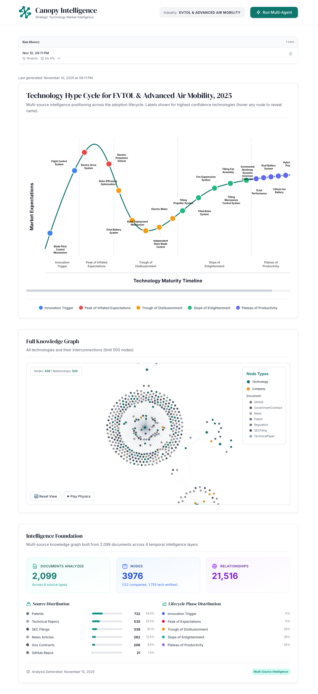
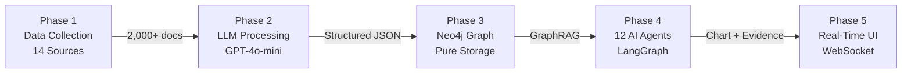

<h1 align="center">🌳 Canopy Intelligence</h1>

<p align="center">
  <b>LLM-powered financial intelligence with Hype Cycles and Graph-RAG.</b>
</p>

<div align="center">


**🦥 Built by Team Pura Vida Sloth (Costa Rica)**

*For the LandingAI Financial AI Hackathon 2025*

</div>


**Strategic market intelligence from above the ecosystem**

Multi-source intelligence platform for strategic analysis of emerging technology markets through 4-layer temporal intelligence triangulation. Combines 14 independent data sources to determine technology maturity positioning and market timing indicators 12-24 months ahead of market consensus.

**Built by Team Pura Vida Sloth (Costa Rica)** for the **LandingAI Financial AI Hackathon 2025** - Strategic Investment Timing Track.

---

## 🎬 Demo

[](https://youtu.be/65Us0ph-_lk)
[](https://canopy-intelligence.vercel.app)

**Live Demo**: Explore the interactive hype cycle chart and Neo4j knowledge graph
**Video Demo**: Full walkthrough of all features (as of November 10, 2025)


<p align="center">
  
</p>


## 🎯 What This System Does

### The Core Problem

Between 2010-2024, corporations and investors deployed billions into emerging technologies at suboptimal times, resulting in significant value destruction:

- **3D Printing (2013)**: Peak media enthusiasm followed by 80% valuation decline
- **Blockchain (2017)**: Extreme narrative coincided with 85% market correction
- **SPACs (2021)**: Government validation absent despite hype, -65% decline

**Root Cause**: Single-source analytical bias. Relying solely on media coverage, financial metrics, or innovation signals misses the cross-layer contradictions that reveal true market positioning.

### Multi-Layer Intelligence Triangulation

This system processes 14 independent data sources across **4 temporal intelligence layers** to reveal technology maturity positioning 12-24 months ahead of market consensus.

**Key Insight**: When data layers contradict each other, that reveals actionable strategic signals about market positioning and timing. Traditional analysis (Bloomberg, CB Insights, media aggregators) uses single-layer data and misses these contradictions.

---

## 🔬 The 4-Layer Intelligence Framework

Our system operates as a strategic intelligence radar with four independent layers, each examining different time horizons:

### Layer 1: Innovation Signals (Leading 18-24 months)

**Data Sources**: Patents (Lens.org, PatentsView), Research Papers (CORE, arXiv, OpenAlex), GitHub Activity

**Purpose**: Predict which technologies will emerge before commercialization

**Strategic Value**: Patent filing velocity spikes 18 months before product launches. Research paper volume validates technical feasibility 2 years ahead of market adoption. GitHub activity shows developer mindshare and technical momentum.

**Example**: eVTOL patent filings surged 2019-2020 → Joby/Archer IPOs Q2 2021 (18-month lead confirmed).

### Layer 2: Market Formation (Leading 12-18 months)

**Data Sources**: Government Contracts (USASpending.gov), Regulatory Filings (FAA, FDA, Federal Register), Job Postings

**Purpose**: Predict when commercial viability begins

**Strategic Value**: Government validation (NASA, DoD contracts) signals institutional confidence. Regulatory approvals precede market entry by 12+ months. Engineering hiring velocity predicts scaling attempts.

**Example**: DARPA quantum computing funding 2020 → IBM Quantum commercial launch 2021.

### Layer 3: Financial Reality (Coincident 0-6 months)

**Data Sources**: SEC Filings (10-K, 10-Q via LandingAI ADE), Insider Trading (Form 4), Institutional Holdings (13F), Stock Prices, Earnings Transcripts

**Purpose**: Measure current valuation vs actual operational performance

**Strategic Value**: SEC filings reveal verifiable operational metrics (R&D spend, revenue, cash burn). Insider trading patterns at price extremes signal executive sentiment before public disclosure. Institutional ownership changes show smart money positioning.

**Example**: Nikola insiders sold $100M stock May-June 2020 (narrative peak) → fraud revealed Sep 2020.

### Layer 4: Narrative (Lagging indicator)

**Data Sources**: News Articles (GDELT), Press Releases

**Purpose**: Detect media saturation peaks (contrarian indicator)

**Strategic Value**: News volume peaks typically coincide with valuation peaks. High media attention + weak fundamentals (L1-L3) = risk indicator. Minimal coverage + strong fundamentals = opportunity indicator.

**Example**: "Metaverse" news peaked Q4 2021 → Meta stock crashed -64% in 2022.

---

## 📊 Cross-Layer Contradiction Analysis

The system's core analytical capability emerges when intelligence layers disagree:

### Peak Phase Indicators (High Risk)

- **Layer 1-2**: Innovation slowing (GitHub inactive, patents declining), market formation moderate
- **Layer 3**: Insiders selling, valuations stretched, risk signals elevated
- **Layer 4**: Media coverage maximum, positive sentiment saturated
- **Signal**: Potential market saturation → risk management phase, expect correction within 6-12 months

### Trough Phase Indicators (High Opportunity)

- **Layer 1-2**: Innovation recovering (patents +YoY, government contracts awarded), regulatory milestones
- **Layer 3**: Insiders buying, valuations compressed, institutional accumulation
- **Layer 4**: Media coverage minimal, negative sentiment dominant
- **Signal**: Potential value formation → strategic opportunity phase, 12-18 months before market recognition

### Real Analysis Example: eVTOL (November 2024)

- **L1 (Innovation)**: GitHub activity 0%, patents declining (innovation stalled)
- **L2 (Market Formation)**: $274M DoD/NASA contracts (government validation present)
- **L3 (Financial Reality)**: Insider selling at $16-18 (executive exits at peak)
- **L4 (Narrative)**: 269 news articles, 1.5/day (high media coverage)
- **Cross-Layer Assessment**: Peak phase indicators → ecosystem saturation. Strategic re-evaluation window: 2026-2027.

---

## 🏗️ System Architecture: 5-Phase Pipeline



### Phase 1: Multi-Source Data Collection

**Location**: `src/downloaders/`

**14 Independent Data Sources**:
- SEC EDGAR filings (8-K, 10-K, 10-Q, DEF 14A)
- Research papers (CORE, arXiv, Lens.org)
- Patents (PatentsView, Lens.org)
- GitHub repository metrics
- Government contracts (USASpending.gov)
- Regulatory documents (Federal Register)
- News sentiment (GDELT)
- Earnings transcripts (Financial Modeling Prep)
- Academic citations (OpenAlex)
- Job postings (RSS feeds)
- Press releases (company websites)
- Insider trading (SEC Form 4 via LandingAI ADE)
- Institutional holdings (SEC Form 13F via LandingAI ADE)
- Stock prices (Alpha Vantage)

**Key Features**: Checkpoint/resume capability, rate limiting, exponential backoff retry logic, parallel downloads

**Output**: 400-2,000 raw documents per analysis window → `data/{industry}/raw/`

**Runtime**: ~45-75 minutes

### Phase 2: Document Processing

**Location**: `src/processors/`

**Technology**: OpenAI GPT-4o-mini (cost-optimized LLM extraction) + LandingAI Agent Data Engine (SEC filings, mandatory hackathon requirement)

**Key Capabilities**:
- Multi-format parsing (PDF, HTML, TXT, JSON)
- Named Entity Recognition (companies, technologies, dates, financials)
- Document type-specific handlers (7 types: patents, SEC, papers, news, regulatory, GitHub, gov contracts)
- Pydantic v2 schema validation
- Vector embeddings (768-dim, OpenAI text-embedding-3-small)

**Output**: Structured JSON → `data/processed/{industry}/`

**Cost**: ~$0.001 per document (~$1.00 for 1,000 documents)

**Runtime**: ~30-45 minutes (parallelized)

**LandingAI ADE Production Statistics** (High-Fidelity PDF Processing):
- **Documents Processed**: 52 PDFs (46 regulatory, 6 patents, 10+ SEC filings)
- **Success Rate**: 86.54% (45/52 successful extractions)
- **Intelligence Layers**: Powers 3 of 4 layers (L1: Innovation, L2: Adoption, L3: Financial)
- **Processing Features**: Async concurrent processing (5x speedup), checkpoint/resume system, 745-line production-grade implementation
- **ADE Cost**: ~$6.20 for 52 PDFs (~$0.10 per document)
- **Neo4j Impact**: 10,000+ relationships extracted from ADE-processed documents
- **Dual-Track Architecture**: ADE markdown feeds 3 specialized LLM parsers (regulatory, SEC, patents)

### Phase 3: Graph Ingestion

**Location**: `src/ingestion/`

**Critical Design Principle**: **Pure GraphRAG Architecture** — Neo4j contains ZERO derived scores, only raw data + relationships. Graph serves as Retrieval-Augmented Generation for agents.

**Why Pure Storage?**
- Reproducibility: Same graph → Same chart (critical for evaluation)
- Flexibility: Change scoring algorithms without re-ingestion
- Debuggability: Trace exact data → score transformations
- Evaluation: Test different strategies easily

**Graph Schema**:
- **Nodes**: Technology, Company, Document, Entity
- **Relationships**: MENTIONED_IN, RELATED_TECH, FILED_BY
- **Indexes**: Vector embeddings (768-dim) for semantic search

**Entity Resolution**: V1.0 uses exact matching against curated catalogs (268 companies, 186 technologies). V2.0 (planned) adds fuzzy + embedding-based matching.

**Output**: Populated Neo4j graph (2,000-8,000 nodes + relationships)

**Runtime**: ~15-25 minutes (batch writes: 1000 nodes/batch)

### Phase 4: Multi-Agent Intelligence System

**Location**: `src/agents/` (LangGraph implementation ONLY)

**12-Agent LangGraph State Machine**:

```
┌─────────────────────────────────────────────────────┐
│         Multi-Agent Intelligence System             │
│              (LangGraph Orchestrator)               │
├─────────────────────────────────────────────────────┤
│  Agent 1:  Tech Discovery     → Sample technologies│
│  Agent 2:  Innovation Scorer  → L1 (Patents/Papers)│
│  Agent 3:  Adoption Scorer    → L2 (Gov/Regulatory)│
│  Agent 4:  Narrative Scorer   → L4 (News/PR)       │
│  Agent 5:  Risk Scorer        → L3 (SEC/Insiders)  │
│  Agent 6:  Hype Scorer        → Cross-layer div.   │
│  Agent 7:  Phase Detector     → Lifecycle position  │
│  Agent 8:  LLM Analyst        → Executive synthesis │
│  Agent 9:  Ensemble           → Weighted combo      │
│  Agent 10: Chart Generator    → D3.js JSON format   │
│  Agent 11: Evidence Compiler  → Citation trails     │
│  Agent 12: Output Validator   → Schema compliance   │
└─────────────────────────────────────────────────────┘
```

**Key Design Principles**:
- **GraphRAG-First**: All agents query Neo4j (Cypher + vector search)
- **Reproducibility**: Deterministic outputs (same graph → same chart)
- **Evidence-Based**: Every score backed by 5-15 source documents with citations
- **Cost-Optimized**: GPT-4o-mini ($0.15/$0.60 per M tokens)

**Execution Flow**:
1. **Discovery**: Sample 50 technologies using community-based stratified sampling
2. **Parallel Layer Scoring** (Agents 2-5): Innovation, Adoption, Narrative, Risk
3. **Hype Detection** (Agent 6): Calculate cross-layer divergence
4. **Phase Classification** (Agent 7): Map to Gartner Hype Cycle (Trigger/Peak/Trough/Slope/Plateau)
5. **LLM Synthesis** (Agent 8): Executive narrative + recommendations
6. **Ensemble** (Agent 9): Weighted score combination (Innovation 30%, Adoption 35%, Narrative 15%, Risk 20%)
7. **Parallel Output** (Agents 10-11): Chart JSON + Evidence compilation
8. **Validation** (Agent 12): Schema compliance checks

**Output**:
- `hype_cycle_chart.json` (25 technologies, top 5 per phase)
- `hype_cycle_chart_full.json` (all 50 analyzed technologies)
- `evidence.json` (citation trails grouped by layer)

**Cost**: ~$0.0016 per technology (~$1.60 for 1,000 technologies)

**Runtime**: ~5-7 minutes for 50 technologies (parallel execution)


## Architecture Overview

### System Data Flow

```
┌─────────────────────────────────────────────────────────────────┐
│                    1. Tech Discovery Agent                      │
│              (Enumerate all technologies from graph)            │
└────────────────────────────┬────────────────────────────────────┘
                             │
                             ▼
┌─────────────────────────────────────────────────────────────────┐
│              PARALLEL EXECUTION: Core Scoring Agents            │
│  ┌──────────────┬──────────────┬──────────────┬──────────────┐  │
│  │ 2. Innovation│ 3. Adoption  │ 4. Narrative │  5. Risk     │  │
│  │    Scorer    │    Scorer    │    Scorer    │   Scorer     │  │
│  │   (Layer 1)  │  (Layer 2)   │  (Layer 4)   │ (Layer 3)    │  │
│  └──────────────┴──────────────┴──────────────┴──────────────┘  │
└────────────────────────────┬────────────────────────────────────┘
                             │
                             ▼
                  ┌──────────────────────┐
                  │   6. Hype Scorer     │
                  │  (Cross-Layer        │
                  │   Contradiction)     │
                  └──────────┬───────────┘
                             │
                             ▼
                  ┌──────────────────────┐
                  │ 7. Phase Detector    │
                  │  (Gartner Lifecycle  │
                  │   Classification)    │
                  └──────────┬───────────┘
                             │
                             ▼
                  ┌──────────────────────┐
                  │  8. LLM Analyst      │
                  │  (GPT-4o-mini        │
                  │   Synthesis)         │
                  └──────────┬───────────┘
                             │
                             ▼
                  ┌──────────────────────┐
                  │  9. Ensemble Agent   │
                  │  (Weighted Score     │
                  │   Combination)       │
                  └──────────┬───────────┘
                             │
                             ▼
┌─────────────────────────────────────────────────────────────────┐
│         PARALLEL EXECUTION: Output Generation Agents            │
│  ┌──────────────────────────────┬──────────────────────────┐    │
│  │  10. Chart Generator         │ 11. Evidence Compiler    │    │
│  │  (X/Y Coordinates)           │ (Source Citations)       │    │
│  └──────────────────────────────┴──────────────────────────┘    │
└────────────────────────────┬────────────────────────────────────┘
                             │
                             ▼
                  ┌──────────────────────┐
                  │ 12. Output Validator │
                  │  (Quality Gate)      │
                  └──────────┬───────────┘
                             │
                             ▼
                   [hype_cycle_chart.json]
```


### Phase 5: Real-Time API + Interactive Frontend

**Location**: `src/api/` + `frontend/`

**Backend**: FastAPI with WebSocket streaming + REST API

**WebSocket Pipeline Execution**:
```
ws://localhost:8000/api/pipeline/ws/run

Events streamed in real-time:
├─ pipeline_start      → Execution begins
├─ agent_start         → Agent X processing tech Y
├─ agent_complete      → Agent X finished (score, reasoning)
├─ tech_complete       → All agents finished tech Y (progress update)
├─ pipeline_log        → Console-style log messages
├─ pipeline_complete   → Final results + chart JSON
└─ pipeline_error      → Error occurred (traceback)
```

**REST API**:
- `GET /health` → API health check
- `GET /health/neo4j` → Neo4j connection status
- `GET /api/pipeline/runs` → List all historical runs
- `GET /api/pipeline/runs/{run_id}` → Get specific run data
- `DELETE /api/pipeline/runs/{run_id}` → Delete run
- `GET /api/pipeline/status` → Current execution status

**Frontend**: React 18 + TypeScript + D3.js v7

**Key Components**:
- **Hype Cycle Chart**: Custom D3.js rendering with Bezier curve (technologies positioned ON curve)
- **Pipeline Runner**: 4-stage modal (config → execution → progress → results)
- **Run History**: Historical run selector with React Query caching
- **Technology Detail**: Drill-down modal with layer-by-layer evidence
- **Neo4j Graph Viz**: Interactive graph exploration (vis-network)

**Real-Time Features**:
- Live progress tracking (0-100%), agent status checklist, technology counter, duration timer, auto-scrolling logs

**Run History Storage**: `src/agents/run_history/{run_id}/` contains chart JSON, evidence JSON, metadata

---

## 🛠️ Technology Stack

### Core Infrastructure
- **Language**: Python 3.13
- **Graph Database**: Neo4j Aura (cloud-hosted, vector-enabled)
- **LLM**: OpenAI GPT-4o-mini (cost-optimized)
- **Multi-Agent Framework**: LangGraph (state machine orchestration)
- **Schema Validation**: Pydantic v2
- **Vector Store**: Neo4j vector indexes (768-dim embeddings)

### Data Collection
- **SEC Filings**: LandingAI Agent Data Engine (ADE) - mandatory hackathon requirement
- **Research Papers**: CORE API, arXiv, Lens.org
- **Patents**: PatentsView, Lens.org
- **News**: GDELT API
- **GitHub**: GitHub REST API

### Frontend
- **UI Framework**: React 18
- **Visualization**: D3.js v7
- **State Management**: React Query
- **Build Tool**: Vite
- **Styling**: Tailwind CSS

### Development Tools
- **Testing**: pytest, pytest-asyncio
- **Linting**: ruff (fast Python linter)
- **Type Checking**: mypy
- **API**: FastAPI (WebSocket + REST)

---

## 🚀 Quick Start

### Prerequisites
- Python 3.13+ (3.11+ works, 3.13 recommended)
- Node.js 18+ (for frontend)
- Neo4j Aura account (free tier: [neo4j.com/cloud/aura](https://neo4j.com/cloud/aura))
- OpenAI API key ([platform.openai.com](https://platform.openai.com))
- LandingAI API key (for SEC data: [landing.ai](https://landing.ai))

### 1. Clone and Install

```bash
# Clone repository
git clone https://github.com/omontes/pura-vida-sloth.git
cd pura-vida-sloth

# Install Python dependencies
pip install -r requirements.txt
pip install -e .

# Install frontend dependencies (optional, for UI)
cd frontend
npm install
cd ..
```

### 2. Configure Environment

```bash
# Copy template
cp .env.template .env

# Edit .env with your API keys
nano .env
```

**Required Environment Variables**:
```bash
OPENAI_API_KEY=sk-proj-...              # OpenAI (GPT-4o-mini + embeddings)
NEO4J_URI=neo4j+s://xxxxx.databases.neo4j.io
NEO4J_USER=neo4j
NEO4J_PASSWORD=...
LANDINGAI_API_KEY=...                   # LandingAI Agent Data Engine (SEC data)
```

**Optional API Keys** (improves data coverage):
```bash
CORE_API_KEY=...                        # Research papers (free tier: 10k/day)
GITHUB_TOKEN=...                        # GitHub data (5k requests/hour)
FMP_API_KEY=...                         # Earnings transcripts ($14/month)
ALPHA_VANTAGE_KEY=...                   # Stock prices (500 calls/day free)
```


### 3. Run End-to-End Pipeline

**Option 1: Complete Pipeline (First Run)**

```bash
# Phase 1: Data Collection (~45-75 min)
python -m src.cli.harvest --config configs/evtol_config.json

# Phase 2: Document Processing (~30-45 min)
python -m src.cli.process --config configs/evtol_config.json

# Phase 3: Graph Ingestion (~15-25 min)
python -m src.cli.ingest --config configs/evtol_config.json

# Phase 4: Multi-Agent Analysis (~5-7 min for 50 techs)
python -m src.cli.analyze --config configs/evtol_config.json

# Phase 5: Start Frontend UI
cd frontend && npm run dev
```

**Total Runtime**: ~90-120 minutes for first run (subsequent runs faster with cached data)

**Option 2: Analysis Only (Existing Data)**

If you already have a populated Neo4j graph:

```bash
# Just run multi-agent analysis
python -m src.cli.analyze --config configs/evtol_config.json

# Start frontend
cd frontend && npm run dev
```

**Runtime**: ~5-7 minutes (agents only)

### 4. View Results

Open browser to `http://localhost:5173` to see interactive visualization.

---

## 🌐 Deployment (Optional)

Want to share your analysis publicly? Deploy the frontend + backend for free!

### Live Demo Mode

The project supports a **read-only demo mode** that:
- ✅ Displays pre-generated Hype Cycle charts
- ✅ Allows interactive Neo4j graph exploration
- ✅ Shows historical run data
- ❌ Disables agent execution (zero OpenAI costs)

Perfect for portfolio demos, hackathon presentations, or sharing with stakeholders.

### Deployment Architecture

```
GitHub Repository
    ↓
[Vercel] Frontend (React + D3.js)
    ↓ REST API calls
[Render.com] Backend (FastAPI) - Read-only mode
    ↓ Cypher queries
[Neo4j Aura] Graph Database (your free instance)
```

**Monthly Cost**: $0 (100% free tier hosting)

### Step 1: Deploy Backend to Render.com

Render provides 750 hours/month of free hosting - perfect for demo apps!

1. **Sign up at [render.com](https://render.com)** with your GitHub account (no credit card required)

2. **Create new Web Service**:
   - Click "New +" → "Web Service"
   - Connect this repository
   - Render will auto-detect `render.yaml` configuration

3. **Add environment variables** in Render Dashboard:
   - `NEO4J_URI`: Your Neo4j Aura connection string
   - `NEO4J_PASSWORD`: Your Neo4j password
   - (Other vars are pre-configured in `render.yaml`)

4. **Deploy!** Render builds and deploys automatically. Your API will be at:
   ```
   https://canopy-intelligence-api.onrender.com
   ```

**Note**: Free tier services sleep after 15 min of inactivity. First request takes ~30 seconds to wake up. Use [UptimeRobot](https://uptimerobot.com) (free) to ping `/health` every 5 minutes to keep it warm.

### Step 2: Deploy Frontend to Vercel

Vercel offers unlimited bandwidth and instant deployments - perfect for React apps!

1. **Sign up at [vercel.com](https://vercel.com)** with your GitHub account (no credit card required)

2. **Import repository**:
   - Click "Add New..." → "Project"
   - Import `pura-vida-sloth` repository
   - Vercel auto-detects Vite configuration

3. **Configure build settings**:
   - **Framework**: Vite
   - **Root Directory**: `frontend`
   - **Build Command**: `npm run build`
   - **Output Directory**: `dist`

4. **Add environment variables**:
   - `VITE_API_URL`: `https://canopy-intelligence-api.onrender.com`
   - `VITE_ENABLE_PIPELINE_EXECUTION`: `false`
   - `VITE_ENV`: `production`

5. **Deploy!** Your frontend will be live at:
   ```
   https://canopy-intelligence.vercel.app
   ```

### Step 3: Test Your Deployment

1. **Backend health**: Visit `https://your-api.onrender.com/health`
2. **Neo4j connection**: Visit `https://your-api.onrender.com/health/neo4j`
3. **Frontend**: Open `https://your-app.vercel.app`
4. **Click a technology** → Verify Neo4j graph loads correctly

### Demo Mode Features

When `ENABLE_PIPELINE_EXECUTION=false` (production default):

✅ **What Works:**
- Full Hype Cycle Chart visualization with D3.js
- Interactive Neo4j graph (click any technology)
- Technology details and phase positioning
- Historical run data browser
- All UI animations and interactions

❌ **What's Disabled:**
- "Run Pipeline" button (grayed out with tooltip)
- Multi-agent execution (no OpenAI API costs)
- New analysis generation

**Banner displays**: "📊 Demo Mode - Viewing pre-generated analysis"

### Enable Full Features Locally

To run the complete multi-agent system on your machine:

1. Set `ENABLE_PIPELINE_EXECUTION=true` in `.env`
2. Add your OpenAI API key
3. Restart backend: `./start_backend.sh`
4. Click "Run Multi-Agent" button in UI

### Deployment Costs

| Service | Free Tier | Monthly Cost |
|---------|-----------|--------------|
| **Render** (Backend) | 750 hours, 512 MB RAM, 100 GB bandwidth | $0 |
| **Vercel** (Frontend) | Unlimited bandwidth, 100 deployments/day | $0 |
| **Neo4j Aura** (Database) | 1 GB storage, 8 GB RAM, always-on | $0 |
| **UptimeRobot** (Optional) | 50 monitors, 5 min intervals | $0 |
| **TOTAL** | | **$0/month** |

**Guaranteed**: No credit card required for any service. No surprise charges.

---

## 📁 Project Structure

```
pura-vida-sloth/
├── src/
│   ├── downloaders/              # Phase 1: 14 Data Sources
│   │   ├── sec_filings.py
│   │   ├── lens_patents.py
│   │   ├── lens_scholarly.py
│   │   ├── github_metrics.py
│   │   ├── gdelt_news.py
│   │   ├── usaspending_contracts.py
│   │   ├── federal_register.py
│   │   ├── alpha_vantage_stocks.py
│   │   ├── fmp_earnings.py
│   │   ├── job_postings.py
│   │   ├── press_releases.py
│   │   └── README.md
│   ├── processors/               # Phase 2: Document processing
│   │   ├── document_processor.py
│   │   ├── doc_type_handlers/
│   │   │   ├── patents/
│   │   │   │   └── patent_parser.py
│   │   │   ├── scholarly/
│   │   │   │   └── paper_parser.py
│   │   │   ├── sec/
│   │   │   │   └── ade_parser.py
│   │   │   ├── news/
│   │   │   │   └── news_parser.py
│   │   │   ├── regulatory/
│   │   │   │   └── regulatory_parser.py
│   │   │   ├── github_activity/
│   │   │   │   └── github_parser.py
│   │   │   └── gov_contracts/
│   │   │       └── contract_parser.py
│   │   └── README.md
│   ├── ingestion/                # Phase 3: Graph ingestion
│   │   ├── graph_ingestor.py
│   │   ├── batch_writer.py
│   │   ├── entity_resolver.py
│   │   ├── node_writer.py
│   │   ├── relationship_writer.py
│   │   └── README.md
│   ├── agents/                   # Phase 4: Multi-agent system
│   │   ├── langgraph_orchestrator.py
│   │   ├── agent_01_tech_discovery/
│   │   │   └── discovery_agent.py
│   │   ├── agent_02_innovation/
│   │   │   └── innovation_scorer.py
│   │   ├── agent_03_adoption/
│   │   │   └── adoption_scorer.py
│   │   ├── agent_04_narrative/
│   │   │   └── narrative_scorer.py
│   │   ├── agent_05_risk/
│   │   │   └── risk_scorer.py
│   │   ├── agent_06_hype/
│   │   │   └── hype_scorer.py
│   │   ├── agent_07_phase/
│   │   │   └── phase_detector.py
│   │   ├── agent_08_analyst/
│   │   │   └── llm_analyst.py
│   │   ├── agent_09_ensemble/
│   │   │   └── ensemble_scorer.py
│   │   ├── agent_10_chart/
│   │   │   └── chart_generator.py
│   │   ├── agent_11_evidence/
│   │   │   └── evidence_compiler.py
│   │   ├── agent_12_validator/
│   │   │   └── output_validator.py
│   │   ├── shared/
│   │   │   ├── queries/
│   │   │   │   ├── innovation_queries.py
│   │   │   │   ├── adoption_queries.py
│   │   │   │   ├── narrative_queries.py
│   │   │   │   ├── risk_queries.py
│   │   │   │   ├── community_queries.py
│   │   │   │   └── temporal_queries.py
│   │   │   ├── logger.py
│   │   │   ├── constants.py
│   │   │   └── openai_client.py
│   │   ├── run_history/          # Output from runs
│   │   └── README.md
│   ├── api/                      # Phase 5: FastAPI backend
│   │   ├── main.py
│   │   ├── config.py
│   │   ├── dependencies.py
│   │   ├── routes/
│   │   │   ├── health.py
│   │   │   ├── pipeline_routes.py
│   │   │   └── neo4j_routes.py
│   │   ├── services/
│   │   │   ├── pipeline_service.py
│   │   │   ├── run_history_service.py
│   │   │   ├── neo4j_service.py
│   │   │   └── vis_converter.py
│   │   └── models/
│   │       ├── pipeline_schemas.py
│   │       └── schemas.py
│   ├── graph/                    # Neo4j abstraction layer
│   │   ├── neo4j_client.py
│   │   ├── entity_resolver.py
│   │   ├── node_writer.py
│   │   └── README.md
│   ├── schemas/                  # Pydantic models
│   │   ├── documents.py
│   │   ├── technologies.py
│   │   └── companies.py
│   ├── utils/                    # Utilities
│   ├── core/                     # Core logic
│   ├── cli/                      # CLI commands
│   │   ├── harvest.py
│   │   ├── process.py
│   │   ├── ingest.py
│   │   └── analyze.py
│   └── scripts/                  # Utility scripts
├── frontend/                     # Phase 5: React UI
│   ├── src/
│   │   ├── components/
│   │   │   ├── pipeline/
│   │   │   │   ├── PipelineRunner.tsx
│   │   │   │   ├── RunHistory.tsx
│   │   │   │   ├── LogViewer.tsx
│   │   │   │   ├── ProgressTracker.tsx
│   │   │   │   └── ConfigForm.tsx
│   │   │   ├── visualization/
│   │   │   │   ├── HypeCycleChart.tsx
│   │   │   │   ├── TechnologyNode.tsx
│   │   │   │   ├── PhaseLabels.tsx
│   │   │   │   └── Neo4jGraphViz.tsx
│   │   │   └── technology/
│   │   │       ├── TechnologyDetail.tsx
│   │   │       ├── EvidenceSection.tsx
│   │   │       └── EvidenceCard.tsx
│   │   ├── hooks/
│   │   │   ├── usePipelineWebSocket.ts
│   │   │   ├── useRunHistory.ts
│   │   │   ├── useHypeCycleData.ts
│   │   │   └── useEvidenceData.ts
│   │   ├── types/
│   │   │   ├── pipeline.ts
│   │   │   ├── chart.ts
│   │   │   └── evidence.ts
│   │   ├── utils/
│   │   │   ├── chartCalculations.ts
│   │   │   └── formatters.ts
│   │   └── App.tsx
│   ├── package.json
│   └── vite.config.ts
├── configs/                      # JSON configurations
│   ├── evtol_config.json
│   └── quantum_config.json
├── data/                         # Downloaded data (gitignored)
│   ├── catalog/                  # Entity catalogs
│   │   ├── companies.json
│   │   └── technologies.json
│   └── {industry}/
│       ├── raw/
│       └── processed/
├── tests/                        # Test suite
│   ├── test_downloaders/
│   ├── test_processors/
│   ├── test_ingestion/
│   ├── test_agents/
│   └── test_integration.py
├── docs/                         # Documentation
│   ├── ARCHITECTURE.md
│   ├── FOLDER_STRUCTURE.md
│   └── API_SETUP_GUIDE.md
├── .claude/                      # Development guide
│   └── CLAUDE.md
├── .env.template                 # Environment template
├── requirements.txt              # Python dependencies
└── README.md                     # This file
```

---

## 📊 Expected Output

### Phase 1: Raw Data (90-180 day window)

| Data Source | Documents | Format | Size |
|------------|-----------|--------|------|
| Research Papers | 200-800 | PDF, HTML | 500MB-2GB |
| SEC Filings | 50-200 | HTML | 50-200MB |
| Patents | 20-100 | PDF, JSON | 100-500MB |
| Press Releases | 50-150 | HTML | 10-30MB |
| News Articles | 100-300 | JSON | 20-50MB |
| GitHub Metrics | 20-50 | JSON | 5-10MB |
| Earnings Transcripts | 10-30 | TXT | 5-15MB |
| Government Contracts | 5-20 | JSON | 2-5MB |
| Job Postings | 20-50 | HTML | 5-10MB |
| **Total** | **495-1,760** | Mixed | **700MB-3GB** |

### Phase 3: Neo4j Graph

| Element Type | Count | Purpose |
|-------------|-------|---------|
| Technology Nodes | 50-200 | Core technologies identified |
| Company Nodes | 100-500 | Organizations in ecosystem |
| Document Nodes | 495-1,760 | Source documents |
| Relationships | 2,000-10,000 | Connections (MENTIONED_IN, RELATED_TECH) |
| Vector Embeddings | 495-1,760 | Semantic search (768-dim) |

### Phase 4: Intelligence Report

For each technology analyzed (e.g., 50 technologies):

**Chart JSON** (`hype_cycle_chart.json`):
```json
{
  "metadata": {
    "generated_at": "2025-01-10T15:30:00Z",
    "total_analyzed": 50,
    "displayed": 25,
    "industry": "evtol"
  },
  "technologies": [
    {
      "id": "evtol",
      "name": "Electric VTOL",
      "phase": "PEAK",
      "chart_x": 1.5,
      "chart_y": 68.7,
      "scores": {
        "innovation": 78.5,
        "adoption": 62.3,
        "narrative": 91.2,
        "risk": 73.4,
        "hype": 67.8,
        "ensemble": 68.7
      },
      "executive_summary": "eVTOL exhibits classic peak-hype characteristics...",
      "key_insight": "Insider selling ($47M) at narrative peak indicates...",
      "recommendation": "AVOID",
      "confidence": 0.87
    }
  ]
}
```

**Evidence JSON** (5-15 citations per layer):
```json
{
  "technology_id": "evtol",
  "evidence_by_layer": {
    "innovation": [
      {
        "doc_id": "patent_US1234567",
        "title": "Electric propulsion system for vertical takeoff aircraft",
        "date": "2024-03-15",
        "relevance_score": 0.94,
        "summary": "Novel battery architecture enabling 100-mile range..."
      }
    ],
    "adoption": [ /* 10 gov contracts/regulations */ ],
    "narrative": [ /* 15 news articles */ ],
    "risk": [ /* 8 SEC filings */ ]
  }
}
```

---

## 🎨 Key Features

### 1. Industry-Agnostic Design

Switch from eVTOL to quantum computing, biotech, or AI by changing a JSON config file. Zero code changes required.

**Supported Markets**:
- Emerging technologies (eVTOL, quantum, fusion, space)
- Regulated industries (biotech, fintech, cannabis)
- Platform shifts (Web3, AI, metaverse)
- Industrial automation (robotics, IoT, smart manufacturing)

**Example Configuration** (`configs/quantum_config.json`):
```json
{
  "industry": "quantum_computing",
  "companies": {
    "public": {
      "IONQ": "IonQ Inc.",
      "RGTI": "Rigetti Computing"
    }
  },
  "keywords": ["quantum computing", "qubit", "quantum annealing"],
  "date_range": {
    "start": "2024-08-01",
    "end": "2025-01-01"
  }
}
```

### 2. Multi-Source Reliability

No single API failure breaks the system. Graceful degradation with fallbacks:
- **Earnings**: FMP → Alpha Vantage → Web scraping
- **Research**: CORE → arXiv → Lens.org
- **Patents**: PatentsView → Lens.org → Manual fallback

### 3. Evidence-Based Analysis

Every analytical claim backed by source documents:
- 5-15 citations per score dimension
- Clickable references to original documents
- Data provenance tracking for audit trails
- Reproducible analysis (same input → same output, 100% deterministic)

### 4. Production-Ready Architecture

- **Checkpoint/Resume**: Automatic recovery from interruptions
- **Retry Logic**: Exponential backoff with rate limit detection
- **Real-Time Streaming**: WebSocket progress updates (<100ms latency)
- **Comprehensive Logging**: 4 levels (SILENT/NORMAL/VERBOSE/DEBUG)
- **Error Handling**: Graceful degradation, never crashes pipeline
- **Run History**: Persistent storage with metadata

### 5. Cost-Optimized LLM Usage

- **GPT-4o-mini**: ~$0.0016 per technology (vs ~$0.032 with GPT-4o)
- **Strategic LLM usage**: Only 4 of 12 agents use LLM (33% vs 100%)
- **Cached embeddings**: Reuse vectors across analyses
- **Batch processing**: Reduce API overhead

<!-- **Total Cost** (1,000 technologies analyzed):
- Phase 2 (Document Processing): ~$1.00
- Phase 4 (Multi-Agent): ~$1.60
- **Total**: ~$2.60 -->

---

## 📖 Documentation

### Core Architecture
- **[ARCHITECTURE.md](ARCHITECTURE.md)** - Complete system architecture (2,900+ lines, production-ready)

### Phase-Specific Guides
- **[Phase 1: Data Collection](src/downloaders/README.md)** - 14 data source collectors
- **[Phase 2: Document Processing](src/parsers/README.md)** - LLM extraction pipeline
- **[Phase 3: Graph Ingestion](src/ingestion/README.md)** - Neo4j pure storage
- **[Phase 4: Multi-Agent System](src/agents/README.md)** - 12-agent LangGraph (2,000+ lines)
- **[Phase 5: Frontend Visualization](frontend/README.md)** - React + D3.js + WebSocket

### Reference Documentation
- **[Neo4j Schema](NEO4J_SCHEMA.md)** - Graph schema specification


---

## 🎯 Unique Value Propositions

### vs. Traditional Financial Analysis Tools
- **Traditional**: Backward-looking (last quarter's earnings), single-layer analysis
- **Canopy Intelligence**: Forward-looking 12-24 months, 4-layer triangulation catches contradictions

### vs. Bloomberg/CB Insights
- **Bloomberg**: Financial focus (Layer 3)
- **CB Insights**: Venture capital focus, limited technical depth
- **Canopy Intelligence**: All 4 layers (innovation, market, financials, narrative), open-source 

### vs. Manual Analyst Research
- **Manual Analysis**: Sample 20-50 documents, weeks of work, subjective interpretation, single analyst bias
- **Canopy Intelligence**: Process +2,000 documents, 90-120 minutes automated, evidence-based reproducible, multi-agent system (12 agents)

---

## ⚠️ Important Notes

### Scope and Purpose

This system is designed for **strategic market research and technology maturity analysis**. It provides intelligence about technology lifecycle positioning to inform strategic planning decisions.

**This is NOT**: A stock trading system, financial advice, real-time market data, or a replacement for professional due diligence.

### Data Limitations

- **Analysis Window**: 90-180 days (not suitable for day trading)
- **Emerging Tech Focus**: Most effective for markets with <10 years commercialization
- **English-Language Bias**: Primary sources are English-language documents
- **Public Data Only**: No proprietary datasets or insider information

### Recommended Use Cases

- Strategic planning for corporate R&D programs
- Market timing analysis for technology sectors
- Competitive intelligence and positioning assessment
- Technology maturity evaluation for enterprise adoption
- Academic research on innovation diffusion patterns

---


## 📝 License

[MIT License](LICENSE) - See LICENSE file for details.

---

## 🏆 Hackathon Context

**Event**: LandingAI Financial AI Hackathon 2025
**Track**: Strategic Investment Timing
**Team**: Pura Vida Sloth (Costa Rica) 🦥
**Submission**: Canopy Intelligence - Strategic market intelligence from above the ecosystem


**Built with**: Python 3.13, Neo4j Aura, OpenAI GPT-4o-mini, LangGraph, FastAPI, React 18, D3.js v7

---

## 🙏 Acknowledgments

### Data Providers

**Lens.org - Patent & Scholarly Data**

This project was enabled by [The Lens](https://www.lens.org/), who generously provided trial API access for patent and scholarly research data collection. The Lens is a free, open, and secure platform that makes the global patent and scholarly knowledge accessible and reusable for the public good.

**Data Sources from The Lens:**
- **Patents**: Patent families, claims, classifications, and citation data across multiple jurisdictions
- **Scholarly Works**: Academic papers, citations, research metadata, and cross-disciplinary knowledge graphs

We acknowledge The Lens for their critical role in democratizing access to patent and scholarly information, which enabled **Layer 1 (Innovation Signals)** analysis in this multi-source intelligence platform. Without their open API infrastructure, tracking innovation velocity at scale (18-24 months ahead) would not have been feasible.

**Attribution:** Data sourced from [The Lens](https://www.lens.org/) • [About The Lens](https://about.lens.org/) • [Attribution Policy](https://about.lens.org/policies/#attribution)

---

**Disclaimer**: This system provides multi-source intelligence for market research purposes only. All analysis is based on publicly available data and does not constitute financial, legal, or professional advice. Users should conduct independent research and consult qualified professionals for specific guidance.
