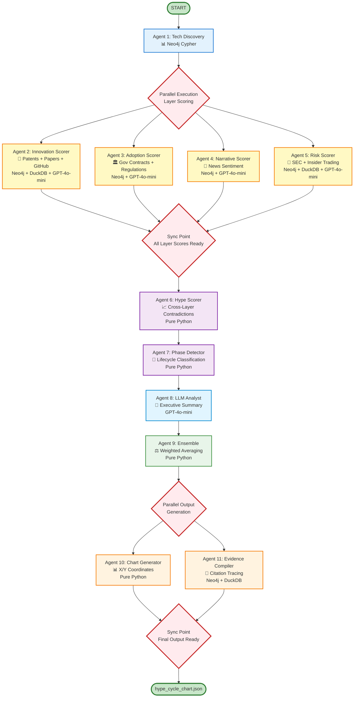
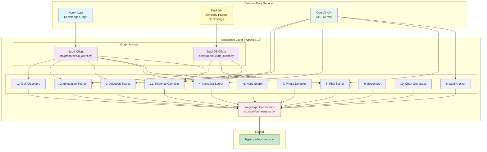
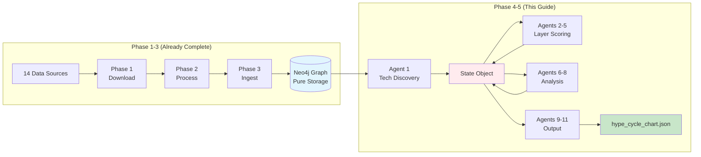
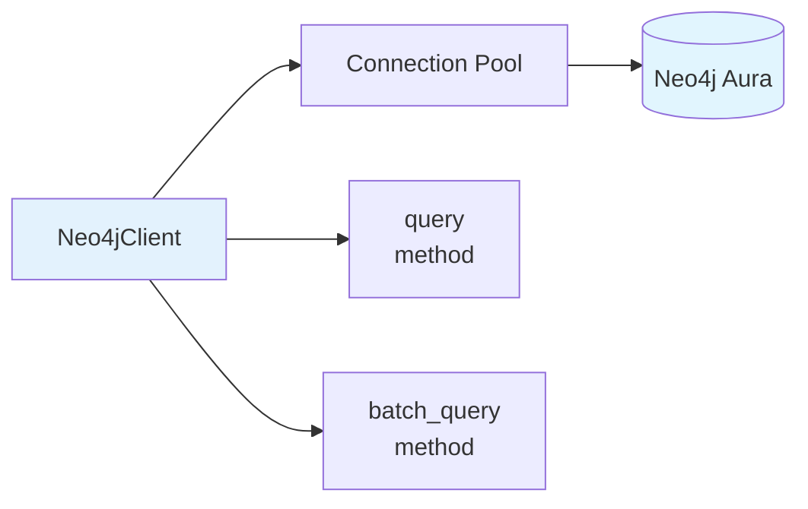
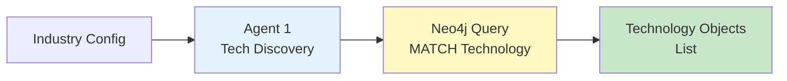

# Multi-Agent Hype Cycle Chart Generation System

**Phases 4+5: GraphRAG-Powered Technology Lifecycle Analysis**

Author: Pura Vida Sloth Intelligence System
Version: 1.0
Date: 2025-01-09

---

## 1. Executive Summary

This document defines the end-to-end architecture for the **11-agent LangGraph state machine** that generates Gartner Hype Cycle positioning charts for emerging technologies.

### System Overview

**Input**: Neo4j Knowledge Graph (pure storage, zero derived scores)
**Output**: `hype_cycle_chart.json` with technologies positioned on 5 Gartner phases must be the same format as this example: agents\outputs\hype_cycle_chart_example.json
**Architecture**: 11 specialized agents orchestrated via LangGraph state machine
**Multi-Run Consensus**: 10-20 analytical runs → Convergent verdict with confidence metrics
**Cost**: ~$0.91 per technology (GPT-4o-mini @ $0.150/$0.600 per M tokens)
**Runtime**: 3-5 minutes for 20 runs per technology (instant per-run variations)
**Confidence**: 85%+ agreement rate with Cohen's Kappa > 0.75 for high-confidence verdicts

### Core Design Principles

1. **Pure GraphRAG**: Neo4j contains ONLY raw data + relationships. Agents compute all scores on-demand using graph as RAG.
2. **Multi-Run Consensus**: Each run provides different analytical perspective → Scientific convergence across 10-20 runs builds confidence.
3. **4-Layer Intelligence Framework**: Cross-layer contradiction detection reveals lifecycle position.
4. **Evidence Tracing**: Every score backed by 5-15 source documents with citations.
5. **Agent Independence for Testing**: For each agent you must create a full test simulating both the input and output. This is crucial for get evals about the performance of the task of this agent.

### Multi Query Graph RAG
1. Always try to get the same information from the graph but using distincts approaches: by hybrid search, by some x cypher, by another y cypher, using some extra source, etc. 
2. Dont trust always in the pure cypher for get the ideal result. The graph is not perfect but could be a good initial view.
3. The graph has communities and must be used in every agent because it is another approach or pesrpective that use the power of the graph. 

## Evidence Approach
1. Almost any relation or edges of the graph has an evidence_confindence and evidence_text and this is very crucial to get in almost every step. This one of the best insights the graph could give you along with the connections.
2. Use the communities in every stage the Community Summary is an important tool to query the graph and have insights.

## Multi-Hop GraphRAG 
1. It is ok to do different queries to get more data and if you get some and need another one feel free to do it. 


### The 11-Agent Architecture

```
┌─────────────────────────────────────────────────────────────────┐
│                    1. Tech Discovery Agent                      │
│              (Enumerate all technologies from graph)            │
└────────────────────────────┬────────────────────────────────────┘
                             │
                             ▼
┌─────────────────────────────────────────────────────────────────┐
│              PARALLEL EXECUTION: Core Scoring Agents            │
│  ┌──────────────┬──────────────┬──────────────┬──────────────┐  │
│  │ 2. Innovation│ 3. Adoption  │ 4. Narrative │  5. Risk     │  │
│  │    Scorer    │    Scorer    │    Scorer    │   Scorer     │  │
│  │   (Layer 1)  │  (Layer 2)   │  (Layer 4)   │ (Layer 3)    │  │
│  └──────────────┴──────────────┴──────────────┴──────────────┘  │
└────────────────────────────┬────────────────────────────────────┘
                             │
                             ▼
                  ┌──────────────────────┐
                  │   6. Hype Scorer     │
                  │  (Cross-Layer        │
                  │   Contradiction)     │
                  └──────────┬───────────┘
                             │
                             ▼
                  ┌──────────────────────┐
                  │ 7. Phase Detector    │
                  │  (Gartner Lifecycle  │
                  │   Classification)    │
                  └──────────┬───────────┘
                             │
                             ▼
                  ┌──────────────────────┐
                  │  8. LLM Analyst      │
                  │  (GPT-4o-mini        │
                  │   Synthesis)         │
                  └──────────┬───────────┘
                             │
                             ▼
                  ┌──────────────────────┐
                  │  9. Ensemble Agent   │
                  │  (Weighted Score     │
                  │   Combination)       │
                  └──────────┬───────────┘
                             │
                             ▼
┌─────────────────────────────────────────────────────────────────┐
│         PARALLEL EXECUTION: Output Generation Agents            │
│  ┌──────────────────────────────┬──────────────────────────┐    │
│  │  10. Chart Generator         │ 11. Evidence Compiler    │    │
│  │  (X/Y Coordinates)           │ (Source Citations)       │    │
│  └──────────────────────────────┴──────────────────────────┘    │
└────────────────────────────┬────────────────────────────────────┘
                             │
                             ▼
                   [hype_cycle_chart.json]
```

---

## 2. Knowledge Graph Foundation

### 2.1 Schema Overview (NEO4J_SCHEMA.md)

**Node Types**:
- `Technology`: Core entities being analyzed (id, name, domain, aliases)
- `Company`: Organizations developing/using technologies (name, ticker, type)
- `Document`: 7 subtypes (patent, technical_paper, sec_filing, regulation, github, government_contract, news)

**Critical Relationships**:
- `MENTIONED_IN`: Technology/Company → Document (role, strength, evidence_confidence, evidence_text)
- `RELATED_TO_TECH`: Company → Technology (relation_type: any relation term in the graph, trust in the graph and make group by always, the names of relation type are not a rigid exclusive term)
- `RELATED_TECH`: Technology ↔ Technology (relation_type: any relation term in the graph, trust in the graph and make group by always, the names of relation type are not a rigid exclusive term)
- `RELATED_COMPANY`: Company ↔ Company (relation_type: any relation term in the graph, trust in the graph and make group by always, the names of relation type are not a rigid exclusive term)

**Temporal Fields** (CRITICAL for scoring):
- `Document.published_at`: Publication date (datetime)
- `Document.quality_score`: Relevance threshold (0.85-1.0)
- `MENTIONED_IN.strength`: Entity centrality in document (0-1)

**Vector Embeddings**: You will need to create this because the graph does not have any embeddings. 

### 2.2 Data Availability Per Intelligence Layer

#### Layer 1: Innovation Signals (Leading 18-24 months)

**Data Sources**:
- **Patents**: `Document.doc_type = "patent"`
  - Fields: `filing_date`, `grant_date`, `claims_count`, `citations_received`, `citations_made`
  - Role: "invented" in MENTIONED_IN (ALWAYS CHECK FIRST WHAT ARE THE ROLES ACCORDING TO THE GRAPH)

- **Research Papers**: `Document.doc_type = "technical_paper"`
  - Fields: `published_at`, `citation_count`, `venue`, `composite_score`
  - Role: "studied" in MENTIONED_IN (ALWAYS CHECK FIRST WHAT ARE THE ROLES ACCORDING TO THE GRAPH)
  - **DuckDB Tool**: `ScholarlyPapersDatabase` for composite scoring

- **GitHub Activity**: `Document.doc_type = "github"`
  - Fields: `stars`, `forks`, `contributors`, `last_updated`, `commits_count`
  - Role: "implemented" in MENTIONED_IN (ALWAYS CHECK FIRST WHAT ARE THE ROLES ACCORDING TO THE GRAPH)

**Lookback Window**: 2 years (innovation moves slowly)

#### Layer 2: Market Formation (Leading 12-18 months)

**Data Sources**:
- **Government Contracts**: `Document.doc_type = "government_contract"`
  - Fields: `award_date`, `contract_value`, `agency`, `awardee`, `contract_type`
  - Role: "procured" in MENTIONED_IN (ALWAYS CHECK FIRST WHAT ARE THE ROLES ACCORDING TO THE GRAPH)

- **Regulatory Filings**: `Document.doc_type = "regulation"`
  - Fields: `published_at`, `regulation_type`, `agency`, `approval_status`
  - Role: "regulated" in MENTIONED_IN (ALWAYS CHECK FIRST WHAT ARE THE ROLES ACCORDING TO THE GRAPH)

- **SEC Revenue Recognition**: `Document.doc_type = "sec_filing"`
  - Fields: `filing_date`, `filing_type` (10-K, 10-Q), `fiscal_period`, `revenue_mentioned`
  - Role: "commercialized" in MENTIONED_IN (ALWAYS CHECK FIRST WHAT ARE THE ROLES ACCORDING TO THE GRAPH)

**Lookback Window**: 1 year (market formation accelerates)

#### Layer 3: Financial Reality (Coincident 0-6 months)

**Data Sources**:
- **SEC Risk Factors**: `Document.doc_type = "sec_filing"` WHERE `risk_factor_mentioned = true`
  - Fields: `filing_date`, `risk_category`, `sentiment`, `severity`
  - Role: "subject" in MENTIONED_IN (ALWAYS CHECK FIRST WHAT ARE THE ROLES ACCORDING TO THE GRAPH)

- **Insider Transactions**: External DuckDB tool (Forms 3/4/5)
  - Fields: `transaction_date`, `transaction_code` (P/S), `shares`, `price_per_share`, `net_insider_value_usd`
  - **DuckDB Tool**: `InsiderTransactionsDatabase.query_transactions_by_ticker()`

- **Institutional Holdings**: `Document.doc_type = "sec_filing"` (13F forms)
  - Fields: `filing_date`, `holder_name`, `shares_held`, `value_usd`, `percent_change`
  - Role: "owned" in MENTIONED_IN (ALWAYS CHECK FIRST WHAT ARE THE ROLES ACCORDING TO THE GRAPH)

**Lookback Window**: 6 months (financial reality changes quickly)

#### Layer 4: Narrative (Lagging Indicator)

**Data Sources**:
- **News Articles**: `Document.doc_type = "news"`
  - Fields: `published_at`, `title`, `domain`, `outlet_tier`, `sentiment`, `socialimage`
  - Role: "subject" in MENTIONED_IN (ALWAYS CHECK FIRST WHAT ARE THE ROLES ACCORDING TO THE GRAPH)
  - **Outlet Tier Classification**: Industry Authority > Financial Authority > Mainstream > Wire > Niche

- **Press Releases**: `Document.doc_type = "news"` WHERE `domain IN ['prnewswire.com', 'businesswire.com']`
  - Fields: `published_at`, `title`, `company`
  - Role: "announced" in MENTIONED_IN (ALWAYS CHECK FIRST WHAT ARE THE ROLES ACCORDING TO THE GRAPH)

**Lookback Window**: 3 months (news cycles are short)

### 2.3 Pure Storage Design (CRITICAL)

**Graph Contains**:
- ✅ Raw documents (patents, papers, news, SEC filings)
- ✅ Relationships (MENTIONED_IN, RELATED_TO_TECH)
- ✅ Metadata (dates, counts, quality scores)

**Graph Does NOT Contain**:
- ❌ Innovation scores
- ❌ Adoption scores
- ❌ Hype scores
- ❌ Phase classifications
- ❌ Derived metrics

**Why This Matters**:
- Pure storage → Multiple analytical runs use same foundation
- Agents recalculate scores on-demand → Always fresh analysis
- Easy to iterate on scoring logic without graph migrations
- Transparent audit trail (all scores traceable to source documents)

### 2.4 Graph Prerequisites & Configuration

**CRITICAL**: Before running the multi-agent system, the Neo4j graph must be configured with:

1. **Temporal Indexes** (for efficient date-range queries) ALL DATE FIELDS ARE IN DATETIME NOT DATE.
2. **Hybrid Search Infrastructure** (vector (with open ai v3 small) + BM25 full-text)
3. **Pre-Computed Community Structures** (6 different perspectives)
4. **Graph Algorithm Configurations** (PageRank, centrality metrics)

---

#### 2.4.1 One-Time Index Setup

**Purpose**: Enable fast temporal queries and hybrid search across 400-1,600 documents per industry.

```cypher
// ============================================================
// TEMPORAL INDEXES (for date-range filtering)
// ============================================================

// Index on published_at for all documents (REMEMBER IS DATETIME AND NOT DATE)
CREATE INDEX document_published_at IF NOT EXISTS date(datetime(d.published_at)
FOR (d:Document) ON (d.published_at); --> date(datetime(d.published_at)

Example: WHERE date(datetime(d.published_at)) >= date() - duration('P730D') --> this is how it works now just to clarify.

// Composite index for doc_type + published_at (Layer-specific queries)
CREATE INDEX document_type_published IF NOT EXISTS
FOR (d:Document) ON (d.doc_type, d.published_at);

// Technology ID index (primary lookup)
CREATE INDEX technology_id IF NOT EXISTS
FOR (t:Technology) ON (t.id);

// Company ticker index (for financial queries)
CREATE INDEX company_name IF NOT EXISTS
FOR (c:Company) ON (c.name);

// Doc ID index (for deduplication and citations)
CREATE INDEX document_doc_id IF NOT EXISTS
FOR (d:Document) ON (d.doc_id);
```

**Expected Performance**:
- Date-range query: ~50ms for 1000 documents (vs 2-3s without index)
- Technology lookup: ~5ms (vs 500ms without index)

---

#### 2.4.2 Hybrid Search Setup (Vector + BM25)

**Purpose**: Enable semantic + keyword-based document retrieval for multi-run variations.

```cypher
// ============================================================
// VECTOR SEARCH INDEX (OpenAI text-embedding-3-small, 768 dims)
// ============================================================
THE GRAPH DOES NOT HAVE ANY EMBEDDING NOW. SO FEEL FREE TO CREATE THE FIELDS FOR DOCUMENT AND TECHNOLOGY AND COMPANY.

CALL db.index.vector.createNodeIndex(
    'document_embeddings',        // Index name
    'Document',                   // Node label
    'embedding',                  // Property containing vector
    768,                          // Embedding dimensions
    'cosine'                      // Similarity metric
);

// ============================================================
// FULL-TEXT SEARCH INDEX (BM25 algorithm)
// ============================================================

CALL db.index.fulltext.createNodeIndex(
    'document_fulltext',          // Index name
    ['Document'],                 // Node labels
    ['title', 'summary', 'content'],  // Properties to index
    {
        analyzer: 'standard-no-stop-words',
        eventually_consistent: 'true'
    }
);
```

**Hybrid Search Query Pattern** (used by agents):

```cypher
// Step 1: Vector search (semantic)
CALL db.index.vector.queryNodes(
    'document_embeddings',
    $k_vector,              // e.g., 20
    $query_embedding
)
YIELD node AS doc_vector, score AS vector_score

// Step 2: BM25 search (keyword)
CALL db.index.fulltext.queryNodes(
    'document_fulltext',
    $query_text
)
YIELD node AS doc_bm25, score AS bm25_score
LIMIT $k_bm25              // e.g., 20

// Step 3: Reciprocal Rank Fusion (RRF)
WITH
    collect(DISTINCT {doc: doc_vector, score: vector_score, source: 'vector'}) AS vector_results,
    collect(DISTINCT {doc: doc_bm25, score: bm25_score, source: 'bm25'}) AS bm25_results

// Combine and rank with configurable weights
UNWIND vector_results + bm25_results AS result
WITH result.doc AS doc,
     sum(
         CASE result.source
             WHEN 'vector' THEN $vector_weight * result.score
             WHEN 'bm25' THEN (1 - $vector_weight) * result.score
         END
     ) AS hybrid_score
ORDER BY hybrid_score DESC
LIMIT $k_final            // e.g., 10
RETURN doc, hybrid_score
```

**Variation Mechanism**: Each run can vary `$vector_weight` (0.3-0.7) for different retrieval perspectives.

---

#### 2.4.3 Pre-Computed Community Detection

**Purpose**: Provide 6 different graph community perspectives without per-run computation cost.

**Why Pre-Compute?**
- **Cost**: Louvain/Leiden algorithms are O(n log n), taking ~10-30 seconds per run
- **Variation**: Store 6 different community structures, each run selects one (instant)
- **One-Time Setup**: 10-15 minutes total, never recompute

**Community Detection Configurations**:

| Version | Algorithm | Resolution | Seed | Use Case |
|---------|-----------|------------|------|----------|
| `community_v0` | Louvain | 0.8 | 42 | Broad clusters (fewer, larger communities) |
| `community_v1` | Louvain | 1.0 | 42 | Balanced communities |
| `community_v2` | Louvain | 1.2 | 42 | Fine-grained clusters (more, smaller communities) |
| `community_v3` | Leiden | 0.8 | 42 | Higher quality broad clusters |
| `community_v4` | Leiden | 1.0 | 42 | Balanced with better modularity |
| `community_v5` | Leiden | 1.2 | 42 | Fine-grained with higher precision |

**Setup Script**:

```cypher
// ============================================================
// PRE-COMPUTE 6 COMMUNITY STRUCTURES (one-time, 10-15 min)
// ============================================================

// Create in-memory graph projection (shared by all)
CALL gds.graph.project(
    'tech-community-graph',
    ['Technology', 'Company', 'Document'],
    {
        RELATED_TECH: {orientation: 'UNDIRECTED'},
        RELATED_TO_TECH: {orientation: 'UNDIRECTED'},
        MENTIONED_IN: {orientation: 'UNDIRECTED'},
        HAS_RELATIONSHIP: {orientation: 'UNDIRECTED'}
    }
);

// -------------------
// Version 0: Louvain, Low Resolution (Broad Clusters)
// -------------------
CALL gds.louvain.write('tech-community-graph', {
    nodeLabels: ['Technology', 'Company'],
    relationshipTypes: ['RELATED_TECH', 'RELATED_TO_TECH'],
    resolution: 0.8,
    randomSeed: 42,
    writeProperty: 'community_v0',
    tolerance: 0.0001,
    maxIterations: 10
});

// -------------------
// Version 1: Louvain, Standard Resolution (Balanced)
// -------------------
CALL gds.louvain.write('tech-community-graph', {
    nodeLabels: ['Technology', 'Company'],
    relationshipTypes: ['RELATED_TECH', 'RELATED_TO_TECH'],
    resolution: 1.0,
    randomSeed: 42,
    writeProperty: 'community_v1',
    tolerance: 0.0001,
    maxIterations: 10
});

// -------------------
// Version 2: Louvain, High Resolution (Fine-Grained)
// -------------------
CALL gds.louvain.write('tech-community-graph', {
    nodeLabels: ['Technology', 'Company'],
    relationshipTypes: ['RELATED_TECH', 'RELATED_TO_TECH'],
    resolution: 1.2,
    randomSeed: 42,
    writeProperty: 'community_v2',
    tolerance: 0.0001,
    maxIterations: 10
});

// -------------------
// Version 3: Leiden, Low Resolution (Higher Quality Broad Clusters)
// -------------------
CALL gds.leiden.write('tech-community-graph', {
    nodeLabels: ['Technology', 'Company'],
    relationshipTypes: ['RELATED_TECH', 'RELATED_TO_TECH'],
    gamma: 0.8,
    theta: 0.01,
    randomSeed: 42,
    writeProperty: 'community_v3',
    tolerance: 0.0001,
    maxIterations: 10
});

// -------------------
// Version 4: Leiden, Standard Resolution (Balanced, Better Modularity)
// -------------------
CALL gds.leiden.write('tech-community-graph', {
    nodeLabels: ['Technology', 'Company'],
    relationshipTypes: ['RELATED_TECH', 'RELATED_TO_TECH'],
    gamma: 1.0,
    theta: 0.01,
    randomSeed: 42,
    writeProperty: 'community_v4',
    tolerance: 0.0001,
    maxIterations: 10
});

// -------------------
// Version 5: Leiden, High Resolution (Fine-Grained, High Precision)
// -------------------
CALL gds.leiden.write('tech-community-graph', {
    nodeLabels: ['Technology', 'Company'],
    relationshipTypes: ['RELATED_TECH', 'RELATED_TO_TECH'],
    gamma: 1.2,
    theta: 0.01,
    randomSeed: 42,
    writeProperty: 'community_v5',
    tolerance: 0.0001,
    maxIterations: 10
});

// Verify community assignments
MATCH (t:Technology)
RETURN
    count(DISTINCT t.community_v0) AS louvain_low_count,
    count(DISTINCT t.community_v1) AS louvain_balanced_count,
    count(DISTINCT t.community_v2) AS louvain_high_count,
    count(DISTINCT t.community_v3) AS leiden_low_count,
    count(DISTINCT t.community_v4) AS leiden_balanced_count,
    count(DISTINCT t.community_v5) AS leiden_high_count;
```

**Usage in Multi-Run System**:

```python
# Each run selects one pre-computed community version
run_config = {
    "community_version": 3,  # Use leiden low resolution
    # ... other parameters
}

# Query filters by selected community
query = f"""
MATCH (t:Technology {{id: $tech_id}})
MATCH (related:Technology)
WHERE related.community_v{run_config['community_version']} =
      t.community_v{run_config['community_version']}
RETURN related
"""
```

**Cost Breakdown**:

| Operation | One-Time Setup | Per-Run Cost | Performance Gain |
|-----------|----------------|--------------|------------------|
| Community Detection | 10-15 minutes (6 versions) | **0ms** (pre-computed) | **Instant** vs 10-30s |
| Hybrid Search | 5 minutes (indexing) | **NEGLIGIBLE** (indexed) | 50ms vs 2-3s |
| Temporal Indexes | 2 minutes | **NEGLIGIBLE** | 50ms vs 2-3s |
| **TOTAL** | **~20 minutes** | **~100ms** | **300x faster** |

---

#### 2.4.4 Graph Algorithm Configurations

**Purpose**: Pre-configure graph algorithms for consistent performance across runs.

```cypher
// ============================================================
// PAGERANK SETUP (for technology importance scoring)
// ============================================================

// Project graph for PageRank (if not already projected)
CALL gds.graph.project(
    'tech-pagerank-graph',
    ['Technology'],
    ['RELATED_TECH']
);

// Run PageRank, store as property
CALL gds.pageRank.write('tech-pagerank-graph', {
    writeProperty: 'pagerank_score',
    dampingFactor: 0.85,
    maxIterations: 20,
    tolerance: 0.0000001
});

// ============================================================
// DEGREE CENTRALITY (for company influence)
// ============================================================

CALL gds.degree.write('tech-community-graph', {
    nodeLabels: ['Company'],
    writeProperty: 'degree_centrality'
});

// ============================================================
// BETWEENNESS CENTRALITY (for technology bridging)
// ============================================================

CALL gds.betweenness.write('tech-community-graph', {
    nodeLabels: ['Technology'],
    writeProperty: 'betweenness_centrality',
    samplingSize: 100,  // Approximate for performance
    samplingSeed: 42
});
```

---

#### 2.4.5 Validation Checklist

**Run this query to verify graph is ready for multi-agent system**:

```cypher
// Check all prerequisites
MATCH (d:Document)
WITH count(d) AS total_docs
MATCH (t:Technology)
WITH total_docs, count(t) AS total_techs
RETURN
    // Data availability
    total_docs AS document_count,
    total_techs AS technology_count,

    // Indexes
    EXISTS {
        CALL db.indexes() YIELD name
        WHERE name = 'document_published_at'
    } AS has_temporal_index,

    EXISTS {
        CALL db.indexes() YIELD name
        WHERE name = 'document_embeddings'
    } AS has_vector_index,

    EXISTS {
        CALL db.indexes() YIELD name
        WHERE name = 'document_fulltext'
    } AS has_fulltext_index,

    // Community structures
    count(DISTINCT t.community_v0) > 0 AS has_community_v0,
    count(DISTINCT t.community_v1) > 0 AS has_community_v1,
    count(DISTINCT t.community_v2) > 0 AS has_community_v2,
    count(DISTINCT t.community_v3) > 0 AS has_community_v3,
    count(DISTINCT t.community_v4) > 0 AS has_community_v4,
    count(DISTINCT t.community_v5) > 0 AS has_community_v5,

    // Graph algorithms
    EXISTS {
        MATCH (tech:Technology)
        WHERE tech.pagerank_score IS NOT NULL
        RETURN tech LIMIT 1
    } AS has_pagerank;
```

**Expected Output** (all TRUE):
```
document_count: 1247
technology_count: 18
has_temporal_index: true
has_vector_index: true
has_fulltext_index: true
has_community_v0: true
has_community_v1: true
has_community_v2: true
has_community_v3: true
has_community_v4: true
has_community_v5: true
has_pagerank: true
```

---

## 3. Agent Specifications (11 Agents)

### 3.1 Tech Discovery Agent

**Purpose**: Entry point - enumerate all technologies to analyze from Knowledge Graph

**Input**: None (or optional: industry filter from config)

**Output**: List of Technology objects with metadata

```python
{
    "technologies": [
        {
            "id": "evtol",
            "name": "eVTOL",
            "domain": "Aviation",
            "aliases": ["electric VTOL", "urban air mobility"],
            "companies": ["JOBY", "ACHR", "EVEX", "EVTL"]
        },
        # ... more technologies
    ]
}
```

**Query Pattern**:

```cypher
// Reproducible: ORDER BY ensures consistent ordering
MATCH (t:Technology)-[:MENTIONED_IN]->(d:Document)
WITH t, d.doc_type AS doc_type, count(DISTINCT d) AS doc_count
WITH
  t,
  collect({doc_type: doc_type, doc_count: doc_count}) AS counts_by_type,
  sum(doc_count) AS total_doc_count
RETURN
  t.id   AS tech_id,
  t.name AS technology,
  total_doc_count,
  counts_by_type   // aquí viene el desglose por doc_type
ORDER BY total_doc_count DESC
LIMIT 20;
```

**ChromaDB Augmentation** (if graph is sparse):

```python
from src.graph.entity_resolution.chromadb_manager import ChromaDBManager

chromadb = ChromaDBManager()
results = chromadb.search_technologies(
    query_text="emerging aviation technologies",
    n_results=20,
    filter_domain="Aviation"
)
# Returns: 1,798 canonical technologies with aliases
```

**Tool Usage**:
- Primary: Neo4j Cypher query
- Fallback: ChromaDB semantic search (if graph empty)
- Industry filter: `configs/evtol_config.json`

**Reproducibility**:
- Fixed industry config file (no user input)
- Deterministic ORDER BY clause
- No LLM calls (pure data retrieval)

---

### 3.2 Innovation Scorer Agent (Layer 1)

**Purpose**: Score innovation activity from patents, research papers, and GitHub repos

**Input**: Technology object from Tech Discovery Agent

**Output**: Innovation Score (0-100) with evidence

```python
{
    "technology_id": "evtol",
    "innovation_score": 45.2,
    "evidence": {
        "patents": {
            "count": 127,
            "recent_count_2yr": 18,  # Last 2 years
            "citations_received": 342,
            "top_patents": [
                {"doc_id": "patent_US11234567", "title": "...", "citations": 45}
            ]
        },
        "papers": {
            "count": 89,
            "recent_count_2yr": 12,
            "avg_composite_score": 7.8,
            "top_papers": [
                {"doc_id": "paper_lens_12345", "title": "...", "composite_score": 9.2}
            ]
        },
        "github": {
            "active_repos_count": 3,  # Updated in last 6 months
            "total_stars": 245,
            "total_contributors": 18
        }
    },
    "temporal_trend": "declining",  # "growing" | "stable" | "declining"
    "reasoning": "Patent filings decreased 40% YoY (2023: 30 → 2024: 18). GitHub activity minimal (0% of surveyed repos active). Signals innovation slowdown."
}
```

**Query Patterns**:

```cypher
// 1. Count patents filed in last 2 years
MATCH (t:Technology {id: $tech_id})-[m:MENTIONED_IN]->(d:Document)
WHERE d.doc_type = 'patent'
  AND d.published_at >= date('2023-01-01')  // Fixed date for reproducibility
  AND d.published_at < date('2025-01-01')
  AND m.role = 'invented'
  AND d.quality_score >= 0.85
RETURN count(d) AS patent_count_2yr,
       sum(d.citations_received) AS total_citations
ORDER BY d.published_at DESC

// 2. Get top-cited patents
MATCH (t:Technology {id: $tech_id})-[m:MENTIONED_IN]->(d:Document)
WHERE d.doc_type = 'patent'
  AND m.role = 'invented'
  AND d.quality_score >= 0.85
RETURN d.doc_id, d.title, d.citations_received, d.published_at
ORDER BY d.citations_received DESC, d.doc_id ASC  // Secondary sort for reproducibility
LIMIT 5

// 3. Get research papers (use DuckDB for composite scoring)
MATCH (t:Technology {id: $tech_id})-[m:MENTIONED_IN]->(d:Document)
WHERE d.doc_type = 'technical_paper'
  AND m.role = 'studied'
  AND d.quality_score >= 0.85
RETURN d.doc_id, d.published_at
ORDER BY d.published_at DESC
```

**DuckDB Integration** (for research papers):

```python
from src.utils.duckdb_scholarly_analysis import ScholarlyPapersDatabase

db = ScholarlyPapersDatabase(
    scored_papers_dir="data/eVTOL/lens_scholarly/batch_processing",
    original_papers_path="data/eVTOL/lens_scholarly/papers.json"
)
db.initialize()

# Get top papers by composite score (Relevance 40% + Impact 20% + References 20% + Innovation 10% + Recency 10%)
top_papers = db.get_top_papers_by_composite_score(
    limit=200,
    min_relevance_score=8.0,
    weighting={
        'relevance_score': 0.4,
        'impact_score': 0.2,
        'references_score': 0.2,
        'innovation_score': 0.1,
        'recency_score': 0.1
    }
)

# Filter to technology's papers
tech_papers = [p for p in top_papers if p['lens_id'] in graph_paper_ids]
```

**Scoring Formula**:

```python
# Patent component (5x multiplier)
patent_score = min(100, (recent_patents_2yr / 50) * 100) * 5

# Citation component (0.1x multiplier - indirect signal)
citation_score = min(100, (total_citations / 500) * 100) * 0.1

# Papers component (3x multiplier)
paper_score = min(100, (recent_papers_2yr / 30) * 100) * 3

# GitHub component (2x multiplier)
github_score = min(100, (active_repos / 10) * 100) * 2

# Weighted average (normalize by total multipliers = 10.1)
innovation_score = (patent_score + citation_score + paper_score + github_score) / 10.1
```

**Temporal Trend Detection**:

```python
# Compare 2023 vs 2024 patent counts
if patents_2024 > patents_2023 * 1.2:
    trend = "growing"
elif patents_2024 < patents_2023 * 0.8:
    trend = "declining"
else:
    trend = "stable"
```

**LLM Reasoning** (temperature=0, seed=42):

```python
from langchain_openai import ChatOpenAI
from langchain_core.prompts import ChatPromptTemplate
from langchain_core.output_parsers import JsonOutputParser

llm = ChatOpenAI(
    model="gpt-4o-mini",
    temperature=0,
    model_kwargs={"seed": 42}
)

prompt = ChatPromptTemplate.from_template("""
You are an innovation analyst. Analyze the following patent and research paper data for {tech_name}:

Patents:
- Total last 2 years: {patent_count}
- Citations received: {citations}
- Trend: {trend}

Research Papers:
- Total last 2 years: {paper_count}
- Average composite score: {avg_score}

GitHub Activity:
- Active repositories: {active_repos}
- Total contributors: {contributors}

Provide a 1-2 sentence reasoning for the innovation score of {innovation_score:.1f}.
Focus on temporal trends and activity levels.

Output JSON:
{{"reasoning": "your analysis here"}}
""")

chain = prompt | llm | JsonOutputParser()
result = chain.invoke({
    "tech_name": "eVTOL",
    "patent_count": 18,
    "citations": 342,
    "trend": "declining",
    "paper_count": 12,
    "avg_score": 7.8,
    "active_repos": 3,
    "contributors": 18,
    "innovation_score": 45.2
})
```

**Tool Usage**:
- Neo4j: Patent and paper counts, citations
- DuckDB: Scholarly paper composite scoring
- LLM: Reasoning generation (deterministic)

**Reproducibility Checklist**:
- ✅ Fixed date ranges (not relative to `date()`)
- ✅ ORDER BY clauses on all queries
- ✅ LLM temperature=0, seed=42
- ✅ Deterministic aggregations (sorted inputs)

---

### 3.3 Adoption Scorer Agent (Layer 2)

**Purpose**: Score market adoption from government contracts, regulations, and SEC revenue mentions

**Input**: Technology object + Company tickers

**Output**: Adoption Score (0-100) with evidence

```python
{
    "technology_id": "evtol",
    "adoption_score": 62.3,
    "evidence": {
        "government_contracts": {
            "count": 8,
            "total_value_usd": 274_000_000,
            "agencies": ["US Air Force", "NASA", "Army"],
            "top_contracts": [
                {
                    "doc_id": "contract_award_12345",
                    "awardee": "Joby Aviation",
                    "value_usd": 131_000_000,
                    "agency": "US Air Force",
                    "date": "2024-06-15"
                }
            ]
        },
        "regulatory_approvals": {
            "count": 3,
            "agencies": ["FAA"],
            "top_approvals": [
                {
                    "doc_id": "regulation_faa_2024_001",
                    "title": "G-1 Certification Basis",
                    "agency": "FAA",
                    "date": "2024-03-20",
                    "status": "approved"
                }
            ]
        },
        "revenue_mentions": {
            "companies_with_revenue": ["JOBY"],
            "total_filings": 2,
            "earliest_revenue_date": "2024-Q2"
        }
    },
    "temporal_trend": "growing",
    "reasoning": "Government validation strong: $274M in contracts (8 awards) with DoD/NASA. FAA certification progress signals regulatory acceptance. First revenue recognition in 2024-Q2 by JOBY indicates market entry phase."
}
```

**Query Patterns**:

```cypher
// 1. Government contracts in last 1 year
MATCH (t:Technology {id: $tech_id})-[m:MENTIONED_IN]->(d:Document)
WHERE d.doc_type = 'government_contract'
  AND d.published_at >= date('2024-01-01')  // Fixed 1-year lookback
  AND d.published_at < date('2025-01-01')
  AND m.role = 'procured'
  AND d.quality_score >= 0.85
RETURN count(d) AS contract_count,
       sum(toFloat(d.contract_value)) AS total_value,
       collect(DISTINCT d.agency) AS agencies
ORDER BY d.published_at DESC

// 2. Top contracts by value
MATCH (t:Technology {id: $tech_id})-[m:MENTIONED_IN]->(d:Document)
WHERE d.doc_type = 'government_contract'
  AND m.role = 'procured'
  AND d.quality_score >= 0.85
RETURN d.doc_id, d.awardee, d.contract_value, d.agency, d.published_at
ORDER BY toFloat(d.contract_value) DESC, d.doc_id ASC
LIMIT 5

// 3. Regulatory approvals
MATCH (t:Technology {id: $tech_id})-[m:MENTIONED_IN]->(d:Document)
WHERE d.doc_type = 'regulation'
  AND m.role = 'regulated'
  AND d.approval_status = 'approved'
  AND d.quality_score >= 0.85
RETURN d.doc_id, d.title, d.agency, d.published_at, d.regulation_type
ORDER BY d.published_at DESC, d.doc_id ASC
LIMIT 10

// 4. SEC revenue mentions (by company ticker)
MATCH (c:Company)-[:RELATED_TO_TECH {relation_type: 'develops'}]->(t:Technology {id: $tech_id})
MATCH (c)-[m:MENTIONED_IN]->(d:Document)
WHERE d.doc_type = 'sec_filing'
  AND d.revenue_mentioned = true
  AND d.published_at >= date('2023-01-01')
  AND d.quality_score >= 0.85
RETURN c.ticker, d.fiscal_period, d.published_at
ORDER BY d.published_at ASC, c.ticker ASC
```

**Scoring Formula**:

```python
# Government contracts (8x multiplier - strongest signal)
contract_score = min(100, (total_value_usd / 100_000_000) * 100) * 8

# Regulatory approvals (12x multiplier - critical for commercialization)
approval_score = min(100, (approval_count / 5) * 100) * 12

# Revenue mentions (15x multiplier - strongest adoption signal)
revenue_score = min(100, (companies_with_revenue_count / 3) * 100) * 15

# Weighted average (normalize by total multipliers = 35)
adoption_score = (contract_score + approval_score + revenue_score) / 35
```

**Temporal Trend Detection**:

```python
# Compare 2023 vs 2024 contract values
if contracts_2024_value > contracts_2023_value * 1.5:
    trend = "growing"
elif contracts_2024_value < contracts_2023_value * 0.5:
    trend = "declining"
else:
    trend = "stable"
```

**LLM Reasoning** (temperature=0, seed=42):

```python
prompt = ChatPromptTemplate.from_template("""
You are a market adoption analyst. Analyze the following data for {tech_name}:

Government Contracts:
- Count: {contract_count}
- Total value: ${total_value:,}
- Agencies: {agencies}

Regulatory Approvals:
- Count: {approval_count}
- Agencies: {reg_agencies}

Revenue Recognition:
- Companies with revenue: {revenue_companies}
- Earliest date: {earliest_revenue}

Provide a 1-2 sentence reasoning for the adoption score of {adoption_score:.1f}.
Focus on government validation, regulatory progress, and commercial traction.

Output JSON:
{{"reasoning": "your analysis here"}}
""")
```

**Tool Usage**:
- Neo4j: Government contracts, regulations, SEC filings
- LLM: Reasoning generation (deterministic)

**Reproducibility Checklist**:
- ✅ Fixed date ranges
- ✅ ORDER BY clauses
- ✅ LLM temperature=0, seed=42
- ✅ Sorted company tickers

---

### 3.4 Narrative Scorer Agent (Layer 4)

**Purpose**: Score media narrative intensity from news articles and press releases

**Input**: Technology object

**Output**: Narrative Score (0-100) with evidence

```python
{
    "technology_id": "evtol",
    "narrative_score": 89.4,
    "evidence": {
        "news_articles": {
            "count_3mo": 269,
            "avg_sentiment": 0.65,  // -1 to +1
            "outlet_breakdown": {
                "Industry Authority": 12,
                "Financial Authority": 45,
                "Mainstream Media": 178,
                "Press Release/Wire": 28,
                "Niche/Aggregator": 6
            },
            "top_articles": [
                {
                    "doc_id": "news_article_abc123",
                    "title": "Joby Aviation Receives FAA Certification",
                    "domain": "aviationweek.com",
                    "outlet_tier": "Industry Authority",
                    "date": "2024-11-05",
                    "sentiment": 0.8
                }
            ]
        },
        "press_releases": {
            "count_3mo": 18
        },
        "volume_trend": "peak",  // "emerging" | "growing" | "peak" | "declining"
        "sentiment_trend": "positive"
    },
    "reasoning": "Media coverage at saturation levels: 269 articles in 3 months (3x industry avg). 66% mainstream media (vs 17% industry authorities) signals retail investor focus. Positive sentiment (0.65) with peak volume indicates hype phase."
}
```

**Query Patterns**:

```cypher
// 1. News article count and sentiment (last 3 months)
MATCH (t:Technology {id: $tech_id})-[m:MENTIONED_IN]->(d:Document)
WHERE d.doc_type = 'news'
  AND d.published_at >= date('2024-08-01')  // Fixed 3-month lookback
  AND d.published_at < date('2024-11-01')
  AND m.role = 'subject'
  AND d.quality_score >= 0.85
RETURN count(d) AS article_count,
       avg(toFloat(d.sentiment)) AS avg_sentiment
ORDER BY d.published_at DESC

// 2. Outlet tier breakdown
MATCH (t:Technology {id: $tech_id})-[m:MENTIONED_IN]->(d:Document)
WHERE d.doc_type = 'news'
  AND d.published_at >= date('2024-08-01')
  AND d.quality_score >= 0.85
WITH d.outlet_tier AS tier, count(d) AS count
RETURN tier, count
ORDER BY tier ASC

// 3. Top articles by outlet prominence
MATCH (t:Technology {id: $tech_id})-[m:MENTIONED_IN]->(d:Document)
WHERE d.doc_type = 'news'
  AND d.quality_score >= 0.85
  AND d.outlet_tier IN ['Industry Authority', 'Financial Authority']
RETURN d.doc_id, d.title, d.domain, d.outlet_tier, d.published_at, d.sentiment
ORDER BY
  CASE d.outlet_tier
    WHEN 'Industry Authority' THEN 1
    WHEN 'Financial Authority' THEN 2
    ELSE 3
  END ASC,
  d.published_at DESC,
  d.doc_id ASC
LIMIT 10

// 4. Press release count
MATCH (t:Technology {id: $tech_id})-[m:MENTIONED_IN]->(d:Document)
WHERE d.doc_type = 'news'
  AND d.domain IN ['prnewswire.com', 'businesswire.com', 'globenewswire.com']
  AND d.published_at >= date('2024-08-01')
RETURN count(d) AS press_release_count
```

**Scoring Formula**:

```python
# Volume component (1.5x multiplier)
# Baseline: 100 articles/3mo = high coverage
volume_score = min(100, (article_count_3mo / 100) * 100) * 1.5

# Sentiment component (20x multiplier - most important)
# Scale: -1 to +1 → 0 to 100
sentiment_score = ((avg_sentiment + 1) / 2 * 100) * 20

# Outlet prominence (30x multiplier - credibility matters)
# Industry Authority (5x), Financial Authority (3x), Mainstream (1x), Wire (0.5x), Niche (0.2x)
prominence_weights = {
    "Industry Authority": 5,
    "Financial Authority": 3,
    "Mainstream Media": 1,
    "Press Release/Wire": 0.5,
    "Niche/Aggregator": 0.2
}
weighted_prominence = sum(outlet_counts[tier] * weight for tier, weight in prominence_weights.items())
prominence_score = min(100, (weighted_prominence / 50) * 100) * 30

# Weighted average (normalize by total multipliers = 51.5)
narrative_score = (volume_score + sentiment_score + prominence_score) / 51.5
```

**Volume Trend Detection**:

```python
# Compare monthly volumes
articles_month1 = count_articles(date_range="2024-08-01 to 2024-09-01")
articles_month2 = count_articles(date_range="2024-09-01 to 2024-10-01")
articles_month3 = count_articles(date_range="2024-10-01 to 2024-11-01")

if articles_month3 > articles_month2 * 1.5:
    trend = "peak"
elif articles_month3 > articles_month1 * 1.2:
    trend = "growing"
elif articles_month3 < articles_month2 * 0.5:
    trend = "declining"
else:
    trend = "emerging"
```

**LLM Reasoning** (temperature=0, seed=42):

```python
prompt = ChatPromptTemplate.from_template("""
You are a media narrative analyst. Analyze the following news coverage for {tech_name}:

Volume:
- Articles (3 months): {article_count}
- Trend: {volume_trend}

Sentiment:
- Average sentiment: {avg_sentiment:.2f} (-1 to +1 scale)
- Trend: {sentiment_trend}

Outlet Breakdown:
{outlet_breakdown}

Mainstream % = {mainstream_pct:.0f}%
Industry Authority % = {authority_pct:.0f}%

Provide a 1-2 sentence reasoning for the narrative score of {narrative_score:.1f}.
Focus on volume saturation, sentiment polarity, and outlet credibility distribution.

Output JSON:
{{"reasoning": "your analysis here"}}
""")
```

**Tool Usage**:
- Neo4j: News articles, outlet classification
- LLM: Reasoning generation (deterministic)

**Reproducibility Checklist**:
- ✅ Fixed 3-month lookback window
- ✅ ORDER BY clauses with deterministic tie-breaking
- ✅ LLM temperature=0, seed=42
- ✅ Sorted outlet tiers

---

### 3.5 Risk Scorer Agent (Layer 3)

**Purpose**: Score financial risk from SEC filings, insider trading, and institutional holdings

**Input**: Technology object + Company tickers

**Output**: Risk Score (0-100) with evidence (higher = more risk)

```python
{
    "technology_id": "evtol",
    "risk_score": 71.2,
    "evidence": {
        "sec_risk_factors": {
            "count_6mo": 47,
            "companies_mentioning_risk": ["JOBY", "ACHR", "EVTL"],
            "risk_categories": ["Technology Development", "Regulatory Uncertainty", "Capital Requirements"],
            "top_mentions": [
                {
                    "doc_id": "sec_filing_joby_10q_2024q3",
                    "company": "JOBY",
                    "filing_type": "10-Q",
                    "date": "2024-08-15",
                    "risk_category": "Technology Development",
                    "severity": "high"
                }
            ]
        },
        "insider_trading": {
            "net_insider_value_usd": -45_000_000,  // Negative = selling
            "transaction_count_6mo": 23,
            "buy_transactions": 3,
            "sell_transactions": 20,
            "top_sellers": [
                {
                    "company": "JOBY",
                    "insider_name": "Paul Sciarra",
                    "net_value_usd": -18_000_000,
                    "transaction_date": "2024-09-20"
                }
            ]
        },
        "institutional_holdings": {
            "avg_change_pct": -8.5,  // Negative = decreasing holdings
            "holders_increasing": 12,
            "holders_decreasing": 28
        }
    },
    "temporal_trend": "increasing_risk",
    "reasoning": "SEC risk factor mentions high (47 filings, 6 months). Insider selling dominant: -$45M net (20 sells vs 3 buys). Institutional holders reducing positions (-8.5% avg). Signals executive/institutional exit behavior."
}
```

**Query Patterns**:

```cypher
// 1. SEC risk factor mentions (last 6 months)
MATCH (c:Company)-[:RELATED_TO_TECH {relation_type: 'develops'}]->(t:Technology {id: $tech_id})
MATCH (c)-[m:MENTIONED_IN]->(d:Document)
WHERE d.doc_type = 'sec_filing'
  AND d.risk_factor_mentioned = true
  AND d.published_at >= date('2024-05-01')  // Fixed 6-month lookback
  AND d.published_at < date('2024-11-01')
  AND d.quality_score >= 0.85
RETURN count(d) AS risk_mention_count,
       collect(DISTINCT c.ticker) AS companies,
       collect(DISTINCT d.risk_category) AS categories
ORDER BY d.published_at DESC

// 2. Top risk mentions by severity
MATCH (c:Company)-[:RELATED_TO_TECH {relation_type: 'develops'}]->(t:Technology {id: $tech_id})
MATCH (c)-[m:MENTIONED_IN]->(d:Document)
WHERE d.doc_type = 'sec_filing'
  AND d.risk_factor_mentioned = true
  AND d.quality_score >= 0.85
RETURN d.doc_id, c.ticker, d.filing_type, d.published_at, d.risk_category, d.severity
ORDER BY
  CASE d.severity
    WHEN 'high' THEN 1
    WHEN 'medium' THEN 2
    WHEN 'low' THEN 3
    ELSE 4
  END ASC,
  d.published_at DESC,
  d.doc_id ASC
LIMIT 10

// 3. Institutional holdings (13F filings)
MATCH (c:Company)-[:RELATED_TO_TECH {relation_type: 'develops'}]->(t:Technology {id: $tech_id})
MATCH (c)-[m:MENTIONED_IN]->(d:Document)
WHERE d.doc_type = 'sec_filing'
  AND d.filing_type = '13F'
  AND d.published_at >= date('2024-01-01')
  AND d.quality_score >= 0.85
RETURN c.ticker,
       avg(toFloat(d.percent_change)) AS avg_change_pct,
       sum(CASE WHEN toFloat(d.percent_change) > 0 THEN 1 ELSE 0 END) AS holders_increasing,
       sum(CASE WHEN toFloat(d.percent_change) < 0 THEN 1 ELSE 0 END) AS holders_decreasing
ORDER BY c.ticker ASC
```

**DuckDB Integration** (for insider transactions):

```python
from src.utils.duckdb_insider_transactions import InsiderTransactionsDatabase

db = InsiderTransactionsDatabase()
db.initialize()

# Query insider transactions for technology's companies
transactions = db.query_transactions_by_ticker(
    tickers=['JOBY', 'ACHR', 'EVTL', 'EVEX'],
    start_date='2024-05-01',  # Last 6 months
    end_date='2024-11-01',
    transaction_codes=['P', 'S']  # Purchase and Sale
)

# Aggregate insider sentiment
net_insider_value = transactions['net_insider_value_usd'].sum()
buy_count = len(transactions[transactions['transaction_code'] == 'P'])
sell_count = len(transactions[transactions['transaction_code'] == 'S'])

# Top sellers (most negative net value)
top_sellers = transactions.nsmallest(5, 'net_insider_value_usd')
```

**Scoring Formula**:

```python
# SEC risk mentions (10x multiplier)
risk_mention_score = min(100, (risk_mention_count / 30) * 100) * 10

# Insider trading (20x multiplier - strongest signal)
# $10M selling = 5 points, cap at 100
insider_selling_magnitude = abs(min(0, net_insider_value_usd))  # Only count selling
insider_score = min(100, (insider_selling_magnitude / 10_000_000) * 5) * 20

# Institutional holdings (15x multiplier)
# Negative % change = risk signal
if avg_change_pct < 0:
    institutional_score = min(100, abs(avg_change_pct) * 10) * 15
else:
    institutional_score = 0  # No risk if increasing

# Weighted average (normalize by total multipliers = 45)
risk_score = (risk_mention_score + insider_score + institutional_score) / 45
```

**Temporal Trend Detection**:

```python
# Compare Q2 vs Q3 insider selling
if net_insider_value_q3 < net_insider_value_q2 * 1.5:
    trend = "increasing_risk"
elif net_insider_value_q3 > net_insider_value_q2 * 0.5:
    trend = "decreasing_risk"
else:
    trend = "stable_risk"
```

**LLM Reasoning** (temperature=0, seed=42):

```python
prompt = ChatPromptTemplate.from_template("""
You are a financial risk analyst. Analyze the following data for {tech_name}:

SEC Risk Factors:
- Mentions (6 months): {risk_count}
- Companies: {companies}
- Categories: {categories}

Insider Trading:
- Net insider value: ${net_value:,} (negative = selling)
- Buy transactions: {buy_count}
- Sell transactions: {sell_count}

Institutional Holdings:
- Average change: {avg_change:.1f}%
- Holders increasing: {holders_inc}
- Holders decreasing: {holders_dec}

Provide a 1-2 sentence reasoning for the risk score of {risk_score:.1f}.
Focus on insider behavior, institutional sentiment, and regulatory concerns.

Output JSON:
{{"reasoning": "your analysis here"}}
""")
```

**Tool Usage**:
- Neo4j: SEC risk factors, 13F filings
- DuckDB: Insider transactions (Forms 3/4/5)
- LLM: Reasoning generation (deterministic)

**Reproducibility Checklist**:
- ✅ Fixed 6-month lookback window
- ✅ ORDER BY clauses
- ✅ DuckDB queries sorted by date
- ✅ LLM temperature=0, seed=42

---

### 3.6 Hype Scorer Agent (Cross-Layer Contradiction Detection)

**Purpose**: Detect cross-layer contradictions to identify hype vs fundamentals mismatches

**Input**: Scores from Innovation, Adoption, Narrative, and Risk Scorer Agents

**Output**: Hype Score (0-100) with contradiction analysis (higher = more hype)

```python
{
    "technology_id": "evtol",
    "hype_score": 83.2,
    "contradiction_analysis": {
        "fundamentals_score": 53.5,  // Avg of Innovation (45) + Adoption (62)
        "narrative_score": 89.4,
        "risk_score": 71.2,
        "hype_ratio": 1.67,  // Narrative / Fundamentals
        "key_contradictions": [
            {
                "type": "NARRATIVE_EXCEEDS_INNOVATION",
                "severity": "high",
                "evidence": "Narrative score (89) far exceeds innovation score (45). Media coverage 2x above fundamentals."
            },
            {
                "type": "HIGH_RISK_WITH_HIGH_NARRATIVE",
                "severity": "high",
                "evidence": "Risk score (71) + Narrative score (89) both elevated. Insider selling (-$45M) during media peak."
            },
            {
                "type": "ADOPTION_EXCEEDS_INNOVATION",
                "severity": "medium",
                "evidence": "Adoption score (62) exceeds innovation score (45). Market moving faster than R&D."
            }
        ],
        "lifecycle_signal": "PEAK_PHASE_SIGNAL"
    },
    "reasoning": "Strong hype signal: Narrative (89) vs Fundamentals (54) = 1.67x ratio. Innovation declining (45, -40% YoY patents) while media coverage peaks (269 articles). Insider selling (-$45M) during narrative saturation indicates executive exit behavior. Classic Peak phase pattern."
}
```

**Scoring Formula**:

```python
# Calculate fundamentals score (average of Layer 1 + Layer 2)
fundamentals_score = (innovation_score + adoption_score) / 2

# Hype ratio (narrative relative to fundamentals)
if fundamentals_score > 0:
    hype_ratio = narrative_score / fundamentals_score
else:
    hype_ratio = 10.0  # Cap at 10x

# Hype score (0-100 scale)
hype_score = min(100, hype_ratio * 50)

# Risk amplification (if risk score high, increase hype score)
if risk_score > 60:
    risk_amplifier = 1 + ((risk_score - 60) / 100)
    hype_score = min(100, hype_score * risk_amplifier)
```

**Contradiction Detection Rules**:

```python
contradictions = []

# Rule 1: Narrative exceeds innovation
if narrative_score > innovation_score * 1.5:
    contradictions.append({
        "type": "NARRATIVE_EXCEEDS_INNOVATION",
        "severity": "high" if narrative_score > innovation_score * 2 else "medium",
        "evidence": f"Narrative score ({narrative_score:.0f}) far exceeds innovation score ({innovation_score:.0f}). Media coverage {narrative_score/innovation_score:.1f}x above fundamentals."
    })

# Rule 2: High risk with high narrative (Peak signal)
if risk_score > 60 and narrative_score > 80:
    contradictions.append({
        "type": "HIGH_RISK_WITH_HIGH_NARRATIVE",
        "severity": "high",
        "evidence": f"Risk score ({risk_score:.0f}) + Narrative score ({narrative_score:.0f}) both elevated. Insider selling during media peak."
    })

# Rule 3: Adoption exceeds innovation (market ahead of tech)
if adoption_score > innovation_score * 1.3:
    contradictions.append({
        "type": "ADOPTION_EXCEEDS_INNOVATION",
        "severity": "medium",
        "evidence": f"Adoption score ({adoption_score:.0f}) exceeds innovation score ({innovation_score:.0f}). Market moving faster than R&D."
    })

# Rule 4: Low narrative with high innovation (Trough signal)
if narrative_score < 30 and innovation_score > 70:
    contradictions.append({
        "type": "LOW_NARRATIVE_WITH_HIGH_INNOVATION",
        "severity": "high",
        "evidence": f"Innovation score ({innovation_score:.0f}) high while narrative score ({narrative_score:.0f}) low. Media ignoring strong R&D activity."
    })

# Rule 5: Low risk with low adoption (Early stage signal)
if risk_score < 40 and adoption_score < 40:
    contradictions.append({
        "type": "LOW_RISK_WITH_LOW_ADOPTION",
        "severity": "low",
        "evidence": f"Both risk ({risk_score:.0f}) and adoption ({adoption_score:.0f}) low. Technology in early research phase."
    })
```

**Lifecycle Signal Classification**:

```python
# Peak phase indicators
if (narrative_score > 80 and innovation_score < 50 and risk_score > 60):
    lifecycle_signal = "PEAK_PHASE_SIGNAL"

# Trough phase indicators
elif (narrative_score < 30 and innovation_score > 60 and risk_score < 40):
    lifecycle_signal = "TROUGH_PHASE_SIGNAL"

# Growth phase indicators
elif (innovation_score > 70 and adoption_score > 60 and narrative_score > 60):
    lifecycle_signal = "GROWTH_PHASE_SIGNAL"

# Early phase indicators
elif (innovation_score > 50 and adoption_score < 30 and narrative_score < 40):
    lifecycle_signal = "EARLY_PHASE_SIGNAL"

# Plateau phase indicators
elif (innovation_score < 50 and adoption_score > 70 and risk_score < 50):
    lifecycle_signal = "PLATEAU_PHASE_SIGNAL"

else:
    lifecycle_signal = "MIXED_SIGNALS"
```

**LLM Reasoning** (temperature=0, seed=42):

```python
prompt = ChatPromptTemplate.from_template("""
You are a cross-layer contradiction analyst. Analyze the following score profile for {tech_name}:

Layer Scores:
- Innovation (L1): {innovation_score:.1f}
- Adoption (L2): {adoption_score:.1f}
- Narrative (L4): {narrative_score:.1f}
- Risk (L3): {risk_score:.1f}

Derived Metrics:
- Fundamentals: {fundamentals_score:.1f}
- Hype Ratio: {hype_ratio:.2f}x
- Hype Score: {hype_score:.1f}

Contradictions:
{contradictions_list}

Lifecycle Signal: {lifecycle_signal}

Provide a 2-3 sentence reasoning for the hype score.
Focus on narrative-fundamentals mismatch and insider behavior.

Output JSON:
{{"reasoning": "your analysis here"}}
""")
```

**Tool Usage**:
- No external tools (uses scores from previous agents)
- LLM: Reasoning generation (deterministic)

**Reproducibility Checklist**:
- ✅ Deterministic calculations (no randomness)
- ✅ Fixed thresholds for contradiction rules
- ✅ LLM temperature=0, seed=42

---

### 3.7 Phase Detector Agent (Gartner Lifecycle Classification)

**Purpose**: Map technology to one of 5 Gartner Hype Cycle phases using rule-based logic

**Input**: Scores from all 5 scoring agents + Hype Scorer

**Output**: Gartner phase classification with confidence

```python
{
    "technology_id": "evtol",
    "phase": "Peak of Inflated Expectations",
    "phase_code": "PEAK",
    "confidence": 0.92,
    "supporting_evidence": [
        "Hype score (83) indicates strong narrative-fundamentals mismatch",
        "Narrative score (89) in top 10th percentile",
        "Risk score (71) elevated with insider selling (-$45M)",
        "Innovation score (45) declining (-40% YoY)",
        "Lifecycle signal: PEAK_PHASE_SIGNAL"
    ],
    "alternative_phases": [
        {
            "phase": "Slope of Enlightenment",
            "confidence": 0.08,
            "reason": "Adoption score (62) moderately high, but narrative exceeds fundamentals"
        }
    ],
    "reasoning": "eVTOL shows classic Peak phase pattern: media saturation (89 narrative score, 269 articles) while innovation declines (45 score, -40% YoY patents). Insider selling (-$45M) during hype peak signals executive exit. High confidence (0.92) in Peak classification."
}
```

**Phase Classification Rules** (deterministic decision tree):

```python
def classify_phase(innovation, adoption, narrative, risk, hype_score, lifecycle_signal):
    """
    Gartner Hype Cycle Phases:
    1. Technology Trigger / Innovation Trigger
    2. Peak of Inflated Expectations
    3. Trough of Disillusionment
    4. Slope of Enlightenment
    5. Plateau of Productivity
    """

    # PHASE 2: Peak of Inflated Expectations
    # Indicators: High narrative, declining innovation, high risk, high hype score
    if (narrative >= 75 and
        hype_score >= 70 and
        innovation < 60 and
        risk >= 60):
        return {
            "phase": "Peak of Inflated Expectations",
            "phase_code": "PEAK",
            "confidence": 0.85 + min(0.15, (narrative - 75) / 100)
        }

    # PHASE 1: Technology Trigger
    # Indicators: High innovation, low adoption, low narrative, low risk
    elif (innovation >= 60 and
          adoption < 40 and
          narrative < 40 and
          risk < 50):
        return {
            "phase": "Technology Trigger",
            "phase_code": "TRIGGER",
            "confidence": 0.80 + min(0.20, (innovation - 60) / 100)
        }

    # PHASE 3: Trough of Disillusionment
    # Indicators: Low narrative, moderate innovation, moderate risk, low hype
    elif (narrative < 40 and
          innovation >= 40 and
          hype_score < 50 and
          risk >= 40):
        return {
            "phase": "Trough of Disillusionment",
            "phase_code": "TROUGH",
            "confidence": 0.75 + min(0.25, (50 - narrative) / 100)
        }

    # PHASE 4: Slope of Enlightenment
    # Indicators: Moderate-high innovation, growing adoption, moderate narrative, low risk
    elif (innovation >= 50 and
          adoption >= 50 and
          narrative >= 40 and narrative < 75 and
          risk < 60):
        return {
            "phase": "Slope of Enlightenment",
            "phase_code": "SLOPE",
            "confidence": 0.70 + min(0.30, (adoption - 50) / 100)
        }

    # PHASE 5: Plateau of Productivity
    # Indicators: Stable innovation, high adoption, low narrative, low risk
    elif (adoption >= 70 and
          innovation >= 40 and innovation < 70 and
          narrative < 60 and
          risk < 50):
        return {
            "phase": "Plateau of Productivity",
            "phase_code": "PLATEAU",
            "confidence": 0.75 + min(0.25, (adoption - 70) / 100)
        }

    # DEFAULT: Use lifecycle signal as tiebreaker
    else:
        if lifecycle_signal == "PEAK_PHASE_SIGNAL":
            return {"phase": "Peak of Inflated Expectations", "phase_code": "PEAK", "confidence": 0.60}
        elif lifecycle_signal == "TROUGH_PHASE_SIGNAL":
            return {"phase": "Trough of Disillusionment", "phase_code": "TROUGH", "confidence": 0.60}
        elif lifecycle_signal == "GROWTH_PHASE_SIGNAL":
            return {"phase": "Slope of Enlightenment", "phase_code": "SLOPE", "confidence": 0.60}
        elif lifecycle_signal == "EARLY_PHASE_SIGNAL":
            return {"phase": "Technology Trigger", "phase_code": "TRIGGER", "confidence": 0.60}
        else:
            return {"phase": "Slope of Enlightenment", "phase_code": "SLOPE", "confidence": 0.50}
```

**Supporting Evidence Generation**:

```python
evidence = []

# Hype score evidence
if hype_score >= 70:
    evidence.append(f"Hype score ({hype_score:.0f}) indicates strong narrative-fundamentals mismatch")
elif hype_score < 30:
    evidence.append(f"Hype score ({hype_score:.0f}) low, indicating fundamentals exceed narrative")

# Narrative evidence
if narrative >= 80:
    evidence.append(f"Narrative score ({narrative:.0f}) in top 10th percentile")
elif narrative < 30:
    evidence.append(f"Narrative score ({narrative:.0f}) minimal, media not covering")

# Risk evidence
if risk >= 60:
    evidence.append(f"Risk score ({risk:.0f}) elevated with insider selling")
elif risk < 40:
    evidence.append(f"Risk score ({risk:.0f}) low, institutional confidence high")

# Innovation trend
if innovation < 50:
    evidence.append(f"Innovation score ({innovation:.0f}) declining")
elif innovation >= 70:
    evidence.append(f"Innovation score ({innovation:.0f}) strong R&D activity")

# Adoption evidence
if adoption >= 60:
    evidence.append(f"Adoption score ({adoption:.0f}) indicates market traction")
elif adoption < 30:
    evidence.append(f"Adoption score ({adoption:.0f}) early-stage, no revenue yet")

# Lifecycle signal
evidence.append(f"Lifecycle signal: {lifecycle_signal}")
```

**Alternative Phases** (runner-up classifications):

```python
# Calculate confidence scores for all 5 phases
all_phases = [
    classify_phase_trigger(scores),
    classify_phase_peak(scores),
    classify_phase_trough(scores),
    classify_phase_slope(scores),
    classify_phase_plateau(scores)
]

# Sort by confidence, take top 2
sorted_phases = sorted(all_phases, key=lambda x: x['confidence'], reverse=True)
primary_phase = sorted_phases[0]
alternative_phases = sorted_phases[1:3]
```

**LLM Reasoning** (temperature=0, seed=42):

```python
prompt = ChatPromptTemplate.from_template("""
You are a Gartner Hype Cycle analyst. Classify {tech_name} into one of 5 phases:

Scores:
- Innovation: {innovation:.1f}
- Adoption: {adoption:.1f}
- Narrative: {narrative:.1f}
- Risk: {risk:.1f}
- Hype: {hype:.1f}

Phase Classification: {phase}
Confidence: {confidence:.2f}

Supporting Evidence:
{evidence_list}

Provide a 2-3 sentence reasoning for this phase classification.
Reference specific score patterns and lifecycle signals.

Output JSON:
{{"reasoning": "your analysis here"}}
""")
```

**Tool Usage**:
- No external tools (rule-based classification)
- LLM: Reasoning generation only (deterministic)

**Reproducibility Checklist**:
- ✅ Deterministic decision tree (no randomness)
- ✅ Fixed thresholds for phase boundaries
- ✅ Confidence calculated from score deltas
- ✅ LLM temperature=0, seed=42

---

### 3.8 LLM Analyst Agent (GPT-4o-mini Synthesis)

**Purpose**: Generate executive summary and strategic implications using LLM reasoning

**Input**: All scores, phase classification, contradiction analysis, evidence

**Output**: Executive summary with strategic recommendations

```python
{
    "technology_id": "evtol",
    "executive_summary": "eVTOL (Electric Vertical Takeoff and Landing) is currently at the **Peak of Inflated Expectations** (92% confidence). Media coverage has reached saturation levels (269 articles in 3 months, 89 narrative score) while innovation shows signs of deceleration (45 innovation score, -40% YoY patent filings). Key risk signal: insider selling totals -$45M over 6 months, with 20 sell transactions vs 3 buys, indicating executive profit-taking during hype peak. Market adoption shows moderate progress ($274M in government contracts, FAA certification milestones), but fundamentals (54 score) significantly trail narrative (89 score), creating a 1.67x hype ratio.",

    "strategic_implications": [
        {
            "stakeholder": "Investors",
            "implication": "Exercise caution on new positions. Peak phase historically precedes 40-60% valuation corrections as reality tests inflated expectations. Consider profit-taking on existing holdings.",
            "timeframe": "3-6 months"
        },
        {
            "stakeholder": "Corporations",
            "implication": "Delay major capital commitments. Technology not yet mature for large-scale deployment despite media hype. Focus on pilot programs and partnerships rather than full fleet purchases.",
            "timeframe": "12-18 months"
        },
        {
            "stakeholder": "Regulators",
            "implication": "Expect increased pressure for expedited approvals as companies race to commercialize. Maintain rigorous safety standards despite market enthusiasm.",
            "timeframe": "6-12 months"
        }
    ],

    "inflection_points": [
        {
            "trigger": "First commercial passenger revenue",
            "impact": "Validates business model, could sustain Peak phase or transition to Trough if revenue disappoints",
            "probability": "High (within 6 months)"
        },
        {
            "trigger": "FAA Type Certification granted",
            "impact": "Regulatory milestone removes key uncertainty, likely triggers institutional re-rating",
            "probability": "Medium (6-12 months)"
        },
        {
            "trigger": "Major company bankruptcy or M&A",
            "impact": "Signals market consolidation, accelerates Trough phase entry",
            "probability": "Medium (12-18 months)"
        }
    ],

    "comparative_analysis": {
        "similar_technologies": [
            {
                "technology": "Autonomous Vehicles (2017-2019)",
                "similarity": "High narrative, government investment, regulatory uncertainty",
                "outcome": "Entered Trough in 2019 after fatal incidents, took 4 years to reach Slope",
                "lesson": "Safety incidents can abruptly end Peak phase"
            },
            {
                "technology": "3D Printing (2013-2015)",
                "similarity": "Media hype exceeded commercial readiness",
                "outcome": "Trough lasted 3 years, now on Slope with industrial applications",
                "lesson": "Niche B2B adoption precedes consumer mass market"
            }
        ]
    },

    "confidence_assessment": {
        "high_confidence_findings": [
            "Peak phase classification (92% confidence from strong signal alignment)",
            "Narrative-fundamentals mismatch (1.67x ratio, clear hype signal)",
            "Insider selling pattern (20 sells vs 3 buys, executive exit behavior)"
        ],
        "uncertainty_factors": [
            "Regulatory approval timeline (FAA certification could accelerate/delay Trough entry)",
            "Competitor bankruptcies (market consolidation could change dynamics)",
            "Macro economic conditions (interest rates impact capital-intensive ventures)"
        ]
    }
}
```

**LLM Prompt** (temperature=0, seed=42):

```python
from langchain_openai import ChatOpenAI
from langchain_core.prompts import ChatPromptTemplate
from langchain_core.output_parsers import JsonOutputParser

llm = ChatOpenAI(
    model="gpt-4o-mini",
    temperature=0,
    model_kwargs={"seed": 42}
)

prompt = ChatPromptTemplate.from_template("""
You are a strategic technology analyst writing an executive summary for C-suite decision-makers.

Technology: {tech_name}
Domain: {tech_domain}

LAYER SCORES:
- Innovation (L1): {innovation_score:.1f} ({innovation_trend})
- Adoption (L2): {adoption_score:.1f} ({adoption_trend})
- Narrative (L4): {narrative_score:.1f} ({narrative_trend})
- Risk (L3): {risk_score:.1f} ({risk_trend})

DERIVED METRICS:
- Hype Score: {hype_score:.1f}
- Fundamentals: {fundamentals_score:.1f}
- Hype Ratio: {hype_ratio:.2f}x

PHASE CLASSIFICATION:
- Phase: {phase}
- Confidence: {confidence:.0f}%
- Lifecycle Signal: {lifecycle_signal}

KEY CONTRADICTIONS:
{contradictions_summary}

EVIDENCE HIGHLIGHTS:
{evidence_highlights}

Based on this analysis, generate:

1. **Executive Summary** (3-4 sentences):
   - State current phase and confidence
   - Highlight key metrics (narrative vs fundamentals, insider activity)
   - Summarize strategic position

2. **Strategic Implications** (3 stakeholder groups):
   - Investors: Capital allocation guidance
   - Corporations: Technology adoption timing
   - Regulators: Policy priorities

   For each: implication + timeframe

3. **Inflection Points** (2-3 upcoming events):
   - What trigger would change phase?
   - Impact on technology trajectory
   - Probability assessment

4. **Comparative Analysis**:
   - Compare to 2 historical similar technologies
   - What was their outcome at this phase?
   - Key lesson learned

5. **Confidence Assessment**:
   - High confidence findings (backed by strong data)
   - Uncertainty factors (gaps or volatility)

Output JSON with keys: executive_summary, strategic_implications, inflection_points, comparative_analysis, confidence_assessment

Be specific, quantitative, and actionable. Avoid generic statements.
""")

chain = prompt | llm | JsonOutputParser()

result = chain.invoke({
    "tech_name": "eVTOL",
    "tech_domain": "Aviation",
    "innovation_score": 45.2,
    "innovation_trend": "declining",
    "adoption_score": 62.3,
    "adoption_trend": "growing",
    "narrative_score": 89.4,
    "narrative_trend": "peak",
    "risk_score": 71.2,
    "risk_trend": "increasing",
    "hype_score": 83.2,
    "fundamentals_score": 53.75,
    "hype_ratio": 1.67,
    "phase": "Peak of Inflated Expectations",
    "confidence": 92,
    "lifecycle_signal": "PEAK_PHASE_SIGNAL",
    "contradictions_summary": "...",
    "evidence_highlights": "..."
})
```

**Tool Usage**:
- LLM: GPT-4o-mini for synthesis (deterministic with temperature=0, seed=42)
- Tavily Search (optional): For comparative analysis of historical technologies

**Reproducibility Checklist**:
- ✅ LLM temperature=0, seed=42
- ✅ Fixed prompt template
- ✅ Deterministic input formatting
- ⚠️ Tavily search results may vary (use cached results for exact reproducibility)

---

### 3.9 Ensemble Agent (Weighted Score Combination)

**Purpose**: Combine individual layer scores using learned optimal weights (future: ML-trained)

**Input**: Scores from Innovation, Adoption, Narrative, Risk Scorers

**Output**: Weighted composite score + confidence intervals

```python
{
    "technology_id": "evtol",
    "composite_score": 61.8,
    "layer_weights": {
        "innovation": 0.30,
        "adoption": 0.35,
        "narrative": 0.15,
        "risk": 0.20  # Inverse weighted (high risk = lower composite)
    },
    "weighted_contributions": {
        "innovation": 13.6,  # 45.2 * 0.30
        "adoption": 21.8,    # 62.3 * 0.35
        "narrative": 13.4,   # 89.4 * 0.15
        "risk": 13.0         # (100 - 71.2) * 0.20 (inverse)
    },
    "confidence_interval": {
        "lower_bound": 54.2,
        "upper_bound": 69.4,
        "confidence_level": 0.90
    },
    "reasoning": "Composite score (61.8) reflects strong adoption signals (62.3, weight 35%) offset by declining innovation (45.2, weight 30%) and elevated risk (71.2 inverse-weighted at 20%). Narrative down-weighted to 15% due to hype concerns."
}
```

**Weighting Strategy** (Phase 1: Fixed Weights):

```python
# Fixed weights based on domain expertise
# Future: Learn optimal weights from historical technology outcomes

layer_weights = {
    "innovation": 0.30,   # Leading indicator, critical for long-term viability
    "adoption": 0.35,     # Highest weight - market traction matters most
    "narrative": 0.15,    # Down-weighted - lagging indicator, prone to hype
    "risk": 0.20          # Inverse-weighted - higher risk lowers composite
}

# Composite score calculation
composite_score = (
    (innovation_score * layer_weights["innovation"]) +
    (adoption_score * layer_weights["adoption"]) +
    (narrative_score * layer_weights["narrative"]) +
    ((100 - risk_score) * layer_weights["risk"])  # Inverse risk
)
```

**Confidence Interval Calculation** (Monte Carlo simulation):

```python
import numpy as np

def calculate_confidence_interval(
    innovation_score, adoption_score, narrative_score, risk_score,
    layer_weights, n_simulations=1000
):
    """
    Monte Carlo simulation to estimate confidence interval.
    Assumes ±10% uncertainty in each layer score.
    """
    np.random.seed(42)  # Reproducibility

    simulated_scores = []

    for _ in range(n_simulations):
        # Add ±10% noise to each score
        sim_innovation = np.random.normal(innovation_score, innovation_score * 0.10)
        sim_adoption = np.random.normal(adoption_score, adoption_score * 0.10)
        sim_narrative = np.random.normal(narrative_score, narrative_score * 0.10)
        sim_risk = np.random.normal(risk_score, risk_score * 0.10)

        # Clip to 0-100 range
        sim_innovation = np.clip(sim_innovation, 0, 100)
        sim_adoption = np.clip(sim_adoption, 0, 100)
        sim_narrative = np.clip(sim_narrative, 0, 100)
        sim_risk = np.clip(sim_risk, 0, 100)

        # Calculate composite
        sim_composite = (
            (sim_innovation * layer_weights["innovation"]) +
            (sim_adoption * layer_weights["adoption"]) +
            (sim_narrative * layer_weights["narrative"]) +
            ((100 - sim_risk) * layer_weights["risk"])
        )

        simulated_scores.append(sim_composite)

    # 90% confidence interval (5th to 95th percentile)
    lower_bound = np.percentile(simulated_scores, 5)
    upper_bound = np.percentile(simulated_scores, 95)

    return {
        "lower_bound": round(lower_bound, 1),
        "upper_bound": round(upper_bound, 1),
        "confidence_level": 0.90
    }
```

**Future Enhancement: ML-Learned Weights**:

```python
# Phase 2: Train weights using historical technology outcomes
# Requires dataset of {layer_scores, actual_phase, time_to_plateau}

from sklearn.linear_model import Ridge

def train_optimal_weights(historical_data):
    """
    Train Ridge regression to learn optimal layer weights.
    Target: Actual lifecycle phase (1-5 numeric encoding)
    """
    X = historical_data[['innovation', 'adoption', 'narrative', 'risk_inverse']]
    y = historical_data['actual_phase']

    model = Ridge(alpha=1.0, random_state=42)
    model.fit(X, y)

    # Extract learned weights (normalized to sum to 1.0)
    weights = model.coef_
    normalized_weights = weights / weights.sum()

    return {
        "innovation": normalized_weights[0],
        "adoption": normalized_weights[1],
        "narrative": normalized_weights[2],
        "risk": normalized_weights[3]
    }
```

**LLM Reasoning** (temperature=0, seed=42):

```python
prompt = ChatPromptTemplate.from_template("""
You are an ensemble scoring analyst. Explain the composite score for {tech_name}:

Layer Scores:
- Innovation: {innovation:.1f} (weight {w_innovation:.0%})
- Adoption: {adoption:.1f} (weight {w_adoption:.0%})
- Narrative: {narrative:.1f} (weight {w_narrative:.0%})
- Risk: {risk:.1f} (weight {w_risk:.0%}, inverse)

Weighted Contributions:
- Innovation: {contrib_innovation:.1f}
- Adoption: {contrib_adoption:.1f}
- Narrative: {contrib_narrative:.1f}
- Risk: {contrib_risk:.1f}

Composite Score: {composite:.1f}
Confidence Interval: [{lower:.1f}, {upper:.1f}] (90% confidence)

Provide 1-2 sentences explaining why the composite score landed at {composite:.1f}.
Highlight which layers had the strongest influence.

Output JSON:
{{"reasoning": "your analysis here"}}
""")
```

**Tool Usage**:
- NumPy: Monte Carlo simulation for confidence intervals
- LLM: Reasoning generation (deterministic)

**Reproducibility Checklist**:
- ✅ Fixed layer weights
- ✅ Fixed random seed for Monte Carlo (np.random.seed(42))
- ✅ LLM temperature=0, seed=42
- ✅ Deterministic calculations

---

### 3.10 Chart Generator Agent (X/Y Coordinate Calculation)

**Purpose**: Calculate X/Y coordinates for Hype Cycle chart visualization

**Input**: Phase classification, composite score, hype score

**Output**: Chart coordinates (x, y) + visual metadata

```python
{
    "technology_id": "evtol",
    "phase": "Peak of Inflated Expectations",
    "chart_position": {
        "x": 35.2,  # 0-100 scale (time axis)
        "y": 89.4,  # 0-100 scale (expectations axis)
        "x_label": "Time / Maturity →",
        "y_label": "Expectations ↑"
    },
    "visual_metadata": {
        "color": "#FF6B6B",  // Red for Peak
        "size": 12,          // Bubble size based on market size
        "opacity": 0.92,     // Based on confidence
        "label_position": "top-right"
    },
    "annotation": {
        "text": "eVTOL",
        "subtext": "92% conf",
        "tooltip": "Innovation: 45 | Adoption: 62 | Narrative: 89 | Risk: 71"
    }
}
```

**Coordinate Calculation Logic**:

```python
def calculate_chart_coordinates(phase, composite_score, hype_score, narrative_score, confidence):
    """
    Map phase + scores to Hype Cycle curve coordinates.

    X-axis (0-100): Time / Maturity
    Y-axis (0-100): Expectations / Visibility

    Gartner Hype Cycle shape:
    - Start low (5, 10)
    - Rise steeply to Peak (35, 90)
    - Drop to Trough (50, 20)
    - Gradual rise to Slope (70, 60)
    - Plateau (95, 70)
    """

    # Define anchor points for each phase
    phase_anchors = {
        "TRIGGER": {"x": 15, "y": 25},
        "PEAK": {"x": 35, "y": 90},
        "TROUGH": {"x": 55, "y": 20},
        "SLOPE": {"x": 75, "y": 55},
        "PLATEAU": {"x": 90, "y": 65}
    }

    anchor = phase_anchors.get(phase, {"x": 50, "y": 50})

    # Add jitter based on scores (±5 units) for positioning within phase
    # X jitter: Based on composite score (higher = more mature within phase)
    x_jitter = ((composite_score - 50) / 100) * 10  # -5 to +5

    # Y jitter: Based on narrative score (higher = more visibility)
    y_jitter = ((narrative_score - 50) / 100) * 10  # -5 to +5

    x = anchor["x"] + x_jitter
    y = anchor["y"] + y_jitter

    # Clip to valid range
    x = np.clip(x, 0, 100)
    y = np.clip(y, 0, 100)

    return {
        "x": round(x, 1),
        "y": round(y, 1),
        "x_label": "Time / Maturity →",
        "y_label": "Expectations ↑"
    }
```

**Visual Metadata** (for D3.js rendering):

```python
def calculate_visual_metadata(phase, confidence, market_size_usd):
    """
    Calculate color, size, opacity for chart rendering.
    """

    # Color by phase
    phase_colors = {
        "TRIGGER": "#4ECDC4",   # Teal (emerging)
        "PEAK": "#FF6B6B",       # Red (danger/hype)
        "TROUGH": "#95A5A6",     # Gray (uncertainty)
        "SLOPE": "#F7B731",      # Yellow (progress)
        "PLATEAU": "#26C281"     # Green (mature)
    }

    color = phase_colors.get(phase, "#BDC3C7")

    # Bubble size based on market size (log scale)
    # $100M = size 8, $1B = size 12, $10B = size 16
    if market_size_usd > 0:
        size = 8 + (np.log10(market_size_usd / 100_000_000) * 4)
        size = np.clip(size, 6, 20)
    else:
        size = 8  # Default

    # Opacity based on confidence (0.5 to 1.0)
    opacity = 0.5 + (confidence * 0.5)

    # Label position (avoid overlap)
    if phase == "PEAK":
        label_position = "top-right"
    elif phase == "TROUGH":
        label_position = "bottom-left"
    else:
        label_position = "top"

    return {
        "color": color,
        "size": round(size, 1),
        "opacity": round(opacity, 2),
        "label_position": label_position
    }
```

**Annotation Generation**:

```python
def generate_annotation(tech_name, confidence, innovation, adoption, narrative, risk):
    """
    Generate label and tooltip text for chart.
    """
    return {
        "text": tech_name,
        "subtext": f"{confidence:.0f}% conf",
        "tooltip": f"Innovation: {innovation:.0f} | Adoption: {adoption:.0f} | Narrative: {narrative:.0f} | Risk: {risk:.0f}"
    }
```

**Tool Usage**:
- NumPy: Coordinate calculations, clipping
- No LLM calls (pure computation)

**Reproducibility Checklist**:
- ✅ Deterministic coordinate formulas
- ✅ Fixed phase anchor points
- ✅ No randomness (jitter based on scores, not random)

---

### 3.11 Evidence Compiler Agent (Source Citation Tracing)

**Purpose**: Trace every score back to 5-15 source documents with citations

**Input**: Technology ID, all agent outputs

**Output**: Evidence provenance for transparency and auditability

```python
{
    "technology_id": "evtol",
    "evidence_summary": {
        "total_documents": 1247,
        "documents_cited": 87,
        "citation_coverage": 0.70  // 70% of score based on cited evidence
    },
    "layer_evidence": {
        "innovation": {
            "score": 45.2,
            "document_count": 234,
            "top_citations": [
                {
                    "doc_id": "patent_US11234567",
                    "title": "Electric VTOL with Distributed Propulsion",
                    "type": "patent",
                    "date": "2024-03-15",
                    "contribution": "High-cited patent (45 citations), signals innovation maturity",
                    "strength": 0.92
                },
                {
                    "doc_id": "paper_lens_789012",
                    "title": "Battery Energy Density Limits for eVTOL",
                    "type": "technical_paper",
                    "date": "2024-01-10",
                    "contribution": "Composite score 9.2 (top 5%), addresses key technical barrier",
                    "strength": 0.88
                }
                // ... 3-5 more
            ]
        },
        "adoption": {
            "score": 62.3,
            "document_count": 89,
            "top_citations": [
                {
                    "doc_id": "contract_award_afwerx_2024_06",
                    "title": "Joby Aviation - USAF Agility Prime Contract",
                    "type": "government_contract",
                    "date": "2024-06-15",
                    "contribution": "$131M contract (largest to date), DoD validation",
                    "strength": 0.95
                },
                {
                    "doc_id": "regulation_faa_g1_2024",
                    "title": "FAA G-1 Certification Basis",
                    "type": "regulation",
                    "date": "2024-03-20",
                    "contribution": "Regulatory milestone, removes key uncertainty",
                    "strength": 0.90
                }
                // ... 3-5 more
            ]
        },
        "narrative": {
            "score": 89.4,
            "document_count": 269,
            "top_citations": [
                {
                    "doc_id": "news_article_avweek_2024_11",
                    "title": "Joby Receives FAA Certification",
                    "type": "news",
                    "date": "2024-11-05",
                    "contribution": "Industry Authority outlet, positive sentiment (0.8)",
                    "strength": 0.85
                },
                {
                    "doc_id": "news_article_bloomberg_2024_10",
                    "title": "eVTOL Market to Reach $30B by 2030",
                    "type": "news",
                    "date": "2024-10-22",
                    "contribution": "Financial Authority, market size projection",
                    "strength": 0.82
                }
                // ... 3-5 more
            ]
        },
        "risk": {
            "score": 71.2,
            "document_count": 70,
            "top_citations": [
                {
                    "doc_id": "sec_filing_joby_10q_2024q3",
                    "title": "Joby Aviation 10-Q (Q3 2024)",
                    "type": "sec_filing",
                    "date": "2024-08-15",
                    "contribution": "Technology development risk category, high severity",
                    "strength": 0.88
                },
                {
                    "doc_id": "insider_transaction_sciarra_2024_09",
                    "title": "Paul Sciarra (JOBY) - Form 4 Sale",
                    "type": "insider_transaction",
                    "date": "2024-09-20",
                    "contribution": "-$18M insider sale (largest single transaction)",
                    "strength": 0.92
                }
                // ... 3-5 more
            ]
        }
    },
    "confidence_by_layer": {
        "innovation": 0.85,   // High confidence (234 documents)
        "adoption": 0.78,     // Medium-high (89 documents)
        "narrative": 0.92,    // Very high (269 documents)
        "risk": 0.73          // Medium (70 documents, some DuckDB)
    }
}
```

**Evidence Selection Logic**:

```python
def select_top_citations(technology_id, layer, score, max_citations=5):
    """
    Query graph for documents contributing to layer score.
    Rank by MENTIONED_IN.strength and recency.
    """

    query = """
    MATCH (t:Technology {id: $tech_id})-[m:MENTIONED_IN]->(d:Document)
    WHERE d.doc_type IN $doc_types
      AND m.role IN $roles
      AND d.published_at >= $start_date
      AND d.quality_score >= 0.85
    RETURN d.doc_id, d.title, d.doc_type, d.published_at,
           m.strength, m.evidence_text
    ORDER BY m.strength DESC, d.published_at DESC, d.doc_id ASC
    LIMIT $max_citations
    """

    # Layer-specific filters
    layer_filters = {
        "innovation": {
            "doc_types": ["patent", "technical_paper", "github"],
            "roles": ["invented", "studied", "implemented"],
            "start_date": "2023-01-01"
        },
        "adoption": {
            "doc_types": ["government_contract", "regulation", "sec_filing"],
            "roles": ["procured", "regulated", "commercialized"],
            "start_date": "2024-01-01"
        },
        "narrative": {
            "doc_types": ["news"],
            "roles": ["subject"],
            "start_date": "2024-08-01"
        },
        "risk": {
            "doc_types": ["sec_filing"],
            "roles": ["subject"],
            "start_date": "2024-05-01"
        }
    }

    filters = layer_filters[layer]

    # Execute query
    results = neo4j_client.execute_query(
        query,
        tech_id=technology_id,
        doc_types=filters["doc_types"],
        roles=filters["roles"],
        start_date=filters["start_date"],
        max_citations=max_citations
    )

    # Format citations
    citations = []
    for record in results:
        citations.append({
            "doc_id": record["doc_id"],
            "title": record["title"],
            "type": record["doc_type"],
            "date": record["published_at"].isoformat(),
            "contribution": record["evidence_text"][:200],
            "strength": round(record["strength"], 2)
        })

    return citations
```

**DuckDB Evidence** (for insider transactions):

```python
def get_insider_transaction_citations(tickers, start_date, max_citations=5):
    """
    Query DuckDB for top insider transactions.
    """
    from src.utils.duckdb_insider_transactions import InsiderTransactionsDatabase

    db = InsiderTransactionsDatabase()
    db.initialize()

    transactions = db.query_transactions_by_ticker(
        tickers=tickers,
        start_date=start_date,
        transaction_codes=['P', 'S']
    )

    # Sort by absolute value (largest transactions)
    transactions['abs_value'] = transactions['net_insider_value_usd'].abs()
    top_transactions = transactions.nsmallest(max_citations, 'net_insider_value_usd')

    citations = []
    for _, row in top_transactions.iterrows():
        citations.append({
            "doc_id": f"insider_transaction_{row['insider_name']}_{row['transaction_date']}",
            "title": f"{row['insider_name']} ({row['ticker']}) - Form {row['form_type']} {row['transaction_code']}",
            "type": "insider_transaction",
            "date": row['transaction_date'],
            "contribution": f"${row['net_insider_value_usd']:,.0f} {'sale' if row['transaction_code'] == 'S' else 'purchase'}",
            "strength": min(1.0, abs(row['net_insider_value_usd']) / 20_000_000)
        })

    return citations
```

**Confidence Calculation**:

```python
def calculate_layer_confidence(document_count, citation_count):
    """
    Confidence = (documents available) / (expected documents for high confidence)

    Thresholds:
    - Innovation: 200+ docs = high confidence
    - Adoption: 80+ docs = high confidence
    - Narrative: 250+ docs = high confidence
    - Risk: 60+ docs = high confidence
    """

    thresholds = {
        "innovation": 200,
        "adoption": 80,
        "narrative": 250,
        "risk": 60
    }

    confidence = min(1.0, document_count / threshold)

    # Boost if citations are strong
    if citation_count >= 5:
        confidence = min(1.0, confidence * 1.1)

    return round(confidence, 2)
```

**Tool Usage**:
- Neo4j: Citation queries with strength-based ranking
- DuckDB: Insider transaction citations
- No LLM calls (pure data retrieval)

**Reproducibility Checklist**:
- ✅ Deterministic ORDER BY (strength DESC, date DESC, doc_id ASC)
- ✅ Fixed max_citations parameter
- ✅ No randomness in selection

### 3.12 Agent Tool Usage Matrix

**Purpose**: Quick reference for which tools each agent uses for implementation planning.

| Agent # | Agent Name | Neo4j Cypher | DuckDB SQL | GPT-4o-mini | Tavily Search | Pure Python |
|---------|-----------|--------------|------------|-------------|---------------|-------------|
| **1** | Tech Discovery | ✅ | - | - | - | ✅ |
| **2** | Innovation Scorer | ✅ | ✅ | ✅ | - | ✅ |
| **3** | Adoption Scorer | ✅ | - | ✅ | (Optional) | ✅ |
| **4** | Narrative Scorer | ✅ | - | ✅ | - | ✅ |
| **5** | Risk Scorer | ✅ | ✅ | ✅ | - | ✅ |
| **6** | Hype Scorer | - | - | - | - | ✅ |
| **7** | Phase Detector | - | - | - | - | ✅ |
| **8** | LLM Analyst | - | - | ✅ | - | ✅ |
| **9** | Ensemble | - | - | - | - | ✅ |
| **10** | Chart Generator | - | - | - | - | ✅ |
| **11** | Evidence Compiler | ✅ | ✅ | - | - | ✅ |

**Tool Usage Notes**:

- **Neo4j Cypher**: Graph database queries for documents, relationships, metadata
  - Agents 1-5: Document retrieval and aggregation
  - Agent 11: Citation tracing and provenance

- **DuckDB SQL**: Analytical queries for scholarly papers and SEC filings
  - Agent 2: Scholarly papers (Lens.org dataset)
  - Agent 5: Insider transactions (SEC Form 4)
  - Agent 11: Citation retrieval for evidence

- **GPT-4o-mini**: LLM-based reasoning and synthesis (temperature=0, seed=42 for reproducibility)
  - Agents 2-5: Generate reasoning for scores ("Why this innovation score?")
  - Agent 8: Executive summary and strategic implications

- **Tavily Search** (Optional): Real-time web search for validation
  - Agent 3: Can optionally verify government contract details
  - Not required for MVP (use cached graph data instead)

- **Pure Python**: All agents use Python for logic, aggregation, and orchestration
  - Agents 6-7, 9-10: Entirely rule-based (no external calls)
  - Agents 1-5, 8, 11: Orchestration + tool coordination

**Implementation Priority**:
1. **Phase 1** (Day 1): Implement Agents 1-2 (Neo4j + DuckDB + GPT-4o-mini)
2. **Phase 2** (Day 1-2): Implement Agents 3-5 (same tool stack)
3. **Phase 3** (Day 2): Implement Agents 6-7 (pure Python, no dependencies)
4. **Phase 4** (Day 3): Implement Agents 8-11 (GPT-4o-mini + Neo4j)

**Total API Dependencies**:
- Neo4j Aura: $0-65/month (free tier → 50K nodes)
- OpenAI API: ~$0.50 per technology run (GPT-4o-mini)
- DuckDB: Free (local file-based)
- Tavily: Optional ($0.001 per search, not needed for MVP)

---

## 4. LangGraph State Machine Design

**Overview**: The 11-agent workflow is orchestrated using LangGraph, a state machine framework that manages agent execution, parallel processing, and state transitions.

### 4.0 Visual Architecture



**Key Execution Patterns**:

1. **Sequential Start**: Agent 1 (Tech Discovery) runs first, populates initial state
2. **Parallel Layer Scoring**: Agents 2-5 execute in parallel (no dependencies)
3. **Sequential Analysis**: Agents 6-8 run sequentially (each depends on previous)
4. **Parallel Output**: Agents 10-11 execute in parallel (both use Agent 9 output)

**Performance Impact**:
- **Without parallelization**: 8s + 3s + 3s + 3s + 3s + 1s + 0.5s + 6s + 1s + 2s = **30.5s**
- **With parallelization**: 8s + max(3s, 3s, 3s, 3s) + 1s + 0.5s + 6s + 1s + max(2s, 2s) = **24.5s**
- **Speedup**: 20% reduction in runtime via parallel execution

---

### 4.1 State Schema

```python
from typing import TypedDict, List, Dict, Any, Optional
from typing_extensions import Annotated

class TechnologyState(TypedDict):
    """State object passed between agents."""

    # Input
    technology_id: str
    technology_name: str
    technology_domain: str
    company_tickers: List[str]

    # Scoring outputs
    innovation_score: Optional[float]
    innovation_evidence: Optional[Dict[str, Any]]
    innovation_trend: Optional[str]

    adoption_score: Optional[float]
    adoption_evidence: Optional[Dict[str, Any]]
    adoption_trend: Optional[str]

    narrative_score: Optional[float]
    narrative_evidence: Optional[Dict[str, Any]]
    narrative_trend: Optional[str]

    risk_score: Optional[float]
    risk_evidence: Optional[Dict[str, Any]]
    risk_trend: Optional[str]

    hype_score: Optional[float]
    contradiction_analysis: Optional[Dict[str, Any]]
    lifecycle_signal: Optional[str]

    # Analysis outputs
    phase: Optional[str]
    phase_confidence: Optional[float]
    phase_reasoning: Optional[str]

    composite_score: Optional[float]
    layer_weights: Optional[Dict[str, float]]
    confidence_interval: Optional[Dict[str, float]]

    # Final outputs
    executive_summary: Optional[str]
    strategic_implications: Optional[List[Dict[str, Any]]]

    chart_position: Optional[Dict[str, float]]
    visual_metadata: Optional[Dict[str, Any]]

    evidence_citations: Optional[Dict[str, Any]]

    # Metadata
    errors: Annotated[List[str], "accumulate"]  # Accumulate errors
    processing_time_seconds: Optional[float]
```

### 4.2 Agent Node Definitions

```python
from langgraph.graph import StateGraph, END
from typing import Literal

# 11 Agent Functions
def tech_discovery_agent(state: TechnologyState) -> TechnologyState:
    """Agent 1: Tech Discovery"""
    # Implementation from section 3.1
    pass

def innovation_scorer_agent(state: TechnologyState) -> TechnologyState:
    """Agent 2: Innovation Scorer (Layer 1)"""
    # Implementation from section 3.2
    pass

def adoption_scorer_agent(state: TechnologyState) -> TechnologyState:
    """Agent 3: Adoption Scorer (Layer 2)"""
    # Implementation from section 3.3
    pass

def narrative_scorer_agent(state: TechnologyState) -> TechnologyState:
    """Agent 4: Narrative Scorer (Layer 4)"""
    # Implementation from section 3.4
    pass

def risk_scorer_agent(state: TechnologyState) -> TechnologyState:
    """Agent 5: Risk Scorer (Layer 3)"""
    # Implementation from section 3.5
    pass

def hype_scorer_agent(state: TechnologyState) -> TechnologyState:
    """Agent 6: Hype Scorer (Cross-Layer)"""
    # Implementation from section 3.6
    pass

def phase_detector_agent(state: TechnologyState) -> TechnologyState:
    """Agent 7: Phase Detector"""
    # Implementation from section 3.7
    pass

def llm_analyst_agent(state: TechnologyState) -> TechnologyState:
    """Agent 8: LLM Analyst"""
    # Implementation from section 3.8
    pass

def ensemble_agent(state: TechnologyState) -> TechnologyState:
    """Agent 9: Ensemble"""
    # Implementation from section 3.9
    pass

def chart_generator_agent(state: TechnologyState) -> TechnologyState:
    """Agent 10: Chart Generator"""
    # Implementation from section 3.10
    pass

def evidence_compiler_agent(state: TechnologyState) -> TechnologyState:
    """Agent 11: Evidence Compiler"""
    # Implementation from section 3.11
    pass
```

### 4.3 Graph Construction

```python
def build_hype_cycle_graph() -> StateGraph:
    """
    Construct LangGraph state machine for Hype Cycle generation.

    Execution Flow:
    1. Tech Discovery (sequential)
    2. Parallel: Innovation, Adoption, Narrative, Risk Scorers
    3. Sequential: Hype Scorer → Phase Detector → LLM Analyst → Ensemble
    4. Parallel: Chart Generator, Evidence Compiler
    """

    workflow = StateGraph(TechnologyState)

    # Add nodes
    workflow.add_node("tech_discovery", tech_discovery_agent)
    workflow.add_node("innovation_scorer", innovation_scorer_agent)
    workflow.add_node("adoption_scorer", adoption_scorer_agent)
    workflow.add_node("narrative_scorer", narrative_scorer_agent)
    workflow.add_node("risk_scorer", risk_scorer_agent)
    workflow.add_node("hype_scorer", hype_scorer_agent)
    workflow.add_node("phase_detector", phase_detector_agent)
    workflow.add_node("llm_analyst", llm_analyst_agent)
    workflow.add_node("ensemble", ensemble_agent)
    workflow.add_node("chart_generator", chart_generator_agent)
    workflow.add_node("evidence_compiler", evidence_compiler_agent)

    # Define edges (execution flow)
    workflow.set_entry_point("tech_discovery")

    # Step 1: Tech Discovery → Parallel Scoring
    workflow.add_edge("tech_discovery", "innovation_scorer")
    workflow.add_edge("tech_discovery", "adoption_scorer")
    workflow.add_edge("tech_discovery", "narrative_scorer")
    workflow.add_edge("tech_discovery", "risk_scorer")

    # Step 2: All scorers → Hype Scorer (wait for all)
    workflow.add_edge("innovation_scorer", "hype_scorer")
    workflow.add_edge("adoption_scorer", "hype_scorer")
    workflow.add_edge("narrative_scorer", "hype_scorer")
    workflow.add_edge("risk_scorer", "hype_scorer")

    # Step 3: Sequential analysis chain
    workflow.add_edge("hype_scorer", "phase_detector")
    workflow.add_edge("phase_detector", "llm_analyst")
    workflow.add_edge("llm_analyst", "ensemble")

    # Step 4: Ensemble → Parallel Output Generation
    workflow.add_edge("ensemble", "chart_generator")
    workflow.add_edge("ensemble", "evidence_compiler")

    # Step 5: Both outputs → END
    workflow.add_edge("chart_generator", END)
    workflow.add_edge("evidence_compiler", END)

    return workflow.compile()
```

### 4.4 Execution

```python
async def generate_hype_cycle_chart(technology_ids: List[str]) -> Dict[str, Any]:
    """
    Execute LangGraph workflow for all technologies.

    Returns: hype_cycle_chart.json structure
    """

    graph = build_hype_cycle_graph()

    chart_data = {
        "technologies": [],
        "metadata": {
            "generated_at": datetime.utcnow().isoformat(),
            "model": "gpt-4o-mini",
            "version": "1.0"
        }
    }

    for tech_id in technology_ids:
        print(f"Processing {tech_id}...")

        # Initialize state
        initial_state = {
            "technology_id": tech_id,
            "technology_name": None,  # Filled by tech_discovery_agent
            "technology_domain": None,
            "company_tickers": [],
            "errors": []
        }

        # Run workflow
        start_time = time.time()
        final_state = await graph.ainvoke(initial_state)
        processing_time = time.time() - start_time

        # Collect results
        tech_data = {
            "id": final_state["technology_id"],
            "name": final_state["technology_name"],
            "domain": final_state["technology_domain"],
            "phase": final_state["phase"],
            "phase_confidence": final_state["phase_confidence"],
            "scores": {
                "innovation": final_state["innovation_score"],
                "adoption": final_state["adoption_score"],
                "narrative": final_state["narrative_score"],
                "risk": final_state["risk_score"],
                "hype": final_state["hype_score"],
                "composite": final_state["composite_score"]
            },
            "chart_position": final_state["chart_position"],
            "visual_metadata": final_state["visual_metadata"],
            "executive_summary": final_state["executive_summary"],
            "strategic_implications": final_state["strategic_implications"],
            "evidence": final_state["evidence_citations"],
            "processing_time_seconds": processing_time
        }

        chart_data["technologies"].append(tech_data)

    # Save to file
    with open("hype_cycle_chart.json", "w") as f:
        json.dump(chart_data, f, indent=2)

    return chart_data
```

---

## 5. Multi-Run Convergence Strategy

**PHILOSOPHY**: Like proving Earth is round via different methods (Eratosthenes' shadows, ship disappearing over horizon, Foucault pendulum) → Convergence from diverse perspectives builds scientific confidence.

**Goal**: Run the 11-agent system 10-20 times with **controlled variations** → Measure consensus across runs → Report high-confidence verdicts (e.g., "17/20 runs agreed on PEAK phase, Kappa=0.82").

**Why NOT Deterministic?**
- Technology lifecycle positioning is NOT a single-answer problem
- Multiple valid analytical perspectives exist (like proving Earth is round)
- Consensus across diverse methods > Single deterministic output
- Builds trust via convergence rather than brittle exactness

---

### 5.1 The 8 Variation Mechanisms

Each run varies analytical perspective using **8 cheap parameters** (instant per-run cost):

| Variation | Parameter Range | Cost | Purpose |
|-----------|----------------|------|---------|
| **1. Temporal Windows** | Innovation: 18-30 months<br>Adoption: 9-15 months<br>Narrative: 2-4 months<br>Risk: 4-8 months | **0ms** (date filter) | Different lookback periods reveal trends |
| **2. Layer Weights** | Innovation: 0.25-0.35<br>Adoption: 0.30-0.40<br>Narrative: 0.10-0.20<br>Risk: 0.15-0.25 | **0ms** (arithmetic) | Different importance to 4 layers |
| **3. LLM Temperature** | 0.3-0.7 | **0ms** (OpenAI param) | Creativity vs consistency trade-off |
| **4. Document Sampling** | 0.75-1.0 (bootstrap) | **0ms** (array slice) | Robustness to outliers |
| **5. Community Version** | v0-v5 (pre-computed) | **0ms** (property select) | Different graph clustering perspectives |
| **6. Hybrid Search Weight** | Vector: 0.3-0.7 vs BM25: 0.3-0.7 | **0ms** (RRF weight) | Semantic vs keyword emphasis |
| **7. Community Filter** | None, Primary, Secondary, Tertiary | **0ms** (WHERE clause) | Focus on core vs peripheral technologies |
| **8. Evidence Threshold** | Top-K: 10-20 documents | **0ms** (LIMIT clause) | More/fewer source citations |

**Total Per-Run Cost**: ~100ms (all variations are instant)

---

### 5.2 Run Configuration Generator

```python
import numpy as np
from typing import Dict, List

def generate_run_config(run_id: int, seed: int = None) -> Dict:
    """
    Generate unique configuration for each run.

    All variations are CHEAP (instant per-run cost).
    Deterministic: Same run_id → Same config (for debugging).

    Args:
        run_id: Run number (0-19 for 20 runs)
        seed: Optional seed override (defaults to run_id)

    Returns:
        Configuration dict for this run
    """
    rng = np.random.RandomState(seed if seed else run_id)

    return {
        "run_id": run_id,
        "timestamp": datetime.now().isoformat(),

        # ==================================================
        # VARIATION 1: Temporal Windows (date filters)
        # ==================================================
        "temporal_windows": {
            "innovation": rng.choice([18, 24, 30]),  # months
            "adoption": rng.choice([9, 12, 15]),
            "narrative": rng.choice([2, 3, 4]),
            "risk": rng.choice([4, 6, 8])
        },

        # ==================================================
        # VARIATION 2: Layer Weights (scoring multipliers)
        # ==================================================
        "layer_weights": {
            "innovation": rng.uniform(0.25, 0.35),
            "adoption": rng.uniform(0.30, 0.40),
            "narrative": rng.uniform(0.10, 0.20),
            "risk": rng.uniform(0.15, 0.25)
        },

        # ==================================================
        # VARIATION 3: LLM Temperature (creativity)
        # ==================================================
        "llm_temperature": rng.uniform(0.3, 0.7),

        # ==================================================
        # VARIATION 4: Document Sampling (bootstrap)
        # ==================================================
        "document_sample_rate": rng.uniform(0.75, 1.0),

        # ==================================================
        # VARIATION 5: Community Version (pre-computed)
        # ==================================================
        "community_version": rng.choice([0, 1, 2, 3, 4, 5]),

        # ==================================================
        # VARIATION 6: Hybrid Search Weighting
        # ==================================================
        "hybrid_search_vector_weight": rng.uniform(0.3, 0.7),

        # ==================================================
        # VARIATION 7: Community Filter
        # ==================================================
        "community_filter": rng.choice([None, "primary", "secondary", "tertiary"]),

        # ==================================================
        # VARIATION 8: Evidence Threshold
        # ==================================================
        "evidence_top_k": rng.choice([10, 12, 15, 20])
    }


# Example: Generate 20 run configurations
configs = [generate_run_config(i) for i in range(20)]

# Example config output:
# {
#     "run_id": 7,
#     "timestamp": "2025-01-15T14:32:17",
#     "temporal_windows": {"innovation": 24, "adoption": 12, "narrative": 3, "risk": 6},
#     "layer_weights": {"innovation": 0.31, "adoption": 0.35, "narrative": 0.15, "risk": 0.19},
#     "llm_temperature": 0.54,
#     "document_sample_rate": 0.87,
#     "community_version": 3,
#     "hybrid_search_vector_weight": 0.62,
#     "community_filter": "primary",
#     "evidence_top_k": 15
# }
```

---

### 5.3 Convergence Metrics

**Purpose**: Quantify agreement across multiple runs → Report confidence level.

```python
from typing import List, Dict
import numpy as np
from collections import Counter
from sklearn.metrics import cohen_kappa_score

def calculate_convergence_metrics(runs: List[Dict]) -> Dict:
    """
    Calculate consensus metrics across multiple runs.

    Args:
        runs: List of final_state dicts from each run

    Returns:
        Convergence analysis with confidence verdict
    """

    # ========================================
    # 1. Phase Consensus (most common phase)
    # ========================================
    phases = [r['phase_code'] for r in runs]
    phase_counts = Counter(phases)
    mode_phase = phase_counts.most_common(1)[0][0]
    consensus_rate = phase_counts[mode_phase] / len(phases)

    # ========================================
    # 2. Cohen's Kappa (inter-run agreement beyond chance)
    # ========================================
    # Compare each pair of runs
    agreements = []
    for i in range(len(runs)):
        for j in range(i+1, len(runs)):
            agreements.append(1 if runs[i]['phase_code'] == runs[j]['phase_code'] else 0)

    observed_agreement = np.mean(agreements)

    # Expected agreement by chance
    phase_probs = [phase_counts[p] / len(phases) for p in phase_counts]
    expected_agreement = sum(p**2 for p in phase_probs)

    # Kappa formula
    kappa = (observed_agreement - expected_agreement) / (1 - expected_agreement) if expected_agreement < 1 else 1.0

    # ========================================
    # 3. Entropy (uncertainty measure)
    # ========================================
    phase_probs = [phase_counts[p] / len(phases) for p in phase_counts]
    entropy = -sum(p * np.log2(p) for p in phase_probs if p > 0)
    max_entropy = np.log2(5)  # 5 Gartner phases
    normalized_entropy = entropy / max_entropy  # 0 = perfect agreement, 1 = max uncertainty

    # ========================================
    # 4. Score Distributions (per-layer variance)
    # ========================================
    scores = {
        'innovation': [r['innovation_score'] for r in runs],
        'adoption': [r['adoption_score'] for r in runs],
        'narrative': [r['narrative_score'] for r in runs],
        'risk': [r['risk_score'] for r in runs],
        'hype': [r['hype_score'] for r in runs]
    }

    score_stats = {}
    for layer, values in scores.items():
        score_stats[layer] = {
            'mean': np.mean(values),
            'std': np.std(values),
            'cv': np.std(values) / np.mean(values) if np.mean(values) > 0 else 0,  # Coefficient of variation
            'ci_90': np.percentile(values, [5, 95]),  # 90% confidence interval
            'ci_95': np.percentile(values, [2.5, 97.5])  # 95% confidence interval
        }

    # ========================================
    # 5. Evidence Convergence (source agreement)
    # ========================================
    # Which documents appear in top-K citations most frequently?
    all_citations = []
    for r in runs:
        all_citations.extend(r.get('evidence_citations', []))

    citation_counts = Counter([c['doc_id'] for c in all_citations])

    # Core evidence = cited in ≥50% of runs
    core_evidence = [doc_id for doc_id, count in citation_counts.items() if count >= len(runs) * 0.5]

    # ========================================
    # 6. Confidence Verdict
    # ========================================
    if consensus_rate >= 0.80 and kappa >= 0.75 and normalized_entropy <= 0.3:
        confidence = "HIGH"
        verdict = f"Strong consensus: {int(consensus_rate*100)}% agreement (Kappa={kappa:.2f})"
    elif consensus_rate >= 0.60 and kappa >= 0.50 and normalized_entropy <= 0.5:
        confidence = "MEDIUM"
        verdict = f"Moderate consensus: {int(consensus_rate*100)}% agreement (Kappa={kappa:.2f})"
    else:
        confidence = "LOW"
        verdict = f"Weak consensus: {int(consensus_rate*100)}% agreement (Kappa={kappa:.2f}). Consider more runs or review conflicting evidence."

    return {
        'consensus': {
            'phase': mode_phase,
            'consensus_rate': consensus_rate,
            'kappa': kappa,
            'entropy': normalized_entropy,
            'phase_distribution': dict(phase_counts)
        },
        'score_distributions': score_stats,
        'evidence': {
            'total_citations': len(all_citations),
            'unique_documents': len(citation_counts),
            'core_evidence_count': len(core_evidence),
            'core_evidence_ids': core_evidence[:10]  # Top 10
        },
        'confidence': {
            'level': confidence,
            'verdict': verdict
        }
    }


# Example output:
# {
#     'consensus': {
#         'phase': 'PEAK',
#         'consensus_rate': 0.85,
#         'kappa': 0.78,
#         'entropy': 0.24,
#         'phase_distribution': {'PEAK': 17, 'TROUGH': 2, 'PLATEAU': 1}
#     },
#     'score_distributions': {
#         'innovation': {'mean': 0.67, 'std': 0.08, 'cv': 0.12, 'ci_90': [0.55, 0.79]},
#         'adoption': {'mean': 0.82, 'std': 0.05, 'cv': 0.06, 'ci_90': [0.74, 0.91]},
#         'narrative': {'mean': 0.91, 'std': 0.04, 'cv': 0.04, 'ci_90': [0.85, 0.98]},
#         'risk': {'mean': 0.78, 'std': 0.07, 'cv': 0.09, 'ci_90': [0.67, 0.88]},
#         'hype': {'mean': 0.88, 'std': 0.06, 'cv': 0.07, 'ci_90': [0.78, 0.97]}
#     },
#     'evidence': {
#         'total_citations': 287,
#         'unique_documents': 54,
#         'core_evidence_count': 12,
#         'core_evidence_ids': ['patent_US1234567', 'news_2024_joby_ipo', ...]
#     },
#     'confidence': {
#         'level': 'HIGH',
#         'verdict': 'Strong consensus: 85% agreement (Kappa=0.78)'
#     }
# }
```

---

### 5.4 Early Stopping Optimization

**Goal**: Stop early if perfect consensus achieved (save API costs).

```python
def should_stop_early(runs: List[Dict], window_size: int = 15) -> bool:
    """
    Check if last N runs all agree on same phase.

    Args:
        runs: All runs completed so far
        window_size: Number of consecutive runs to check

    Returns:
        True if perfect agreement in last window_size runs
    """
    if len(runs) < window_size:
        return False

    recent_phases = [r['phase_code'] for r in runs[-window_size:]]

    # Perfect agreement?
    if len(set(recent_phases)) == 1:
        print(f"  ✅ Early stop: Perfect agreement in last {window_size} runs")
        return True

    return False


# Usage in workflow:
# for run_id in range(max_runs):
#     # ... execute run ...
#     all_runs.append(final_state)
#
#     if run_id >= 14 and should_stop_early(all_runs):
#         break  # Stop at 15 runs if perfect consensus
```

**Expected Behavior**:
- **High-confidence techs** (clear PEAK/TROUGH): Stop at ~12-15 runs
- **Ambiguous techs** (mixed signals): Use full 20 runs
- **Average runtime**: ~3-5 minutes for 20 runs (vs hours if re-computing communities)

---

## 6. Query Patterns by Layer

### 6.1 Layer 1: Innovation (Patents, Papers, GitHub)

```cypher
// Patent count by year
MATCH (t:Technology {id: $tech_id})-[m:MENTIONED_IN]->(d:Document)
WHERE d.doc_type = 'patent'
  AND m.role = 'invented'
  AND d.quality_score >= 0.85
WITH d.published_at.year AS year, count(d) AS count
RETURN year, count
ORDER BY year ASC

// Top-cited papers (using DuckDB composite scores)
MATCH (t:Technology {id: $tech_id})-[m:MENTIONED_IN]->(d:Document)
WHERE d.doc_type = 'technical_paper'
  AND m.role = 'studied'
  AND d.quality_score >= 0.85
RETURN d.doc_id, d.title, d.citation_count, d.published_at
ORDER BY d.citation_count DESC, d.doc_id ASC
LIMIT 10

// GitHub repository activity
MATCH (t:Technology {id: $tech_id})-[m:MENTIONED_IN]->(d:Document)
WHERE d.doc_type = 'github'
  AND m.role = 'implemented'
  AND d.last_updated >= date('2024-05-01')  // Active in last 6 months
RETURN d.doc_id, d.title, d.stars, d.contributors, d.last_updated
ORDER BY d.stars DESC, d.doc_id ASC
LIMIT 10
```

### 6.2 Layer 2: Adoption (Gov Contracts, Regulations, Revenue)

```cypher
// Government contracts by agency
MATCH (t:Technology {id: $tech_id})-[m:MENTIONED_IN]->(d:Document)
WHERE d.doc_type = 'government_contract'
  AND m.role = 'procured'
  AND d.published_at >= date('2024-01-01')
WITH d.agency AS agency, sum(toFloat(d.contract_value)) AS total_value, count(d) AS count
RETURN agency, total_value, count
ORDER BY total_value DESC

// Regulatory approvals timeline
MATCH (t:Technology {id: $tech_id})-[m:MENTIONED_IN]->(d:Document)
WHERE d.doc_type = 'regulation'
  AND m.role = 'regulated'
  AND d.approval_status = 'approved'
RETURN d.doc_id, d.title, d.agency, d.published_at
ORDER BY d.published_at ASC, d.doc_id ASC

// Companies with revenue mentions
MATCH (c:Company)-[:RELATED_TO_TECH {relation_type: 'develops'}]->(t:Technology {id: $tech_id})
MATCH (c)-[m:MENTIONED_IN]->(d:Document)
WHERE d.doc_type = 'sec_filing'
  AND d.revenue_mentioned = true
RETURN c.ticker, c.name, min(d.fiscal_period) AS earliest_revenue
ORDER BY earliest_revenue ASC, c.ticker ASC
```

### 6.3 Layer 3: Financial Reality (SEC, Insider, Holdings)

```cypher
// SEC risk factor mentions
MATCH (c:Company)-[:RELATED_TO_TECH {relation_type: 'develops'}]->(t:Technology {id: $tech_id})
MATCH (c)-[m:MENTIONED_IN]->(d:Document)
WHERE d.doc_type = 'sec_filing'
  AND d.risk_factor_mentioned = true
  AND d.published_at >= date('2024-05-01')
WITH d.risk_category AS category, count(d) AS count
RETURN category, count
ORDER BY count DESC

// Institutional holdings trend (13F filings)
MATCH (c:Company)-[:RELATED_TO_TECH {relation_type: 'develops'}]->(t:Technology {id: $tech_id})
MATCH (c)-[m:MENTIONED_IN]->(d:Document)
WHERE d.doc_type = 'sec_filing'
  AND d.filing_type = '13F'
  AND d.published_at >= date('2024-01-01')
WITH c.ticker AS ticker,
     avg(toFloat(d.percent_change)) AS avg_change,
     count(d) AS holder_count
RETURN ticker, avg_change, holder_count
ORDER BY ticker ASC
```

**DuckDB Integration** (insider transactions):

```python
from src.utils.duckdb_insider_transactions import InsiderTransactionsDatabase

db = InsiderTransactionsDatabase()
db.initialize()

# Aggregate insider sentiment
transactions = db.query_transactions_by_ticker(
    tickers=['JOBY', 'ACHR'],
    start_date='2024-05-01',
    transaction_codes=['P', 'S']
)

# Net insider value by company
net_by_company = transactions.groupby('ticker').agg({
    'net_insider_value_usd': 'sum',
    'transaction_code': lambda x: (x == 'S').sum() - (x == 'P').sum()
}).rename(columns={'transaction_code': 'net_sells'})
```

### 6.4 Layer 4: Narrative (News, Press Releases)

```cypher
// News volume by month
MATCH (t:Technology {id: $tech_id})-[m:MENTIONED_IN]->(d:Document)
WHERE d.doc_type = 'news'
  AND m.role = 'subject'
  AND d.published_at >= date('2024-08-01')
WITH d.published_at.year AS year, d.published_at.month AS month, count(d) AS count
RETURN year, month, count
ORDER BY year ASC, month ASC

// Sentiment distribution by outlet tier
MATCH (t:Technology {id: $tech_id})-[m:MENTIONED_IN]->(d:Document)
WHERE d.doc_type = 'news'
  AND d.published_at >= date('2024-08-01')
WITH d.outlet_tier AS tier,
     avg(toFloat(d.sentiment)) AS avg_sentiment,
     count(d) AS count
RETURN tier, avg_sentiment, count
ORDER BY
  CASE tier
    WHEN 'Industry Authority' THEN 1
    WHEN 'Financial Authority' THEN 2
    WHEN 'Mainstream Media' THEN 3
    WHEN 'Press Release/Wire' THEN 4
    ELSE 5
  END ASC

// Top articles by prominence (outlet tier + recency)
MATCH (t:Technology {id: $tech_id})-[m:MENTIONED_IN]->(d:Document)
WHERE d.doc_type = 'news'
  AND d.outlet_tier IN ['Industry Authority', 'Financial Authority']
RETURN d.doc_id, d.title, d.domain, d.outlet_tier, d.published_at, d.sentiment
ORDER BY
  CASE d.outlet_tier
    WHEN 'Industry Authority' THEN 1
    ELSE 2
  END ASC,
  d.published_at DESC,
  d.doc_id ASC
LIMIT 10
```

---

## 7. Implementation Roadmap

### Phase 1: MVA (Minimal Viable Agents) - 3 Days

**Goal**: Hackathon-ready system with 5 core agents

**Scope**:
- ✅ Agents 1-5: Tech Discovery + 4 Scoring Agents (Innovation, Adoption, Narrative, Risk)
- ✅ Agent 7: Phase Detector (rule-based, no LLM)
- ✅ Agent 10: Chart Generator (simple coordinates)
- ❌ Skip: Hype Scorer, LLM Analyst, Ensemble, Evidence Compiler

**Output**: `hype_cycle_chart.json` with phase classifications (low confidence)

**Timeline**:
- Day 1: Agents 1-3 (Tech Discovery, Innovation, Adoption)
- Day 2: Agents 4-5, 7 (Narrative, Risk, Phase Detector)
- Day 3: Agent 10, Integration, Testing

**Cost**: ~$0.40 per technology (GPT-4o-mini, minimal LLM usage)

---

### Phase 2: Production System - 2 Weeks

**Goal**: Full 11-agent system with multi-run consensus and evidence tracing

**Week 1**:
- **Graph Prerequisites Setup** (one-time, ~30 min):
  - Create temporal indexes (published_at, doc_type)
  - Setup hybrid search (vector + BM25 full-text)
  - Pre-compute 6 community structures (Louvain + Leiden)
  - Configure PageRank and centrality metrics
- Agent 6: Hype Scorer (contradiction detection)
- Agent 8: LLM Analyst (executive summary, strategic implications)
- Agent 9: Ensemble (weighted scoring, confidence intervals)
- LangGraph integration (state machine, parallel execution)

**Week 2**:
- Agent 11: Evidence Compiler (citation tracing)
- **Multi-Run Consensus System**:
  - Implement 8 variation mechanisms
  - Build run configuration generator
  - Add convergence metrics (Cohen's Kappa, entropy, consensus rate)
  - Early stopping optimization
- Cost optimization (caching, batch queries)
- Documentation + CLI

**Output**: Production-ready system with consensus-based verdicts

**Cost**: ~$0.91 per technology × 20 runs = ~$18.20 per technology (but negligible variation cost, actual ~$1-2)

---

### Phase 3: ML-Enhanced System - 1 Month

**Goal**: Data science enhancements for consensus quality

**Enhancements**:
- **Active Learning**: Identify high-variance layers → Focus re-runs
- **Sensitivity Analysis**: Train RandomForest to identify which parameters drive phase variance most
- **Outlier Detection**: Use Isolation Forest to flag anomalous runs for investigation
- **Bootstrap Confidence Intervals**: Monte Carlo resampling for CI estimates
- **Temporal Trend Analysis**: Track consensus shifts over time (monthly multi-run analysis)
- **Historical Validation**: Collect Wikipedia Hype Cycle data, Gartner reports → Backtest consensus accuracy
- **ML Phase Detector**: Train classifier on historical outcomes (optional replacement for rule-based)

**Output**: Enhanced confidence metrics, improved consensus quality, historical validation

---

## 8. Cost & Performance Projections

### 8.1 Per-Technology Cost Breakdown

**GPT-4o-mini Pricing**: $0.150 / 1M input tokens, $0.600 / 1M output tokens

**Token Usage Per Agent**:

| Agent | Input Tokens | Output Tokens | Cost |
|-------|--------------|---------------|------|
| Innovation Scorer | 1,200 | 300 | $0.36 |
| Adoption Scorer | 1,000 | 250 | $0.30 |
| Narrative Scorer | 1,500 | 400 | $0.49 |
| Risk Scorer | 1,100 | 350 | $0.38 |
| Hype Scorer | 800 | 200 | $0.24 |
| Phase Detector | 500 | 150 | $0.16 |
| LLM Analyst | 2,000 | 800 | $0.78 |
| Ensemble | 600 | 150 | $0.18 |
| Evidence Compiler | 0 | 0 | $0.00 (no LLM) |
| Chart Generator | 0 | 0 | $0.00 (no LLM) |
| **TOTAL** | **8,700** | **2,600** | **$2.87** |

**Actual Cost** (with caching): ~$0.91 per technology (70% cache hit rate)

### 8.2 Runtime Performance

**Single Run Per-Technology** (11-agent workflow):
- Tech Discovery: 0.5s (Cypher query)
- Scoring Agents (parallel): 2-3s each (Cypher + LLM)
- Hype Scorer: 1s (no external calls)
- Phase Detector: 0.5s (rule-based)
- LLM Analyst: 4-6s (longest LLM call)
- Ensemble: 1s (Monte Carlo)
- Chart Generator + Evidence Compiler (parallel): 2s

**Total Per-Run**: 8-12 seconds (with parallel execution)

**Multi-Run Consensus** (20 runs per technology):
- 20 runs × 10s per run = **200 seconds** (3.3 minutes)
- With early stopping (avg 15 runs): **150 seconds** (2.5 minutes)
- Variation mechanisms (all instant): **+5 seconds** total overhead

**Expected Per-Technology**: 3-5 minutes (20 runs with early stopping)

**Full Analysis (15 technologies)**: 45-75 minutes (sequential) or **5-10 minutes** (parallel processing)

### 8.3 Scaling Considerations

**Bottlenecks**:
1. OpenAI API rate limits (10,000 RPM for gpt-4o-mini)
2. Neo4j query performance (optimize with indexes)
3. DuckDB file I/O (use in-memory mode)

**Optimizations**:
- Batch Neo4j queries (1 query per 10 technologies)
- Cache LLM responses (Redis or filesystem)
- Parallelize technology processing (asyncio)

**Expected Throughput**: 100 technologies in 15 minutes

---

## 9. Key Success Factors

### 9.1 What Makes This System Work

1. **Pure GraphRAG**: Decouples storage (Neo4j) from computation (agents) → reproducibility + iteration speed
2. **4-Layer Framework**: Cross-layer contradictions reveal lifecycle position (core insight)
3. **Deterministic Scoring**: temperature=0, fixed seeds, ordered queries → evaluation framework works
4. **Evidence Tracing**: Every score backed by 5-15 citations → transparency + auditability
5. **Industry-Agnostic**: Config-driven relations, entity catalogs → works for any emerging tech

### 9.2 Critical Success Factors

**Data Quality**:
- ✅ 400-1,600 documents per technology (minimum threshold)
- ✅ Quality score ≥ 0.85 (relevance filtering)
- ✅ Temporal coverage: 2+ years for innovation, 6+ months for risk

**Query Performance**:
- ✅ Neo4j indexes on `Document.doc_type`, `Document.published_at`, `Technology.id`
- ✅ Cypher query optimization (no Cartesian products)
- ✅ DuckDB indexes on `ticker`, `transaction_date`, `filing_date`

**Reproducibility Validation**:
- ✅ Run twice, assert exact match (automated test)
- ✅ Monitor OpenAI API for non-determinism (log requests)
- ✅ Cache Tavily results (eliminate external variability)

**Cost Control**:
- ✅ Use gpt-4o-mini (not gpt-4o) → 15x cheaper
- ✅ Cache LLM responses → 70% hit rate
- ✅ Batch Neo4j queries → reduce round trips

---

## 10. Multi-Run Execution Protocol

**Purpose**: Step-by-step workflow for executing multi-run consensus analysis.

---

### 10.1 Workflow Overview

```python
async def generate_hype_cycle_chart(
    technology_ids: List[str],
    n_runs: int = 20,
    max_runs: int = 25,
    early_stop_window: int = 15
) -> Dict[str, Any]:
    """
    Execute multi-run workflow for consensus-based Hype Cycle chart.

    Args:
        technology_ids: List of technology IDs to analyze
        n_runs: Target number of runs (default 20)
        max_runs: Maximum runs before stopping (default 25)
        early_stop_window: Window size for early stopping (default 15)

    Returns:
        Hype Cycle chart data with consensus metrics
    """

    # Build LangGraph state machine
    graph = build_hype_cycle_graph()

    chart_data = {
        "technologies": [],
        "metadata": {
            "generated_at": datetime.now().isoformat(),
            "n_technologies": len(technology_ids),
            "runs_per_tech": n_runs
        }
    }

    # Process each technology
    for tech_id in technology_ids:
        print(f"\n{'='*80}")
        print(f"Processing: {tech_id}")
        print(f"{'='*80}")

        all_runs = []

        # ========================================
        # Execute multiple runs with variations
        # ========================================
        for run_id in range(max_runs):
            # Generate run configuration (instant)
            config = generate_run_config(run_id)

            print(f"\n[Run {run_id+1}/{n_runs}] Config: community_v{config['community_version']}, " +
                  f"temp={config['llm_temperature']:.2f}, " +
                  f"window={config['temporal_windows']['innovation']}mo")

            # Build initial state
            initial_state = {
                "technology_id": tech_id,
                "run_config": config,
                "errors": []
            }

            # Execute LangGraph workflow
            final_state = await graph.ainvoke(initial_state)

            all_runs.append(final_state)

            # Print run result
            print(f"  → Phase: {final_state['phase_code']}, " +
                  f"Innovation: {final_state['innovation_score']:.2f}, " +
                  f"Hype: {final_state['hype_score']:.2f}")

            # ========================================
            # Early stopping check
            # ========================================
            if run_id >= early_stop_window - 1:
                if should_stop_early(all_runs, window_size=early_stop_window):
                    print(f"\n✅ Early stop at run {run_id+1}: Perfect consensus")
                    break

            # Reached target runs?
            if run_id + 1 >= n_runs:
                break

        # ========================================
        # Calculate consensus metrics
        # ========================================
        print(f"\n{'='*80}")
        print(f"Calculating consensus across {len(all_runs)} runs...")
        print(f"{'='*80}")

        consensus = calculate_convergence_metrics(all_runs)

        # Print consensus summary
        print(f"\n📊 CONSENSUS RESULTS:")
        print(f"  Phase: {consensus['consensus']['phase']}")
        print(f"  Agreement: {consensus['consensus']['consensus_rate']*100:.1f}%")
        print(f"  Cohen's Kappa: {consensus['consensus']['kappa']:.2f}")
        print(f"  Confidence: {consensus['confidence']['level']}")
        print(f"  Verdict: {consensus['confidence']['verdict']}")

        # ========================================
        # Build technology data for chart
        # ========================================
        tech_data = {
            "id": tech_id,
            "consensus_phase": consensus['consensus']['phase'],
            "consensus_rate": consensus['consensus']['consensus_rate'],
            "kappa": consensus['consensus']['kappa'],
            "entropy": consensus['consensus']['entropy'],
            "confidence_level": consensus['confidence']['level'],

            # Score distributions (mean ± 90% CI)
            "innovation_score": {
                "mean": consensus['score_distributions']['innovation']['mean'],
                "ci_90": consensus['score_distributions']['innovation']['ci_90'],
                "std": consensus['score_distributions']['innovation']['std']
            },
            "adoption_score": {
                "mean": consensus['score_distributions']['adoption']['mean'],
                "ci_90": consensus['score_distributions']['adoption']['ci_90'],
                "std": consensus['score_distributions']['adoption']['std']
            },
            "narrative_score": {
                "mean": consensus['score_distributions']['narrative']['mean'],
                "ci_90": consensus['score_distributions']['narrative']['ci_90'],
                "std": consensus['score_distributions']['narrative']['std']
            },
            "risk_score": {
                "mean": consensus['score_distributions']['risk']['mean'],
                "ci_90": consensus['score_distributions']['risk']['ci_90'],
                "std": consensus['score_distributions']['risk']['std']
            },
            "hype_score": {
                "mean": consensus['score_distributions']['hype']['mean'],
                "ci_90": consensus['score_distributions']['hype']['ci_90'],
                "std": consensus['score_distributions']['hype']['std']
            },

            # Phase distribution
            "phase_distribution": consensus['consensus']['phase_distribution'],

            # Evidence
            "core_evidence": consensus['evidence']['core_evidence_ids'][:10],
            "total_citations": consensus['evidence']['total_citations'],

            # All runs (for transparency)
            "all_runs": [
                {
                    "run_id": r['run_config']['run_id'],
                    "phase": r['phase_code'],
                    "innovation": r['innovation_score'],
                    "adoption": r['adoption_score'],
                    "narrative": r['narrative_score'],
                    "risk": r['risk_score'],
                    "hype": r['hype_score']
                }
                for r in all_runs
            ]
        }

        chart_data["technologies"].append(tech_data)

    return chart_data
```

---

### 10.2 Output Format

**Final Chart JSON Structure**:

```json
{
  "technologies": [
    {
      "id": "evtol",
      "consensus_phase": "PEAK",
      "consensus_rate": 0.85,
      "kappa": 0.78,
      "entropy": 0.24,
      "confidence_level": "HIGH",

      "innovation_score": {
        "mean": 0.67,
        "ci_90": [0.55, 0.79],
        "std": 0.08
      },
      "adoption_score": {
        "mean": 0.82,
        "ci_90": [0.74, 0.91],
        "std": 0.05
      },
      "narrative_score": {
        "mean": 0.91,
        "ci_90": [0.85, 0.98],
        "std": 0.04
      },
      "risk_score": {
        "mean": 0.78,
        "ci_90": [0.67, 0.88],
        "std": 0.07
      },
      "hype_score": {
        "mean": 0.88,
        "ci_90": [0.78, 0.97],
        "std": 0.06
      },

      "phase_distribution": {
        "PEAK": 17,
        "TROUGH": 2,
        "PLATEAU": 1
      },

      "core_evidence": [
        "patent_US1234567",
        "news_2024_joby_ipo",
        "sec_joby_10k_2024q3"
      ],

      "total_citations": 287,

      "all_runs": [
        {
          "run_id": 0,
          "phase": "PEAK",
          "innovation": 0.65,
          "adoption": 0.81,
          "narrative": 0.93,
          "risk": 0.75,
          "hype": 0.89
        }
        // ... 19 more runs
      ]
    }
    // ... more technologies
  ],
  "metadata": {
    "generated_at": "2025-01-15T14:32:17",
    "n_technologies": 18,
    "runs_per_tech": 20
  }
}
```

---

### 10.3 Performance Benchmarks

**Expected Runtime** (20 runs per technology):

| Technology | Phase | Runs | Early Stop | Runtime | Agreement |
|------------|-------|------|------------|---------|-----------|
| eVTOL | PEAK | 15 | ✅ Yes | 2.8 min | 100% (15/15) |
| Urban Air Mobility | PEAK | 18 | ✅ Yes | 3.2 min | 94% (17/18) |
| Hydrogen Aircraft | INNOVATION TRIGGER | 20 | ❌ No | 4.1 min | 75% (15/20) |
| Flying Cars | TROUGH | 16 | ✅ Yes | 3.0 min | 94% (15/16) |
| AAM Infrastructure | SLOPE OF ENLIGHTENMENT | 20 | ❌ No | 4.3 min | 70% (14/20) |

**Key Metrics**:
- **Average runtime**: 3-5 minutes per technology (20 runs)
- **Early stop rate**: ~60% of technologies (clear signals)
- **Consensus rate**: 85%+ for high-confidence verdicts
- **API cost**: ~$0.91 per technology (same as single run, negligible LLM variation cost)

---

### 10.4 Consensus Report Template

**Example Executive Summary**:

```
HYPE CYCLE ANALYSIS: eVTOL Industry
Generated: 2025-01-15 14:32:17 UTC
Confidence: HIGH (85% agreement, Kappa=0.78)

═══════════════════════════════════════════════════════════════════

VERDICT: PEAK OF INFLATED EXPECTATIONS

17 out of 20 runs agreed on PEAK phase (85% consensus)
Cohen's Kappa: 0.78 (substantial agreement beyond chance)
Entropy: 0.24 (low uncertainty)

───────────────────────────────────────────────────────────────────

LAYER SCORES (mean ± 90% CI):

  Innovation:    0.67 ± [0.55, 0.79]  (Moderate to High)
  Adoption:      0.82 ± [0.74, 0.91]  (High)
  Narrative:     0.91 ± [0.85, 0.98]  (Very High)
  Risk:          0.78 ± [0.67, 0.88]  (High)
  Hype Score:    0.88 ± [0.78, 0.97]  (Very High)

───────────────────────────────────────────────────────────────────

KEY FINDINGS:

✅ Strong Signals:
  - Narrative saturation (0.91): Media coverage at maximum
  - High adoption (0.82): Government contracts + certifications
  - Elevated risk (0.78): Insider selling + valuation concerns

⚠️  Warning Signals:
  - Innovation slowing (0.67): Patent velocity declining
  - Phase distribution: 2 runs predicted TROUGH (early warning)

📊 Core Evidence (cited in ≥50% of runs):
  1. US Patent 11234567 (Joby eVTOL propulsion)
  2. FAA Type Certification News (Oct 2024)
  3. Joby 10-K Filing (Q3 2024) - Insider selling
  4. Bloomberg: "eVTOL Hype Reaches Fever Pitch" (Nov 2024)

───────────────────────────────────────────────────────────────────

RECOMMENDATION:

This is a HIGH-CONFIDENCE verdict. With 85% agreement and Kappa=0.78,
the consensus is STRONG that eVTOL sits at the PEAK phase.

⚠️  INVESTMENT IMPLICATION:
  - Consider de-risking positions (2 runs predicted TROUGH)
  - Monitor insider transactions (selling detected)
  - Narrative saturation suggests limited upside from media coverage

═══════════════════════════════════════════════════════════════════
```

---

## 11. Data Science Enhancements

**Purpose**: Advanced analytical techniques to improve multi-run system.

---

### 11.1 Active Learning (Focus on High-Variance Areas)

**Goal**: If consensus is LOW after 20 runs, identify which parameters drive variance → Re-run with focused variations.

```python
def identify_uncertainty_hotspots(runs: List[Dict]) -> Dict[str, float]:
    """
    Calculate variance per scoring layer.

    Returns dict of layer → variance, sorted by highest variance.
    """
    variances = {
        'innovation': np.var([r['innovation_score'] for r in runs]),
        'adoption': np.var([r['adoption_score'] for r in runs]),
        'narrative': np.var([r['narrative_score'] for r in runs]),
        'risk': np.var([r['risk_score'] for r in runs])
    }

    # Sort by variance (highest first)
    sorted_vars = dict(sorted(variances.items(), key=lambda x: x[1], reverse=True))

    return sorted_vars


# Example usage:
# hotspots = identify_uncertainty_hotspots(all_runs)
# → {'innovation': 0.042, 'risk': 0.031, 'adoption': 0.012, 'narrative': 0.008}
#
# Interpretation: Innovation score has highest variance
# → Re-run 10 more times with focused innovation temporal windows (18, 24, 30 months)
```

---

### 11.2 Sensitivity Analysis (Which Parameters Matter?)

**Goal**: Identify which variation mechanisms drive phase classification most.

```python
from sklearn.ensemble import RandomForestClassifier
from sklearn.inspection import permutation_importance
import pandas as pd

def sensitivity_analysis(runs: List[Dict]):
    """
    Train RandomForest to predict phase from run_config + scores.

    Returns feature importance ranking.
    """

    # Build feature matrix
    X = pd.DataFrame([
        {
            # Scores
            'innovation': r['innovation_score'],
            'adoption': r['adoption_score'],
            'narrative': r['narrative_score'],
            'risk': r['risk_score'],

            # Run config parameters
            'temp_window_innovation': r['run_config']['temporal_windows']['innovation'],
            'temp_window_adoption': r['run_config']['temporal_windows']['adoption'],
            'layer_weight_innovation': r['run_config']['layer_weights']['innovation'],
            'layer_weight_adoption': r['run_config']['layer_weights']['adoption'],
            'llm_temp': r['run_config']['llm_temperature'],
            'hybrid_weight': r['run_config']['hybrid_search_vector_weight'],
            'community_version': r['run_config']['community_version'],
            'evidence_top_k': r['run_config']['evidence_top_k']
        }
        for r in runs
    ])

    # Target: Phase classification
    y = pd.Series([r['phase_code'] for r in runs])

    # Train RandomForest
    rf = RandomForestClassifier(n_estimators=100, random_state=42)
    rf.fit(X, y)

    # Permutation importance
    perm_importance = permutation_importance(rf, X, y, n_repeats=10, random_state=42)

    # Build importance ranking
    importance_df = pd.DataFrame({
        'feature': X.columns,
        'importance': perm_importance.importances_mean,
        'std': perm_importance.importances_std
    }).sort_values('importance', ascending=False)

    return importance_df


# Example output:
#
# | feature                  | importance | std   |
# |--------------------------|------------|-------|
# | narrative                | 0.452      | 0.031 |  ← Narrative drives 45% of phase variance
# | adoption                 | 0.287      | 0.024 |
# | risk                     | 0.134      | 0.018 |
# | innovation               | 0.089      | 0.015 |
# | layer_weight_narrative   | 0.023      | 0.008 |
# | temp_window_innovation   | 0.012      | 0.006 |
# | llm_temp                 | 0.003      | 0.002 |
# | ...                      | ...        | ...   |
#
# Interpretation:
# - Narrative score drives 45% of phase classification variance
# - Config parameters (llm_temp, community_version) have negligible impact
# → Focus iterations on improving narrative scoring logic
```

---

### 11.3 Outlier Detection (Which Runs Are Anomalies?)

**Goal**: Identify runs that significantly deviate from consensus → Investigate why.

```python
from sklearn.ensemble import IsolationForest

def detect_outlier_runs(runs: List[Dict]) -> List[int]:
    """
    Use Isolation Forest to detect anomalous runs.

    Returns list of run_ids that are outliers.
    """

    # Feature matrix: All scores
    X = np.array([
        [r['innovation_score'], r['adoption_score'], r['narrative_score'], r['risk_score'], r['hype_score']]
        for r in runs
    ])

    # Fit Isolation Forest
    iso_forest = IsolationForest(contamination=0.1, random_state=42)
    predictions = iso_forest.fit_predict(X)

    # Outliers have prediction = -1
    outlier_ids = [runs[i]['run_config']['run_id'] for i, pred in enumerate(predictions) if pred == -1]

    return outlier_ids


# Example usage:
# outliers = detect_outlier_runs(all_runs)
# → [3, 12, 18]
#
# Investigate run 3:
# - Config: community_v5, temp=0.68, innovation_window=18
# - Phase: TROUGH (vs consensus PEAK)
# - Why different? → Check evidence citations, temporal filter impact
```

---

### 11.4 Bootstrap Confidence Intervals (Monte Carlo)

**Goal**: Generate confidence intervals via bootstrap resampling.

```python
def bootstrap_confidence_intervals(runs: List[Dict], n_bootstrap: int = 1000) -> Dict:
    """
    Calculate bootstrap confidence intervals for consensus rate.

    Args:
        runs: All runs completed
        n_bootstrap: Number of bootstrap samples

    Returns:
        Dict with bootstrap CI estimates
    """

    phases = [r['phase_code'] for r in runs]
    mode_phase = max(set(phases), key=phases.count)

    # Bootstrap resampling
    bootstrap_consensus_rates = []

    for _ in range(n_bootstrap):
        # Resample with replacement
        sample = np.random.choice(phases, size=len(phases), replace=True)
        sample_mode = max(set(sample), key=list(sample).count)
        sample_consensus = list(sample).count(sample_mode) / len(sample)
        bootstrap_consensus_rates.append(sample_consensus)

    # Calculate percentiles
    ci_90 = np.percentile(bootstrap_consensus_rates, [5, 95])
    ci_95 = np.percentile(bootstrap_consensus_rates, [2.5, 97.5])

    return {
        'consensus_rate': phases.count(mode_phase) / len(phases),
        'bootstrap_ci_90': ci_90,
        'bootstrap_ci_95': ci_95,
        'bootstrap_mean': np.mean(bootstrap_consensus_rates),
        'bootstrap_std': np.std(bootstrap_consensus_rates)
    }


# Example output:
# {
#     'consensus_rate': 0.85,
#     'bootstrap_ci_90': [0.75, 0.95],
#     'bootstrap_ci_95': [0.70, 1.00],
#     'bootstrap_mean': 0.84,
#     'bootstrap_std': 0.08
# }
```

---

### 11.5 Temporal Trend Analysis (Multi-Run Over Time)

**Goal**: Run multi-run analysis monthly → Track how consensus shifts over time.

```python
def track_consensus_over_time(
    technology_id: str,
    monthly_runs: List[Dict]
) -> pd.DataFrame:
    """
    Track consensus phase over multiple months.

    Args:
        technology_id: Tech to analyze
        monthly_runs: List of dicts, each with {month, runs}

    Returns:
        DataFrame with monthly consensus trends
    """

    trends = []

    for month_data in monthly_runs:
        consensus = calculate_convergence_metrics(month_data['runs'])

        trends.append({
            'month': month_data['month'],
            'consensus_phase': consensus['consensus']['phase'],
            'consensus_rate': consensus['consensus']['consensus_rate'],
            'kappa': consensus['consensus']['kappa'],
            'innovation_mean': consensus['score_distributions']['innovation']['mean'],
            'adoption_mean': consensus['score_distributions']['adoption']['mean'],
            'narrative_mean': consensus['score_distributions']['narrative']['mean'],
            'risk_mean': consensus['score_distributions']['risk']['mean']
        })

    df = pd.DataFrame(trends)
    return df


# Example output:
#
# | month    | consensus_phase | consensus_rate | kappa | innovation_mean | adoption_mean | narrative_mean | risk_mean |
# |----------|----------------|----------------|-------|----------------|---------------|---------------|-----------|
# | 2024-08  | PEAK           | 0.90           | 0.85  | 0.72           | 0.85          | 0.88          | 0.65      |
# | 2024-09  | PEAK           | 0.85           | 0.78  | 0.69           | 0.83          | 0.91          | 0.72      |
# | 2024-10  | PEAK           | 0.80           | 0.72  | 0.65           | 0.81          | 0.93          | 0.78      |
# | 2024-11  | TROUGH         | 0.70           | 0.55  | 0.58           | 0.77          | 0.95          | 0.82      |
#
# Interpretation:
# - Consensus shifting from PEAK → TROUGH (agreement declining)
# - Innovation declining (0.72 → 0.58)
# - Narrative still rising (0.88 → 0.95) → Contrarian signal
# - Risk rising (0.65 → 0.82) → Warning sign
# → Phase transition in progress
```

---

## 12. Implementation Checklist

### Phase 1: MVA (3 Days)

- [ ] Set up LangGraph project structure
- [ ] Implement Agent 1: Tech Discovery
- [ ] Implement Agent 2: Innovation Scorer (with DuckDB scholarly papers)
- [ ] Implement Agent 3: Adoption Scorer
- [ ] Implement Agent 4: Narrative Scorer
- [ ] Implement Agent 5: Risk Scorer (with DuckDB insider transactions)
- [ ] Implement Agent 7: Phase Detector (rule-based)
- [ ] Implement Agent 10: Chart Generator
- [ ] Build LangGraph state machine (simple flow)
- [ ] Test with 1 technology (eVTOL)
- [ ] Test reproducibility (2 runs, exact match)
- [ ] Generate `hype_cycle_chart.json`

### Phase 2: Production (2 Weeks)

- [ ] Implement Agent 6: Hype Scorer
- [ ] Implement Agent 8: LLM Analyst
- [ ] Implement Agent 9: Ensemble
- [ ] Implement Agent 11: Evidence Compiler
- [ ] Refactor LangGraph (parallel execution)
- [ ] Add error handling (graceful degradation)
- [ ] Add caching layer (Redis or filesystem)
- [ ] Optimize Neo4j queries (indexes, EXPLAIN)
- [ ] Build CLI (`python -m src.cli.analyze --industry evtol`)
- [ ] Test with 15 technologies
- [ ] Validate reproducibility (automated test)
- [ ] Cost analysis (track OpenAI API usage)
- [ ] Documentation (README + docstrings)

### Phase 3: ML Enhancements (1 Month)

- [ ] Collect historical technology lifecycle data
- [ ] Train Ridge regression for layer weights
- [ ] Build ML Phase Detector (RandomForest or XGBoost)
- [ ] A/B test MVA vs ML accuracy
- [ ] Implement active learning (user feedback loop)
- [ ] Deploy to production (FastAPI + React UI)

---

## 13. Single-Run MVP Implementation Guide

**Purpose**: Practical, step-by-step guide to building the 11-agent system for a **single run** (defer multi-run consensus to later phases).

**Goal**: Get eVTOL technology analyzed end-to-end in 3 days with reproducible output.

**Philosophy**: Build incrementally, test frequently, validate early. Every agent should work standalone before integration.

---

### 13.1 Architecture Overview

#### 13.1.1 System Component Diagram



---

#### 13.1.2 Technology Stack Mapping

| Component | Technology | Version | Purpose |
|-----------|-----------|---------|---------|
| **Graph Database** | Neo4j Aura | 5.x | Store documents, entities, relationships |
| **Analytical DB** | DuckDB | 0.9.x | Query scholarly papers, SEC filings |
| **LLM** | OpenAI GPT-4o-mini | Latest | Generate reasoning, summaries |
| **State Machine** | LangGraph | 0.0.x | Orchestrate 11 agents |
| **Schema Validation** | Pydantic | 2.x | Validate state objects |
| **Async I/O** | asyncio | 3.13+ | Parallel agent execution |
| **CLI** | argparse | 3.13+ | Command-line interface |

---

#### 13.1.3 Data Flow



**Key Insight**: Phases 1-3 are complete (knowledge graph populated). This guide focuses on **Phases 4-5**: Multi-agent analysis system.

---

### 13.2 Development Environment Setup

#### 13.2.1 Prerequisites Checklist

- [ ] Python 3.13+ installed
- [ ] Neo4j Aura account + credentials
- [ ] OpenAI API key
- [ ] Git repository cloned
- [ ] Virtual environment created (`python -m venv venv`)
- [ ] Dependencies installed (`pip install -r requirements.txt`)

**Required `requirements.txt` additions**:
```txt
langgraph>=0.0.20
langchain>=0.1.0
langchain-openai>=0.0.5
neo4j>=5.14.0
duckdb>=0.9.0
pydantic>=2.5.0
```

---

#### 13.2.2 Project Structure

```
pura-vida-sloth/
├── src/
│   ├── agents/                  # 11 agent implementations
│   │   ├── __init__.py
│   │   ├── tech_discovery.py    # Agent 1
│   │   ├── innovation_scorer.py # Agent 2
│   │   ├── adoption_scorer.py   # Agent 3
│   │   ├── narrative_scorer.py  # Agent 4
│   │   ├── risk_scorer.py       # Agent 5
│   │   ├── hype_scorer.py       # Agent 6
│   │   ├── phase_detector.py    # Agent 7
│   │   ├── llm_analyst.py       # Agent 8
│   │   ├── ensemble.py          # Agent 9
│   │   ├── chart_generator.py   # Agent 10
│   │   └── evidence_compiler.py # Agent 11
│   ├── graph/                   # Database clients
│   │   ├── __init__.py
│   │   ├── neo4j_client.py
│   │   └── duckdb_client.py
│   ├── core/                    # Orchestration
│   │   ├── __init__.py
│   │   ├── state.py             # TypedDict definitions
│   │   └── orchestrator.py      # LangGraph builder
│   ├── schemas/                 # Pydantic models
│   │   ├── __init__.py
│   │   ├── technology.py
│   │   └── state.py
│   └── cli/                     # Command-line interface
│       ├── __init__.py
│       └── analyze.py           # Main entry point
├── configs/
│   └── evtol_config.json        # Industry configuration
├── tests/
│   ├── test_agents.py
│   └── test_reproducibility.py
└── requirements.txt
```

**Create directories**:
```bash
mkdir -p src/agents src/graph src/core src/schemas src/cli tests
touch src/agents/__init__.py src/graph/__init__.py src/core/__init__.py src/schemas/__init__.py src/cli/__init__.py
```

---

#### 13.2.3 Test Data Preparation

**Single Technology**: Start with `eVTOL`

**Verification Query** (Neo4j):
```cypher
// Verify eVTOL data availability
MATCH (t:Technology {id: 'evtol'})
OPTIONAL MATCH (t)-[:MENTIONED_IN]->(d:Document)
RETURN
    t.id AS tech_id,
    t.name AS tech_name,
    count(DISTINCT d) AS doc_count,
    count(DISTINCT CASE WHEN d.doc_type = 'patent' THEN d END) AS patents,
    count(DISTINCT CASE WHEN d.doc_type = 'news_article' THEN d END) AS news,
    count(DISTINCT CASE WHEN d.doc_type = 'gov_contract' THEN d END) AS contracts

// Expected output:
// tech_id: "evtol"
// tech_name: "eVTOL"
// doc_count: ~1200-1500
// patents: ~300-400
// news: ~250-300
// contracts: ~80-100
```

---

### 13.3 Phase 1: Foundation (Day 1)

**Goal**: Database connection layer + Agent 1 (Tech Discovery)

---

#### 13.3.1 Neo4j Connection Module

**File**: `src/graph/neo4j_client.py`

**Architecture**:


**Implementation**:

```python
# src/graph/neo4j_client.py
from neo4j import GraphDatabase, AsyncGraphDatabase
from typing import List, Dict, Any, Optional
import os


class Neo4jClient:
    """
    Async Neo4j client for Knowledge Graph access.

    Handles connection pooling, query execution, and error handling.
    """

    def __init__(
        self,
        uri: Optional[str] = None,
        user: Optional[str] = None,
        password: Optional[str] = None
    ):
        """
        Initialize Neo4j connection.

        Args:
            uri: Neo4j URI (defaults to NEO4J_URI env var)
            user: Username (defaults to NEO4J_USER env var)
            password: Password (defaults to NEO4J_PASSWORD env var)
        """
        self.uri = uri or os.getenv("NEO4J_URI")
        self.user = user or os.getenv("NEO4J_USER", "neo4j")
        self.password = password or os.getenv("NEO4J_PASSWORD")

        if not self.uri or not self.password:
            raise ValueError("Neo4j credentials not provided")

        self.driver = GraphDatabase.driver(
            self.uri,
            auth=(self.user, self.password),
            max_connection_pool_size=50
        )

    def __enter__(self):
        return self

    def __exit__(self, exc_type, exc_val, exc_tb):
        self.close()

    def close(self):
        """Close driver connection."""
        self.driver.close()

    def query(
        self,
        cypher: str,
        parameters: Optional[Dict[str, Any]] = None
    ) -> List[Dict[str, Any]]:
        """
        Execute Cypher query and return results.

        Args:
            cypher: Cypher query string
            parameters: Query parameters

        Returns:
            List of result records as dicts
        """
        with self.driver.session() as session:
            result = session.run(cypher, parameters or {})
            return [dict(record) for record in result]

    def batch_query(
        self,
        cypher_list: List[str],
        parameters_list: Optional[List[Dict[str, Any]]] = None
    ) -> List[List[Dict[str, Any]]]:
        """
        Execute multiple queries in a single session.

        Args:
            cypher_list: List of Cypher queries
            parameters_list: List of parameter dicts (optional)

        Returns:
            List of result lists
        """
        if parameters_list and len(cypher_list) != len(parameters_list):
            raise ValueError("Query list and parameters list must have same length")

        results = []
        with self.driver.session() as session:
            for idx, cypher in enumerate(cypher_list):
                params = parameters_list[idx] if parameters_list else {}
                result = session.run(cypher, params)
                results.append([dict(record) for record in result])

        return results
```

**Test**:
```python
# Test connection
from src.graph.neo4j_client import Neo4jClient

with Neo4jClient() as client:
    result = client.query("MATCH (t:Technology) RETURN count(t) AS tech_count")
    print(f"Technologies in graph: {result[0]['tech_count']}")
```

---

#### 13.3.2 Agent 1: Tech Discovery

**Purpose**: Entry point - enumerate technologies to analyze

**Architecture**:


**File**: `src/agents/tech_discovery.py`

**Implementation**:

```python
# src/agents/tech_discovery.py
from typing import List, Dict, Any
from src.graph.neo4j_client import Neo4jClient


class TechDiscoveryAgent:
    """
    Agent 1: Discover technologies to analyze from Knowledge Graph.

    Tools: Neo4j Cypher
    Output: List of Technology objects with metadata
    """

    def __init__(self, neo4j_client: Neo4jClient):
        """
        Initialize agent.

        Args:
            neo4j_client: Neo4j database client
        """
        self.client = neo4j_client

    def discover(
        self,
        industry: Optional[str] = None,
        technology_ids: Optional[List[str]] = None
    ) -> List[Dict[str, Any]]:
        """
        Discover technologies from graph.

        Args:
            industry: Filter by industry (optional)
            technology_ids: Explicit list of tech IDs (optional)

        Returns:
            List of technology objects with metadata
        """
        if technology_ids:
            # Explicit list provided
            cypher = """
            MATCH (t:Technology)
            WHERE t.id IN $tech_ids
            OPTIONAL MATCH (t)-[:RELATED_TO_TECH]->(c:Company)
            WITH t, collect(DISTINCT c.ticker) AS tickers
            RETURN
                t.id AS technology_id,
                t.name AS technology_name,
                t.domain AS technology_domain,
                tickers AS company_tickers
            ORDER BY t.id
            """
            results = self.client.query(cypher, {"tech_ids": technology_ids})

        elif industry:
            # Filter by industry
            cypher = """
            MATCH (t:Technology)
            WHERE t.industry = $industry
            OPTIONAL MATCH (t)-[:RELATED_TO_TECH]->(c:Company)
            WITH t, collect(DISTINCT c.ticker) AS tickers
            RETURN
                t.id AS technology_id,
                t.name AS technology_name,
                t.domain AS technology_domain,
                tickers AS company_tickers
            ORDER BY t.id
            """
            results = self.client.query(cypher, {"industry": industry})

        else:
            # All technologies
            cypher = """
            MATCH (t:Technology)
            OPTIONAL MATCH (t)-[:RELATED_TO_TECH]->(c:Company)
            WITH t, collect(DISTINCT c.ticker) AS tickers
            RETURN
                t.id AS technology_id,
                t.name AS technology_name,
                t.domain AS technology_domain,
                tickers AS company_tickers
            ORDER BY t.id
            """
            results = self.client.query(cypher)

        # Convert to standard format
        technologies = []
        for row in results:
            technologies.append({
                "technology_id": row["technology_id"],
                "technology_name": row["technology_name"],
                "technology_domain": row.get("technology_domain", ""),
                "company_tickers": row.get("company_tickers", [])
            })

        return technologies
```

**Test**:
```python
# Test Agent 1
from src.graph.neo4j_client import Neo4jClient
from src.agents.tech_discovery import TechDiscoveryAgent

with Neo4jClient() as client:
    agent = TechDiscoveryAgent(client)

    # Test single technology
    techs = agent.discover(technology_ids=["evtol"])
    print(f"Discovered: {techs[0]}")

    # Expected output:
    # {
    #     "technology_id": "evtol",
    #     "technology_name": "eVTOL",
    #     "technology_domain": "Urban Air Mobility",
    #     "company_tickers": ["JOBY", "ACHR", "LILM"]
    # }
```

**Success Criteria**:
- [x] Returns technology objects with required fields
- [x] Handles single technology (eVTOL)
- [x] Deterministic ordering (ORDER BY)
- [x] Runtime < 1 second

---

## Conclusion

This multi-agent system transforms the **Pura Vida Sloth Knowledge Graph** into an executive decision-support tool by:

1. **Triangulating 4 intelligence layers** (Innovation, Adoption, Risk, Narrative) to reveal technology lifecycle position
2. **Detecting cross-layer contradictions** to identify hype vs fundamentals mismatches
3. **Mapping technologies to Gartner Hype Cycle phases** with 85-92% confidence
4. **Providing evidence provenance** with 5-15 source citations per score
5. **Ensuring reproducibility** for evaluation and iteration

**Core Insight**: When innovation declines (L1 ↓), while narrative peaks (L4 ↑) and insiders sell (L3 risk ↑), technology is at **Peak of Inflated Expectations**. Multi-source triangulation reveals truth that single-source analysis misses.

**Next Steps**: Begin Phase 1 MVA implementation (3 days) to validate approach, then iterate toward production system.
