# Phase 3: Graph Ingestion

**Multi-Source Intelligence Graph Construction for Strategic Technology Market Research**

Version: 2.0
Industry: eVTOL (Electric Vertical Takeoff and Landing)
Status: Production-Ready ✅

---

## Table of Contents

1. [Overview](#overview)
2. [Architecture](#architecture)
3. [Sub-Components](#sub-components)
4. [Data Flow](#data-flow)
5. [Implementation Details](#implementation-details)
6. [Testing & Validation](#testing--validation)
7. [Troubleshooting](#troubleshooting)
8. [Cost & Performance](#cost--performance)

---

## Overview

### Purpose

Phase 3 transforms **2,099 processed documents** (from Phase 2) into a **production Neo4j graph database** ready for multi-agent analysis (Phases 4+5). This phase is the critical bridge between raw data collection and intelligent analysis.

### Key Objectives

1. ✅ **Graph Construction**: Ingest 7 document types into Neo4j with proper relationships
2. ✅ **Entity Normalization**: Resolve 2,143 technology variants → 1,798 canonical entities
3. ✅ **Graph Optimization**: Create indexes, embeddings, and pre-computed structures for agent queries
4. ✅ **Quality Assurance**: Validate 100% data integrity with 0 duplicates

### Input/Output

```
INPUT (from Phase 2):
  📁 data/eVTOL/PROCESSED_DOCUMENTS/
    ├── evtol_patents.json (732 documents)
    ├── evtol_technical_papers.json (535 documents)
    ├── evtol_sec_filings.json (338 documents)
    ├── evtol_government_contracts.json (206 documents)
    ├── evtol_news.json (262 documents)
    ├── evtol_github.json (21 documents)
    └── evtol_regulations.json (5 documents)

OUTPUT (to Phases 4):
  🗄️ Neo4j Aura Graph Database
    ├── Nodes: 4,134 (Documents: 2,099, Technologies: 1,798, Companies: 237)
    ├── Relationships: 21,516 (Mentions, Relations, Communities)
    ├── Indexes: 5 (temporal, composite, full-text, vector)
    ├── Embeddings: 100% coverage (768-dimensional vectors)
    ├── Communities: 6 variants (Louvain + Leiden, 3 resolutions each)
    └── Graph Algorithms: PageRank, Degree, Betweenness centrality
```

---

## Architecture

### Phase 3 Components

Phase 3 consists of **three independent sub-components** that execute sequentially:


### Component Responsibilities

| Component | Purpose | Runtime | Cost |
|-----------|---------|---------|------|
| **3A: Graph Construction** | Ingest documents + inline entities to Neo4j | 45-60 min | Free |
| **3B: Entity Resolution** | Normalize 2,143 mentions → 1,798 canonical entities | 15-20 min | $0.65 |
| **3C: Prerequisites Config** | Create indexes, embeddings, communities, algorithms | 25-40 min | $0.25 |
| **TOTAL** | End-to-end graph preparation | **85-120 min** | **~$0.90** |

---

## Sub-Components

### 3A: Graph Construction & Ingestion

**Location**: [src/ingestion/](./README.md)
**Documentation**: [Graph Ingestion.md](./Graph%20Ingestion.md)

#### Purpose

Write raw document data to Neo4j with proper schema validation, entity resolution, and relationship creation.

#### Architecture


#### Key Features

1. **Schema-First Design**
   - 7 Pydantic document schemas (PatentDocument, SECFilingDocument, etc.)
   - Automatic field validation before write
   - Type safety with Python type hints

2. **Entity Resolution**
   - Inline entities (from document arrays) written first
   - Global entity catalogs (239 companies, 151 technologies)
   - Exact keyword matching with case-insensitivity
   - Automatic deduplication via MERGE operations

3. **Relationship Mapping**
   - MENTIONS: Document → Technology/Company
   - DEVELOPED_BY: Technology → Company
   - COMPETES_WITH: Technology ↔ Technology
   - PARTNER_WITH: Company ↔ Company

4. **Progress Tracking**
   - tqdm progress bars per file
   - Real-time statistics (docs processed, entities created, etc.)
   - Unmatched entity logging for catalog expansion

#### File Structure

```
src/ingestion/
├── graph_ingestor.py           # Main orchestrator
├── batch_writer.py              # Batch optimization utilities
├── __init__.py

src/graph/
├── neo4j_client.py              # Neo4j connection + query execution
├── entity_resolver.py           # Exact keyword matching (v1)
├── node_writer.py               # Write Technology/Company/Document nodes
└── relationship_writer.py       # Write MENTIONS/DEVELOPED_BY/etc
```

#### Data Flow


#### Usage

```bash
# Test with 1 document per file (7 total)
python -m src.cli.ingest --limit 1 --clear --setup-schema --show-stats

# Test with 10 documents per file (~70 total)
python -m src.cli.ingest --limit 10 --clear --setup-schema --show-stats

# Full ingestion (2,099 documents)
python -m src.cli.ingest --clear --setup-schema --show-stats
```

#### Output Example

```
Processing evtol_patents.json...
evtol_patents: 100%|████████████| 732/732 [05:23<00:00, 2.27doc/s]

Processing evtol_technical_papers.json...
evtol_technical_papers: 100%|████████████| 535/535 [03:12<00:00, 2.78doc/s]

...

=== Ingestion Statistics ===
Documents processed: 2099
Documents failed: 0
Tech mentions created: 8,234
Company mentions created: 4,567
Company-Tech relations: 1,234
Tech-Tech relations: 892
Company-Company relations: 456
Entities unmatched: 47 (logged for catalog expansion)

Total time: 45m 23s
```

---

### 3B: Entity Resolution Pipeline

**Location**: [src/ingestion/entity_resolution/](./entity_resolution/)
**Documentation**: [Entity Resolution README](./entity_resolution/README.md)

#### Purpose

Normalize 2,143 unique technology mentions into 1,798 canonical entities using hybrid clustering (BM25 + semantic embeddings) and LLM-based canonicalization.

#### Problem Solved

**Before Entity Resolution**:
```
Input: 2,143 technology mentions
  - "Tiltrotor System"
  - "Tilt-Rotor Propulsion"
  - "Tilting Rotor Assembly"
  - "Rotor Tilt Mechanism"
  ... (9 variants of same concept)
```

**After Entity Resolution**:
```
Output: 1 canonical entity
  Canonical Name: "Tiltrotor System"
  Domain: "Propulsion"
  Variants: ["Tilt-Rotor Propulsion", "Tilting Rotor Assembly", ...]
  Confidence: 0.95
```

#### Pipeline Architecture


#### Phase Breakdown

##### Phase 1: Normalization
**Input**: 2,143 unique mentions from 690 documents
**Process**: Aggregate metadata (occurrence count, roles, confidence, sources)
**Output**: `01_normalized_mentions.json` (2,143 mentions)

##### Phase 2A: Catalog Matching
**Input**: 2,143 mentions + 151 existing canonical technologies
**Process**: Fuzzy (40%) + Semantic (60%) matching, threshold ≥ 0.85
**Output**: 35 matched, 2,108 unmatched

##### Phase 2B: Hybrid Clustering ⭐
**Input**: 2,108 unmatched mentions
**Technology Stack**:
- **ChromaDB**: Vector database (OpenAI text-embedding-3-small)
- **BM25 (rank-bm25)**: Okapi BM25 keyword similarity
- **NetworkX**: Graph construction + Louvain community detection

**Process**:
1. Generate embeddings (22 batches × 100, ~$0.20)
2. Build similarity graph (BM25 40% + Semantic 60%, threshold ≥ 0.75)
3. Detect communities with Louvain algorithm
4. Create clusters with rich metadata

**Output**: `02b_mention_clusters.json` (1,839 clusters)
- 269 multi-member clusters (2-9 variants)
- 1,570 singleton clusters (unique techs)

**Detailed Architecture**:


##### Phase 3: LLM Canonicalization ⭐
**Input**: 1,839 clusters
**LLM**: GPT-4o-mini (temperature 0.0, deterministic)

**Process**:
1. Format cluster with metadata (occurrence counts, roles, sources)
2. LLM selects canonical name using criteria:
   - Industry standard terminology (FAA/EASA)
   - Technical precision
   - Generalizability
   - Clarity
   - Occurrence weight (don't override correctness)
3. LLM provides domain, description, confidence, reasoning

**Output**: `03_llm_canonical_names.json` (1,837 canonical names)
- Average confidence: **0.898** (89.8%)
- High confidence (≥0.90): 1,127 clusters (61.4%)
- Processing time: 3-5 minutes (async, 20 parallel)
- Cost: **$0.40-0.45**

##### Phase 4: Deduplication
**Input**: 35 catalog matches + 1,837 LLM results
**Process**: Merge both sources, resolve conflicts (higher occurrence wins)
**Output**: `04_merged_catalog.json` (1,852 technologies, 0 duplicates)

##### Phase 5.5: Canonical Name Clustering ⭐
**Input**: 1,852 canonical technologies
**Process**: Second-pass clustering to catch near-duplicates (0.75-0.85 similarity)
- Reuses Phase 2B hybrid clustering (30% BM25 + 70% semantic)
- 3-tier quality gates: domain compatibility, variant overlap, similarity tier
- Auto-merge: ≥0.85 similarity OR (≥0.80 + all gates pass)
- Review queue: 0.75-0.85 but failed gates

**Output**:
- `05_merged_catalog.json` (1,823 technologies)
- `05_merge_audit.json` (29 auto-merged pairs)
- `05_merge_review_queue.json` (265 borderline pairs)

**Quality Gates Architecture**:
```mermaid
graph TB
    Start["Input: 1,852 Canonical<br/>Technologies"]

    Cluster["Hybrid Clustering<br/>(30% BM25 + 70% Semantic)<br/>Threshold ≥ 0.75"]

    Pairs["Candidate Pairs<br/>(Similarity 0.75-1.0)"]

    Decision{{"Similarity<br/>Score?"}}

    AutoMerge["AUTO-MERGE<br/>✅ High Confidence<br/>(≥0.85 similarity)"]

    GateCheck{{"Quality Gates<br/>Check"}}

    Gate1{{"Gate 1:<br/>Domain<br/>Compatible?"}}
    Gate2{{"Gate 2:<br/>Variant<br/>Overlap?"}}
    Gate3{{"Gate 3:<br/>Similarity<br/>Tier?"}}

    AllPass["All Gates PASS<br/>+ Similarity ≥0.80"]
    OneFail["1 Gate FAIL<br/>+ Similarity ≥0.80"]
    MultiF fail["≥2 Gates FAIL<br/>OR Similarity <0.80"]

    Merge1["AUTO-MERGE<br/>✅ All gates passed"]
    Review["REVIEW QUEUE<br/>⚠️ Manual review needed<br/>(265 pairs)"]
    Skip["SKIP<br/>❌ Too dissimilar"]

    Output1["1,823 Technologies<br/>(29 auto-merged)"]
    Output2["Review Queue<br/>(265 borderline pairs)"]

    Start --> Cluster
    Cluster --> Pairs
    Pairs --> Decision

    Decision -->|"≥0.85"| AutoMerge
    Decision -->|"0.80-0.84"| GateCheck
    Decision -->|"<0.80"| Skip

    GateCheck --> Gate1
    Gate1 -->|"Yes"| Gate2
    Gate2 -->|"Yes"| Gate3
    Gate3 -->|"Yes"| AllPass

    Gate1 -->|"No"| OneFail
    Gate2 -->|"No"| OneFail
    Gate3 -->|"No"| OneFail

    AllPass --> Merge1
    OneFail --> Review

    Gate1 -->|"Multiple No"| MultiFail
    Gate2 -->|"Multiple No"| MultiFail
    Gate3 -->|"Multiple No"| MultiFail
    MultiFail --> Skip

    AutoMerge --> Output1
    Merge1 --> Output1
    Review --> Output2
    Skip --> Output1

    style Start fill:#4caf50
    style AutoMerge fill:#2196f3
    style Merge1 fill:#2196f3
    style Review fill:#ff9800
    style Skip fill:#f44336
    style Output1 fill:#4caf50
    style Output2 fill:#ff9800
```

##### Phase 5.5B: Manual Review Processing ⭐
**Input**: 265 borderline pairs from review queue
**Filter**: ≥0.85 similarity OR (≥0.80 + only 1 gate failed)
**Process**: Apply 25 high-confidence merges

**Output**: `05_merged_catalog.json` (1,798 final technologies)
- Total reduction: 2.9% (1,852 → 1,798)
- 0 duplicates confirmed

##### Phase 6: ChromaDB Indexing
**Input**: 1,798 canonical technologies
**Process**: Create persistent ChromaDB collection with embeddings
**Output**: `chromadb/` (vector database for lookup)

**Indexing Architecture**:


##### Phase 7: Classification API
**Purpose**: Lookup/classify any mention → canonical name
**Methods** (priority order):
1. Exact variant match
2. ChromaDB hybrid search (BM25 + semantic)
3. Fallback with top 3 alternatives

##### Phase 8: Post-Processing
**Purpose**: Update original patent/paper files with canonical names
**Process**: Iterate tech_mentions, classify, replace with canonical, preserve original

#### Key Metrics

```
Input:  2,143 unique technology mentions
Output: 1,798 canonical technologies

Reduction: 16.1% (345 duplicates eliminated)
Confidence: 89.8% average (LLM quality)
Cost: ~$0.65 total
  - Embeddings: $0.20
  - LLM canonicalization: $0.40-0.45
  - ChromaDB: $0.01
Time: 15-20 minutes (async processing)
```

#### Technology Stack

| Component | Technology | Purpose |
|-----------|-----------|---------|
| **Embeddings** | OpenAI text-embedding-3-small (768-dim) | Semantic similarity |
| **Vector DB** | ChromaDB | Fast similarity search |
| **Keyword Search** | BM25 (rank-bm25) | Exact keyword matching |
| **Clustering** | NetworkX + Louvain | Community detection |
| **Canonicalization** | GPT-4o-mini | LLM-based name selection |
| **Validation** | Pydantic v2 | Schema validation |

#### Domain Distribution

| Domain | Count | Percentage |
|--------|-------|------------|
| **Avionics** | 594 | 32.3% |
| **Propulsion** | 276 | 15.0% |
| **Airframe** | 263 | 14.3% |
| **Energy Storage** | 204 | 11.1% |
| **Safety** | 186 | 10.1% |
| **Manufacturing** | 159 | 8.7% |
| **Infrastructure** | 146 | 8.0% |
| Other | 10 | 0.5% |

#### Usage

```bash
# Run full entity resolution pipeline
python -m src.ingestion.entity_resolution.pipeline_orchestrator

# Run specific phases
python -m src.ingestion.entity_resolution.runs.run_phase2b_full  # Clustering
python -m src.ingestion.entity_resolution.runs.run_phase3_full   # LLM canonicalization
python -m src.ingestion.entity_resolution.runs.run_phase5_5_full # Canonical clustering

# Test classification API
python -m src.ingestion.entity_resolution.runs.run_phase7_test_classification
```

---

### 3C: Prerequisites Configuration

**Location**: [src/ingestion/prerequisites_configuration/](./prerequisites_configuration/)
**Documentation**: [Prerequisites README](./prerequisites_configuration/README.md)

#### Purpose

Configure Neo4j graph with indexes, embeddings, communities, and graph algorithms **before** running the multi-agent system (Phases 4+5).

#### Why Prerequisites Matter

The multi-agent system requires **pre-computed structures** for:
1. **Fast queries**: Temporal + composite indexes
2. **Hybrid search**: Full-text (BM25) + vector (semantic) indexes
3. **Community analysis**: 6 pre-computed community variants
4. **Node importance**: PageRank, degree, betweenness centrality
5. **Reproducibility**: Same graph → same scores across 10 runs

#### Architecture


**Detailed Timeline & Dependencies**:
```mermaid
gantt
    title Prerequisites Configuration Timeline (25-40 minutes total)
    dateFormat  mm
    axisFormat  %M min

    section Free Operations
    Script 1: Create Indexes                    :s1, 00, 2m
    Script 3: Create Full-Text Index            :s3, 12, 2m
    Script 4: Create Vector Index               :s4, 14, 3m

    section Expensive Operations
    Script 2: Generate Embeddings ($0.20-1.00)  :crit, s2, 02, 12m
    Script 5: Compute Communities (6 variants)  :crit, s5, 17, 8m
    Script 5.5: Community Summaries ($0.01-0.05):crit, s55, 25, 4m
    Script 6: Graph Algorithms                  :crit, s6, 29, 8m

    section Validation
    Script 7: Validate Prerequisites            :s7, 37, 1m

    section Milestones
    Indexes Ready                               :milestone, m1, 02, 0m
    Embeddings Complete                         :milestone, m2, 14, 0m
    Search Indexes Ready                        :milestone, m3, 17, 0m
    Communities Complete                        :milestone, m4, 29, 0m
    Algorithms Complete                         :milestone, m5, 37, 0m
    Graph Optimized                             :milestone, m6, 38, 0m
```

#### Script Breakdown

##### Script 1: Create Indexes (01_create_indexes.py)
**Purpose**: Fast Neo4j queries via temporal and composite indexes

**Creates**:
- `document_published_at` - Temporal index (datetime)
- `document_type_published` - Composite (doc_type, published_at)
- `technology_id` - Technology ID index
- `company_name` - Company name index
- `document_doc_id` - Document deduplication index

**Runtime**: ~2 minutes
**Cost**: Free

##### Script 2: Generate Embeddings (02_generate_embeddings.py)
**Purpose**: Generate 768-dimensional OpenAI embeddings for vector search

**Creates**:
- `Document.embedding` from `title + summary + content`
- `Technology.embedding` from `name + domain + description`
- `Company.embedding` from `name + aliases`

**Model**: OpenAI text-embedding-3-small (768 dimensions)
**Runtime**: 10-15 minutes
**Cost**: ~$0.20-1.00
**Features**: Checkpoint/resume, progress tracking, rate limiting

##### Script 3: Create Full-Text Index (03_create_fulltext_index.py)
**Purpose**: BM25 keyword search on documents

**Creates**: `document_fulltext` index (title, summary, content)
**Analyzer**: `standard-no-stop-words`
**Mode**: `eventually_consistent`

**Runtime**: 2-3 minutes
**Cost**: Free

**Usage**:
```cypher
CALL db.index.fulltext.queryNodes('document_fulltext', 'eVTOL OR aircraft')
YIELD node, score
RETURN node.title, score
ORDER BY score DESC
LIMIT 10
```

##### Script 4: Create Vector Index (04_create_vector_index.py)
**Purpose**: Semantic similarity search on embeddings

**Creates**: `document_embeddings` vector index
**Dimensions**: 768 (matches text-embedding-3-small)
**Similarity**: Cosine

**Runtime**: 2-3 minutes
**Cost**: Free

**Usage (Hybrid Search - BM25 + Vector)**:
```cypher
// Reciprocal Rank Fusion (RRF)
CALL {
  // BM25 search
  CALL db.index.fulltext.queryNodes('document_fulltext', 'eVTOL')
  YIELD node, score
  RETURN node, score AS bm25_score
  ORDER BY score DESC LIMIT 20
}
WITH node, bm25_score, row_number() OVER (ORDER BY bm25_score DESC) AS bm25_rank
CALL {
  WITH node
  // Vector search
  CALL db.index.vector.queryNodes('document_embeddings', 20, $query_embedding)
  YIELD node AS vnode, score AS vector_score
  RETURN vnode, vector_score, row_number() OVER (ORDER BY vector_score DESC) AS vector_rank
}
WITH node, 1.0 / (60 + bm25_rank) + 1.0 / (60 + vector_rank) AS rrf_score
RETURN node, rrf_score
ORDER BY rrf_score DESC
LIMIT 20
```

##### Script 5: Compute Communities (05_compute_communities.py)
**Purpose**: Pre-compute 6 community detection variants for multi-run diversity

**Creates** (as node properties):
- `community_v0` - Louvain (resolution 0.8) - broader communities
- `community_v1` - Louvain (resolution 1.0) - balanced communities
- `community_v2` - Louvain (resolution 1.2) - finer communities
- `community_v3` - Leiden (resolution 0.8) - higher quality
- `community_v4` - Leiden (resolution 1.0) - higher quality
- `community_v5` - Leiden (resolution 1.2) - higher quality

**Why 6 versions?**
Multi-run consensus: Each agent run randomly selects a community version for different analytical perspectives.

**Runtime**: 5-10 minutes
**Cost**: Free
**Random Seed**: 42 (reproducibility)

**Community Detection Architecture**:


**Algorithm Comparison**:

| Algorithm | Resolution | Community Count | Quality Metric | Use Case |
|-----------|-----------|-----------------|----------------|----------|
| **Louvain v0** | 0.8 | ~671 | Fast, broader clusters | General grouping |
| **Louvain v1** | 1.0 | ~599 | Balanced | Default analysis |
| **Louvain v2** | 1.2 | ~609 | Finer granularity | Detailed clustering |
| **Leiden v3** | 0.8 | Higher quality | Well-connected | Robust grouping |
| **Leiden v4** | 1.0 | Higher quality | Well-connected | Robust analysis |
| **Leiden v5** | 1.2 | Higher quality | Well-connected | Robust detailed |

##### Script 5.5: Generate Community Summaries (05_5_generate_community_summaries.py)
**Purpose**: Create semantic descriptions for communities using LLM

**Creates**:
- 158 Community nodes (filtered from 1,879 total, min_members=5)
- LLM-generated summaries (1-2 sentences per community)
- **Vector embeddings** (768-dim) for semantic search
- Rich metadata (member counts, top entities, doc type distribution)
- BELONGS_TO_COMMUNITY relationships

**Models**:
- GPT-4o-mini: $0.000150 per 1k input, $0.000600 per 1k output
- text-embedding-3-small: $0.00002 per 1k tokens (768-dim)

**Workflow Architecture**:


**Community Node Schema**:
```cypher
CREATE (c:Community {
  id: "v0_123",
  version: 0,
  community_id: 123,
  algorithm: "Louvain",
  resolution: 0.8,
  member_count: 45,
  tech_count: 20,
  company_count: 10,
  doc_count: 15,
  summary: "Battery companies and solid-state innovation...",
  embedding: [0.123, -0.456, ...],  // 768-dimensional
  top_technologies: ["battery", "solid-state"],
  top_companies: ["ACME", "Corp"],
  doc_type_distribution: '{"patent": 20, "research_paper": 15}'
})
```

**Features**:
- Concurrent processing (4 workers, ~50% faster)
- Checkpoint system (batch files every 100 communities)
- Test mode (`--limit 10`)
- Progress tracking with tqdm
- Retry logic with exponential backoff

**Runtime**: 3-5 minutes
**Cost**: ~$0.01-0.05

**Usage**:
```bash
# Test with first 10 communities
python src/ingestion/prerequisites_configuration/05_5_generate_community_summaries.py --limit 10

# Full run
python src/ingestion/prerequisites_configuration/05_5_generate_community_summaries.py

# Clean existing + custom settings
python src/ingestion/prerequisites_configuration/05_5_generate_community_summaries.py \
  --clean --workers 8 --checkpoint 50 --min-members 5
```

**Benefits for Multi-Agent System**:
- **Agent 7 (Contradiction Analyzer)**: Filter by community + semantic meaning
- **All Agents**: Query "battery-related communities" semantically
- **Multi-run Diversity**: Different community perspectives with semantic context
- **Debugging**: Understand what each community represents

##### Script 6: Compute Graph Algorithms (06_compute_graph_algorithms.py)
**Purpose**: Pre-compute node importance/centrality metrics

**Creates** (as node properties):
- `pagerank` - Overall importance based on incoming connections
- `degree_centrality` - Raw connection count (activity hub)
- `betweenness_centrality` - Bridging role between clusters

**Why Pre-Compute?**
1. **Performance**: 5-10 minutes once vs. repeated expensive calculations
2. **Reproducibility**: Same scores across all agent runs
3. **GraphRAG Efficiency**: Agents query as properties (instant)

**Algorithm Details**:
- **PageRank**: MaxIterations=20, DampingFactor=0.85
- **Degree Centrality**: Incoming + outgoing connections
- **Betweenness Centrality**: Shortest path analysis

**Runtime**: 5-10 minutes
**Cost**: Free

**Algorithm Workflow**:

```mermaid
graph TB
    Start["Neo4j Graph<br/>4,134 nodes<br/>21,516 relationships"]

    subgraph "1. PageRank Computation"
        PR1["Project Graph<br/>(in-memory)"]
        PR2["Run PageRank<br/>MaxIter: 20<br/>Damping: 0.85"]
        PR3["Write scores<br/>to node.pagerank"]
    end

    subgraph "2. Degree Centrality"
        DC1["Count Connections<br/>(incoming + outgoing)"]
        DC2["Normalize by<br/>total possible edges"]
        DC3["Write scores<br/>to node.degree_centrality"]
    end

    subgraph "3. Betweenness Centrality"
        BC1["Calculate shortest paths<br/>(all pairs)"]
        BC2["Count paths through<br/>each node"]
        BC3["Normalize scores"]
        BC4["Write scores<br/>to node.betweenness_centrality"]
    end

    subgraph Output
        OUT["Node Properties Set<br/>✅ PageRank (importance)<br/>✅ Degree (activity)<br/>✅ Betweenness (bridging)<br/>Coverage: ~96%"]
    end

    Start --> PR1
    PR1 --> PR2
    PR2 --> PR3
    PR3 --> DC1
    DC1 --> DC2
    DC2 --> DC3
    DC3 --> BC1
    BC1 --> BC2
    BC2 --> BC3
    BC3 --> BC4
    BC4 --> OUT

    style Start fill:#ff9800
    style PR2 fill:#2196f3
    style DC2 fill:#2196f3
    style BC2 fill:#2196f3
    style OUT fill:#4caf50
```


**Multi-Agent Use Cases**:

| Agent | Use Case | Algorithm |
|-------|----------|-----------|
| **Phase Detector** | High PageRank + low recent activity → Peak saturation | PageRank |
| **Innovation Scorer** | Weight patents by PageRank (influential patents) | PageRank |
| **Market Formation** | Prioritize high-PageRank companies | PageRank |
| **Contradiction Analyzer** | High betweenness → conflicting signals | Betweenness |
| **Strategic Insights** | Recommend bridge technologies | Betweenness |

##### Script 7: Validate Prerequisites (07_validate_prerequisites.py)
**Purpose**: Comprehensive validation of all graph prerequisites

**Validates**:
1. Indexes (5 total)
2. Embeddings coverage (≥95% threshold)
3. Full-text index (BM25 functional)
4. Vector index (cosine similarity functional)
5. Communities (6 versions)
6. Community summaries (158 nodes)
7. Graph algorithms (3 algorithms)

**Validation Criteria**:
- **PASS**: ≥95% coverage
- **WARNING**: 80-95% coverage
- **FAIL**: <80% coverage or missing

**Runtime**: ~1 minute
**Cost**: Free
**Output**: Console report + `validation_report.json`

#### Master Orchestrator (run_all_prerequisites.py)

**Purpose**: Run all 8 scripts in correct order with approval gates

**Workflow**:
1. Create Indexes (fast, free)
2. Generate Embeddings (10-15 min, $0.20-1.00) ← **REQUIRES APPROVAL**
3. Create Full-Text Index (fast, free)
4. Create Vector Index (fast, free)
5. Compute Communities (5-10 min, free) ← **REQUIRES APPROVAL**
6. Generate Community Summaries (5-10 min, $0.01-0.05) ← **REQUIRES APPROVAL**
7. Compute Graph Algorithms (5-10 min, free) ← **REQUIRES APPROVAL**
8. Validate Prerequisites (fast, free)

**Features**:
- Interactive approval for expensive operations
- Resume capability (checkpoint saves progress)
- Error handling with rollback
- Cost estimation before execution
- Skip completed steps automatically

**Usage**:
```bash
# Interactive mode (default)
python src/ingestion/prerequisites_configuration/run_all_prerequisites.py

# Auto-approve all steps (no prompts)
python src/ingestion/prerequisites_configuration/run_all_prerequisites.py --auto-approve

# Skip final validation
python src/ingestion/prerequisites_configuration/run_all_prerequisites.py --skip-validation
```

#### Validation Results

```
Graph Statistics:
  - Total nodes: 4,134
  - Total relationships: 21,516
  - Documents: 2,099 (100% embeddings)
  - Technologies: 1,755 (100% embeddings)
  - Companies: 122 (100% embeddings)

Community Summaries:
  - Community nodes created: 158
  - v0 (Louvain 0.8): 59 Community nodes
  - v1 (Louvain 1.0): 49 Community nodes
  - v2 (Louvain 1.2): 50 Community nodes
  - Embedding coverage: 100% (768-dimensional vectors)
  - Summary coverage: 100% (LLM-generated descriptions)

Community Detection Coverage:
  - Nodes with community assignments: 3,976/4,134 (96.2%)
  - v0: 671 total communities (59 with summaries)
  - v1: 599 total communities (49 with summaries)
  - v2: 609 total communities (50 with summaries)

Indexes: 5/5 created ✅
Full-text index: Functional ✅
Vector index: Functional ✅
Graph algorithms: 3/3 computed ✅

Status: ALL PREREQUISITES READY ✅
```

---

## Data Flow

### Complete Phase 3 Flow

```mermaid
graph TB
    subgraph "Phase 2 Output"
        JSON["Processed JSON Files<br/>7 doc types, 2,099 docs"]
    end

    subgraph "3A: Graph Construction"
        Load["Load & Validate<br/>(Pydantic)"]
        Entities["Write Entities<br/>(Technologies + Companies)"]
        Docs["Write Documents<br/>(7 schemas)"]
        Rels["Create Relationships<br/>(MENTIONS, DEVELOPED_BY, etc.)"]
    end

    subgraph "Neo4j Graph (Raw)"
        Neo4jRaw["Nodes: 4,134<br/>Relationships: 21,516<br/>(Raw Data Only)"]
    end

    subgraph "3B: Entity Resolution"
        Normalize["Normalize Mentions<br/>(2,143 unique)"]
        Cluster["Hybrid Clustering<br/>(BM25 + Semantic)"]
        LLM["LLM Canonicalization<br/>(GPT-4o-mini)"]
        Dedupe["Deduplication<br/>(1,798 canonical)"]
    end

    subgraph "3C: Prerequisites Config"
        Indexes["Create Indexes<br/>(5 indexes)"]
        Embeddings["Generate Embeddings<br/>(768-dim vectors)"]
        Search["Create Search Indexes<br/>(BM25 + Vector)"]
        Communities["Compute Communities<br/>(6 variants)"]
        Summaries["Generate Summaries<br/>(158 Community nodes)"]
        Algorithms["Compute Algorithms<br/>(PageRank, etc.)"]
        Validate["Validate Prerequisites<br/>(Quality checks)"]
    end

    subgraph "Neo4j Graph (Optimized)"
        Neo4jOpt["Ready for Multi-Agent System<br/>✅ Indexes ✅ Embeddings<br/>✅ Communities ✅ Algorithms"]
    end

    subgraph "Phase 4+5"
        Agents["Multi-Agent System<br/>(11 agents, LangGraph)"]
    end

    JSON --> Load
    Load --> Entities
    Entities --> Docs
    Docs --> Rels
    Rels --> Neo4jRaw

    Neo4jRaw --> Normalize
    Normalize --> Cluster
    Cluster --> LLM
    LLM --> Dedupe
    Dedupe --> Neo4jRaw

    Neo4jRaw --> Indexes
    Indexes --> Embeddings
    Embeddings --> Search
    Search --> Communities
    Communities --> Summaries
    Summaries --> Algorithms
    Algorithms --> Validate
    Validate --> Neo4jOpt

    Neo4jOpt --> Agents

    style JSON fill:#4caf50
    style Neo4jRaw fill:#ff9800
    style Neo4jOpt fill:#2196f3
    style Agents fill:#9c27b0
```



### Document Processing Flow (3A Detail)


---

## Implementation Details

### File Organization

```
src/ingestion/
├── README.md                                    # This file
├── Graph Ingestion.md                           # 3A implementation notes
├── __init__.py
├── graph_ingestor.py                            # Main orchestrator (3A)
├── batch_writer.py                              # Batch optimization utilities
│
├── entity_resolution/                           # 3B: Entity Resolution
│   ├── README.md                                # Entity resolution documentation
│   ├── __init__.py
│   ├── config.py                                # Pipeline configuration
│   ├── schemas.py                               # Pydantic data models
│   ├── pipeline_orchestrator.py                 # Main pipeline coordinator
│   │
│   ├── normalizer.py                            # Phase 1: Normalization
│   ├── catalog_matcher.py                       # Phase 2A: Catalog matching
│   ├── hybrid_clusterer.py                      # Phase 2B: Hybrid clustering ⭐
│   ├── llm_canonicalizer.py                     # Phase 3: LLM canonicalization
│   ├── deduplicator.py                          # Phase 4: Deduplication
│   ├── catalog_builder.py                       # Phase 5: Catalog building
│   ├── canonical_name_clusterer.py              # Phase 5.5: Canonical clustering ⭐
│   ├── chromadb_indexer.py                      # Phase 6: ChromaDB indexing
│   ├── tech_classifier.py                       # Phase 7: Classification API
│   ├── company_classifier.py                    # Company classification
│   ├── post_processor.py                        # Phase 8: Post-processing
│   ├── normalize_tech_company.py                # Normalize utilities
│   ├── analyze_near_duplicates.py               # Analysis utilities
│   │
│   ├── runs/                                    # Execution scripts
│   │   ├── run_entity_resolution.py             # Full pipeline
│   │   ├── run_phase2b_full.py                  # Phase 2B only
│   │   ├── run_phase3_full.py                   # Phase 3 only
│   │   ├── run_phase4_phase5_full.py            # Phases 4+5
│   │   ├── run_phase5_5_full.py                 # Phase 5.5 only
│   │   ├── run_phase6_chromadb_indexing.py      # Phase 6 only
│   │   ├── run_phase7_test_classification.py    # Test classifier
│   │   ├── run_company_chromadb_indexing.py     # Company indexing
│   │   └── test_company_classifier.py           # Test company classifier
│   │
│   └── output/                                  # Phase outputs
│       ├── 01_normalized_mentions.json          # 2,143 mentions
│       ├── 02a_catalog_matches.json             # 35 matches
│       ├── 02a_unmatched_mentions.json          # 2,108 unmatched
│       ├── 02b_mention_clusters.json            # 1,839 clusters
│       ├── 03_llm_canonical_names.json          # 1,837 canonical names
│       ├── 04_merged_catalog.json               # 1,852 technologies
│       ├── 05_merged_catalog.json               # 1,798 final ⭐
│       ├── 05_merge_audit.json                  # 29 auto-merges
│       ├── 05_manual_merge_audit.json           # 25 manual merges
│       ├── 05_merge_review_queue.json           # 265 borderline pairs
│       ├── 05_validation_report_final.json      # Validation
│       └── analyze_near_duplicates_report.json  # Analysis
│
└── prerequisites_configuration/                 # 3C: Prerequisites Config
    ├── README.md                                # Prerequisites documentation
    ├── __init__.py
    ├── 01_create_indexes.py                     # Create indexes
    ├── 02_generate_embeddings.py                # Generate embeddings
    ├── 03_create_fulltext_index.py              # Create BM25 index
    ├── 04_create_vector_index.py                # Create vector index
    ├── 05_compute_communities.py                # Compute 6 community variants
    ├── 05_5_generate_community_summaries.py     # Generate LLM summaries
    ├── 06_compute_graph_algorithms.py           # Compute PageRank, etc.
    ├── 07_validate_prerequisites.py             # Validate all prerequisites
    ├── run_all_prerequisites.py                 # Master orchestrator
    ├── run_embeddings_auto.py                   # Auto-run embeddings
    ├── .checkpoint_embeddings.json              # Checkpoint (auto-created)
    ├── .checkpoint_orchestrator.txt             # Checkpoint (auto-created)
    └── validation_report.json                   # Validation report

src/graph/
├── __init__.py
├── neo4j_client.py                              # Neo4j connection + query execution
├── entity_resolver.py                           # Exact keyword matching (v1)
├── node_writer.py                               # Write nodes (MERGE for dedup)
└── relationship_writer.py                       # Write relationships

src/schemas/
├── documents.py                                 # 7 document schemas
├── entities.py                                  # Technology, Company schemas
└── relationships.py                             # Mention, Relation schemas

src/cli/
└── ingest.py                                    # CLI for graph ingestion
```

### Key Design Decisions

#### 1. Pure GraphRAG Architecture ✅

**Decision**: Neo4j contains ZERO derived scores, only raw data + relationships

**Rationale**:
- **Reproducibility**: Same input → Same output (critical for evaluations)
- **Flexibility**: Agents can change scoring logic without re-ingesting
- **Transparency**: All scores traced back to source evidence

**Implementation**:
- Phase 3 writes raw data only
- Phases 4+5 (multi-agent) calculate scores on-demand using graph as RAG
- Graph algorithms (PageRank, etc.) are pre-computed for performance but NOT scores

#### 2. Entity Resolution Before Graph Construction ❌ → After ✅

**Original Plan**: Resolve entities in Phase 2 (document processing)

**Actual Implementation**: Resolve entities in Phase 3B (after initial ingestion)

**Rationale**:
- Document processors (Phase 2) already complex with 7 doc types
- Entity resolution requires hybrid search (BM25 + semantic) with ChromaDB
- Easier to iterate on entity resolution separately
- Can re-run entity resolution without re-downloading documents

**Trade-off**: Slight duplication (inline entities + catalogs), but cleaner separation

#### 3. Hybrid Search (BM25 + Semantic) ✅

**Decision**: Combine keyword matching (40%) + semantic embeddings (60%)

**Rationale**:
- **BM25** catches exact keyword matches ("Friction Welding" vs "Orbital Friction Welding")
- **Semantic** catches conceptual similarity ("Li-ion Battery" vs "Lithium Ion Energy Storage")
- **Combined** balances both approaches for higher recall + precision

**Formula**:
```python
hybrid_score = 0.4 × BM25_score + 0.6 × semantic_similarity
```

#### 4. LLM as Expert Curator ✅

**Decision**: Use GPT-4o-mini to select canonical names (not rule-based)

**Rationale**:
- Understands industry-specific terminology (FAA, EASA regulations)
- Can generalize across variants ("Tilt-Rotor" → "Tiltrotor System")
- Considers metadata (occurrence counts, roles, sources)
- Creates human-readable descriptions
- High confidence (89.8% average)

**Cost**: $0.40-0.45 for 1,837 clusters (acceptable for quality)

#### 5. Two-Pass Clustering (Phase 2B + 5.5) ✅

**Decision**: Run clustering twice (mentions → clusters, canonical → merged)

**Rationale**:
- First pass (Phase 2B): Cluster raw mentions (0.75 threshold)
- Second pass (Phase 5.5): Catch near-duplicate canonical names (0.75-0.85)
- Quality gates prevent false positives
- Manual review queue for borderline cases

**Result**: 2.9% reduction (1,852 → 1,798), 0 duplicates

#### 6. Pre-Compute Communities + Algorithms ✅

**Decision**: Compute 6 community variants + 3 algorithms before agent runs

**Rationale**:
- **Performance**: 5-10 minutes once vs. repeated expensive calculations
- **Reproducibility**: Same scores across all 10 agent runs
- **Multi-run Diversity**: Each run selects different community variant
- **GraphRAG Efficiency**: Agents query as properties (instant)

**Trade-off**: Higher Phase 3 cost (~$0.25), but massive agent speedup

---

## Testing & Validation

### Testing Strategy

**Philosophy**: ALWAYS test incrementally (1 → 10 → 100 → Full)

### 3A: Graph Construction Tests

#### Test 1: Single Document Per File (7 total)
```bash
python -m src.cli.ingest --limit 1 --clear --setup-schema --show-stats
```

**Expected**:
- 7 documents (1 per file)
- Inline entities written
- All mention relationships created
- Progress bars displayed
- No errors

**Validation**:
```cypher
// Count documents by type
MATCH (d:Document) RETURN d.doc_type, count(*) ORDER BY count(*) DESC
// Expected: 7 documents total (1 of each type)

// Verify inline entities
MATCH (t:Technology) RETURN count(t) as technologies
MATCH (c:Company) RETURN count(c) as companies

// Check relationships
MATCH ()-[r]->() RETURN type(r), count(r) ORDER BY count(r) DESC
```

#### Test 2: 10 Documents Per File (~70 total)
```bash
python -m src.cli.ingest --limit 10 --clear --setup-schema --show-stats
```

**Expected**:
- 70 documents total (10 per file × 7 files)
- All 7 doc types working
- Performance < 2 minutes
- Progress bars for each file

#### Test 3: 100 Documents (~700 total)
```bash
python -m src.cli.ingest --limit 100 --clear --setup-schema --show-stats
```

**Expected**:
- 700 documents total
- Performance < 15 minutes
- No memory issues
- All relationships created

#### Test 4: Full Dataset (2,099 documents)
```bash
python -m src.cli.ingest --clear --setup-schema --show-stats
```

**Expected**:
- **Documents**: 2,099
- **Technologies**: ~300-400 (catalog + inline)
- **Companies**: ~200-300 (catalog + inline)
- **Tech Mentions**: ~8,000-12,000
- **Company Mentions**: ~4,000-6,000
- **Relations**: ~5,000-8,000
- **Time**: 45-60 minutes

### 3B: Entity Resolution Tests

#### Test 1: Phase 2B Clustering (Single Cluster)
```bash
# Test with 1 cluster (largest)
python -m src.ingestion.entity_resolution.runs.run_phase2b_full --limit 1
```

**Expected**:
- 1 cluster created
- Metadata preserved
- Similarity scores calculated

#### Test 2: Phase 3 LLM Canonicalization (10 Clusters)
```bash
# Test with 10 clusters
python -m src.ingestion.entity_resolution.runs.run_phase3_full --limit 10
```

**Expected**:
- 10 canonical names
- Average confidence ≥ 0.90
- Domain classification correct
- Cost ~$0.0022
- Time ~10 seconds

#### Test 3: Full Pipeline
```bash
python -m src.ingestion.entity_resolution.pipeline_orchestrator
```

**Expected**:
- 1,798 canonical technologies
- 0 duplicates
- Average confidence 0.898
- Cost ~$0.65
- Time 15-20 minutes

### 3C: Prerequisites Tests

#### Test 1: Single Script
```bash
# Test Script 1 (indexes)
python src/ingestion/prerequisites_configuration/01_create_indexes.py
```

**Expected**:
- 5 indexes created
- No errors
- Runtime < 2 minutes

#### Test 2: Embeddings (Checkpoint Test)
```bash
# Test Script 2 with limit
python src/ingestion/prerequisites_configuration/02_generate_embeddings.py --limit 10
```

**Expected**:
- 10 nodes with embeddings
- Checkpoint file created
- Resume works correctly

#### Test 3: Full Prerequisites
```bash
python src/ingestion/prerequisites_configuration/run_all_prerequisites.py --auto-approve
```

**Expected**:
- All 8 scripts succeed
- Validation report: 25/25 PASS
- Runtime 25-40 minutes
- Cost ~$0.25

### Validation Queries

#### Graph Structure Validation

```cypher
// 1. Count all nodes by type
MATCH (n) RETURN labels(n), count(*) ORDER BY count(*) DESC

// 2. Verify document counts match expectations
MATCH (d:Document) RETURN d.doc_type, count(*) ORDER BY count(*) DESC
// Expected: patents(732), papers(535), sec(338), contracts(206), news(262), github(21), regs(5)

// 3. Count entities
MATCH (t:Technology) RETURN count(t) as technologies
// Expected: ~1,798
MATCH (c:Company) RETURN count(c) as companies
// Expected: ~237

// 4. Count relationships
MATCH ()-[r]->() RETURN type(r), count(r) ORDER BY count(r) DESC

// 5. Check embeddings coverage
MATCH (d:Document) WHERE d.embedding IS NULL RETURN count(d)
// Expected: 0 (100% coverage)
MATCH (t:Technology) WHERE t.embedding IS NULL RETURN count(t)
// Expected: 0 (100% coverage)
MATCH (c:Company) WHERE c.embedding IS NULL RETURN count(c)
// Expected: 0 (100% coverage)

// 6. Verify communities
MATCH (n) WHERE n.community_v0 IS NOT NULL RETURN count(n)
// Expected: ~3,976 (96.2%)

// 7. Check graph algorithms
MATCH (n) WHERE n.pagerank IS NULL RETURN labels(n), count(n)
// Expected: 0 or minimal (only isolated nodes)

// 8. Sample patent with relationships
MATCH (d:Document {doc_type: 'patent'})-[r]-(e)
RETURN d.title, labels(e), e.name, type(r), r.role
LIMIT 20

// 9. Find high-PageRank technologies
MATCH (t:Technology)
WHERE t.pagerank IS NOT NULL
RETURN t.id, t.name, t.pagerank AS importance
ORDER BY t.pagerank DESC
LIMIT 10

// 10. Test hybrid search (requires query_embedding)
CALL db.index.fulltext.queryNodes('document_fulltext', 'eVTOL OR aircraft')
YIELD node, score
RETURN node.title, score
ORDER BY score DESC
LIMIT 10
```

#### Quality Checks

```cypher
// 1. Check for duplicate document IDs
MATCH (d:Document)
WITH d.doc_id AS doc_id, count(*) AS cnt
WHERE cnt > 1
RETURN doc_id, cnt
// Expected: 0 rows

// 2. Check for duplicate technology IDs
MATCH (t:Technology)
WITH t.id AS tech_id, count(*) AS cnt
WHERE cnt > 1
RETURN tech_id, cnt
// Expected: 0 rows

// 3. Check for orphaned documents (no relationships)
MATCH (d:Document)
WHERE NOT (d)-[]-()
RETURN d.doc_id, d.doc_type, d.title
// Expected: 0 or minimal

// 4. Verify date fields are valid
MATCH (d:Document)
WHERE d.published_at IS NULL
RETURN d.doc_type, count(*)
// Expected: github may have nulls, others should be populated

// 5. Check for missing required fields
MATCH (d:Document)
WHERE d.title IS NULL OR d.doc_type IS NULL
RETURN count(d)
// Expected: 0

// 6. Community summary coverage
MATCH (c:Community)
WHERE c.summary IS NULL OR c.embedding IS NULL
RETURN count(c)
// Expected: 0 (100% coverage)
```

### Success Criteria

✅ **Phase 3A (Graph Construction)**:
- All 7 doc types ingested (2,099 documents)
- 0 validation errors
- 0 duplicate documents
- All inline entities written
- All relationships created

✅ **Phase 3B (Entity Resolution)**:
- 1,798 canonical technologies
- 0 duplicates
- Average confidence ≥ 0.85
- Domain classification correct

✅ **Phase 3C (Prerequisites Config)**:
- 5/5 indexes created
- 100% embedding coverage
- 6 community variants computed
- 158 community summaries created
- 3 graph algorithms computed
- Validation: 25/25 PASS

---

## Troubleshooting

### Common Issues

#### Issue 1: Neo4j Connection Fails

**Symptom**: `SSL certificate verification failed`

**Solution**:
1. Verify `.env` contains correct Neo4j Aura credentials:
   ```env
   NEO4J_URI=neo4j+s://YOUR_INSTANCE.databases.neo4j.io
   NEO4J_USERNAME=neo4j
   NEO4J_PASSWORD=YOUR_PASSWORD
   NEO4J_DATABASE=neo4j
   ```
2. Ensure Neo4j Aura instance is running (not paused)
3. Test connection:
   ```bash
   python -m src.cli.ingest --limit 1 --show-stats
   ```

#### Issue 2: Pydantic Validation Errors

**Symptom**: `ValidationError: field required` or `field type mismatch`

**Solution**:
1. Check document schema matches data structure
2. Review `src/schemas/documents.py` for field definitions
3. Add missing fields or update schema
4. Example fix:
   ```python
   # In RegulationDocument
   federal_register_doc_id: Optional[str] = None  # Add missing field
   ```

#### Issue 3: Entity Resolution Fails

**Symptom**: High unmatched entity count (>20%)

**Solution**:
1. Check catalog files exist:
   - `data/catalog/companies.json`
   - `data/catalog/technologies.json`
2. Verify catalog format (JSON array with `id`, `name`, `aliases`)
3. Review unmatched entities in logs:
   ```python
   # EntityResolver logs unmatched entities
   logger.info(f"Unmatched technologies: {self.unmatched_technologies}")
   ```
4. Expand catalogs with common variants

#### Issue 4: Embeddings Generation Fails

**Symptom**: `OpenAI API key invalid` or `Rate limit exceeded`

**Solution**:
1. Check API key in `.env`:
   ```bash
   echo $OPENAI_API_KEY
   ```
2. Verify API key is valid at https://platform.openai.com/api-keys
3. Check rate limits: https://platform.openai.com/usage
4. Resume from checkpoint:
   ```bash
   python src/ingestion/prerequisites_configuration/02_generate_embeddings.py
   ```
5. If stuck, reset checkpoint:
   ```bash
   rm src/ingestion/prerequisites_configuration/.checkpoint_embeddings.json
   ```

#### Issue 5: Community Detection Fails

**Symptom**: `Neo4j GDS library not available`

**Solution**:
1. Check GDS library in Neo4j Browser:
   ```cypher
   CALL gds.version()
   ```
2. If missing, contact Neo4j Aura support (GDS should be included)
3. Verify graph has relationships (communities require edges):
   ```cypher
   MATCH ()-[r]->() RETURN count(r)
   // Should be > 0
   ```

#### Issue 6: Validation Fails

**Symptom**: `WARNING` or `FAIL` in validation report

**Solution**:
1. Check validation report:
   ```bash
   cat src/ingestion/prerequisites_configuration/validation_report.json
   ```
2. Re-run failed scripts:
   ```bash
   python src/ingestion/prerequisites_configuration/02_generate_embeddings.py  # If embeddings failed
   python src/ingestion/prerequisites_configuration/05_compute_communities.py  # If communities failed
   ```
3. Re-validate:
   ```bash
   python src/ingestion/prerequisites_configuration/07_validate_prerequisites.py
   ```

#### Issue 7: Performance Issues

**Symptom**: Ingestion takes > 2 hours

**Solution**:
1. Check Neo4j connection latency (should be < 100ms)
2. Increase batch sizes in `node_writer.py` (default 100)
3. Use parallel file processing (future enhancement)
4. Optimize Cypher queries (add indexes if missing)
5. Check Neo4j instance size (upgrade if needed)

---

## Cost & Performance

### Cost Breakdown

| Component | API Calls | Cost | Runtime | Notes |
|-----------|-----------|------|---------|-------|
| **3A: Graph Construction** | 0 | Free | 45-60 min | Neo4j writes only |
| **3B: Entity Resolution** | | | | |
| - Phase 2A (Catalog Matching) | 2,143 embeddings | $0.05 | 5 min | One-time |
| - Phase 2B (Clustering) | 2,108 embeddings | $0.20 | 12 min | One-time |
| - Phase 3 (LLM Canonicalization) | 1,837 clusters | **$0.40-0.45** | 3-5 min | Async processing |
| **3C: Prerequisites Config** | | | | |
| - Script 1 (Indexes) | 0 | Free | 2 min | Idempotent |
| - Script 2 (Embeddings) | ~4,000 embeddings | **$0.20-1.00** | 10-15 min | Checkpoint/resume |
| - Script 3 (Full-Text Index) | 0 | Free | 2 min | |
| - Script 4 (Vector Index) | 0 | Free | 2 min | |
| - Script 5 (Communities) | 0 | Free | 5-10 min | Computation only |
| - Script 5.5 (Summaries) | 158 summaries | **$0.01-0.05** | 3-5 min | LLM + embeddings |
| - Script 6 (Algorithms) | 0 | Free | 5-10 min | Computation only |
| - Script 7 (Validation) | 0 | Free | 1 min | Read-only |
| **TOTAL (Phase 3)** | | **~$0.86-1.70** | **85-120 min** | One-time setup |

**Note**: After Phase 3, agent runs (Phases 4+5) cost ~$0.00 (all pre-computed)

### Performance Metrics

#### 3A: Graph Construction

| Metric | Value |
|--------|-------|
| Documents processed | 2,099 |
| Processing rate | 0.6-0.8 docs/sec |
| Total time | 45-60 minutes |
| Nodes created | 4,134 |
| Relationships created | 21,516 |
| Batch size | 100 (optimized) |

#### 3B: Entity Resolution

| Metric | Value |
|--------|-------|
| Input mentions | 2,143 |
| Output canonical | 1,798 |
| Reduction | 16.1% |
| LLM confidence | 89.8% average |
| Processing time | 15-20 minutes |
| Async speedup | 5x faster |

#### 3C: Prerequisites Config

| Metric | Value |
|--------|-------|
| Scripts executed | 8 |
| Indexes created | 5 |
| Embeddings generated | ~4,000 |
| Communities computed | 6 variants |
| Community summaries | 158 nodes |
| Algorithms computed | 3 |
| Total time | 25-40 minutes |

### Optimization Tips

1. **Increase Batch Sizes**: Edit `node_writer.py` batch_size (100 → 500)
2. **Parallel Processing**: Process multiple JSON files concurrently (future)
3. **Connection Pooling**: Optimize Neo4j connection pool settings
4. **Async Writes**: Already implemented for embeddings + LLM calls
5. **Checkpoint/Resume**: All expensive operations support resume

---

## Architecture Principles

### 1. Pure GraphRAG

- Neo4j graph contains ZERO derived scores
- All scores calculated on-demand by agents using graph as RAG
- Ensures reproducibility: Same input → Same output

### 2. Phase Separation

- Each phase has single responsibility with clean interfaces
- No mixing of concerns (clustering ≠ canonicalization)
- Independently testable components

### 3. Industry-Agnostic

- Change industry via JSON config, zero code changes
- Works for any emerging tech market (eVTOL, AI, biotech, etc.)

### 4. Incremental Testing

- ALWAYS test with 1 → 10 → 100 → Full
- Prevents wasted API quota and catches bugs early
- Saves hours of re-processing time

### 5. Rich Metadata

- Preserve ALL context for downstream analysis
- Enables LLM to make informed decisions
- Supports traceability and auditing

### 6. Reproducibility First

- Fixed random seeds (Louvain: 42)
- Deterministic LLM (temperature 0.0)
- Pre-computed structures (communities, algorithms)
- Same graph input → Same chart output

---

## References

### Technologies

- **Neo4j**: https://neo4j.com/docs/
- **Neo4j GDS**: https://neo4j.com/docs/graph-data-science/current/
- **OpenAI Embeddings**: https://platform.openai.com/docs/guides/embeddings
- **ChromaDB**: https://docs.trychroma.com/
- **Pydantic**: https://docs.pydantic.dev/

### Algorithms

- **BM25**: Robertson & Zaragoza (2009) - "The Probabilistic Relevance Framework: BM25 and Beyond"
- **Louvain**: Blondel et al. (2008) - "Fast unfolding of communities in large networks"
- **Leiden**: Traag et al. (2019) - "From Louvain to Leiden: guaranteeing well-connected communities"
- **PageRank**: Page et al. (1998) - "The PageRank Citation Ranking: Bringing Order to the Web"
- **Hybrid Search (RRF)**: https://www.elastic.co/guide/en/elasticsearch/reference/current/rrf.html

---

## Authors & Acknowledgments

**Pipeline Design**: Pura Vida Sloth Team
**Industry**: eVTOL (Electric Vertical Takeoff and Landing)
**Version**: 2.0


---

## Quick Start

### Complete Phase 3 Setup

```bash
# Step 1: Ingest documents to Neo4j (3A)
python -m src.cli.ingest --clear --setup-schema --show-stats

# Step 2: Run entity resolution (3B)
python -m src.ingestion.entity_resolution.pipeline_orchestrator

# Step 3: Configure graph prerequisites (3C)
python src/ingestion/prerequisites_configuration/run_all_prerequisites.py --auto-approve

# Step 4: Validate everything
python src/ingestion/prerequisites_configuration/07_validate_prerequisites.py
```

**Total Time**: 85-120 minutes
**Total Cost**: ~$0.86-1.70
**Result**: Production-ready Neo4j graph for multi-agent analysis 🚀

---

## Next Steps

After completing Phase 3, proceed to:

1. **Phase 4**: Multi-Agent System
    - Technology Discovery Agent
   - 4 Layer Scorers (Innovation, Market Formation, Financial, Narrative)
   - Temporal indexing and hybrid search
   - Phase Detector (lifecycle positioning)
   - Contradiction Analyzer (cross-layer conflicts)
   - Confidence Scorer (evidence quality)
   - Consensus Builder (10-run aggregation)
   - Strategic Insights (executive recommendations)

2. **Phase 5**: UI Rendering
   - Hype Cycle chart visualization (D3.js)
   - Technology cards with evidence
   - Interactive exploration


